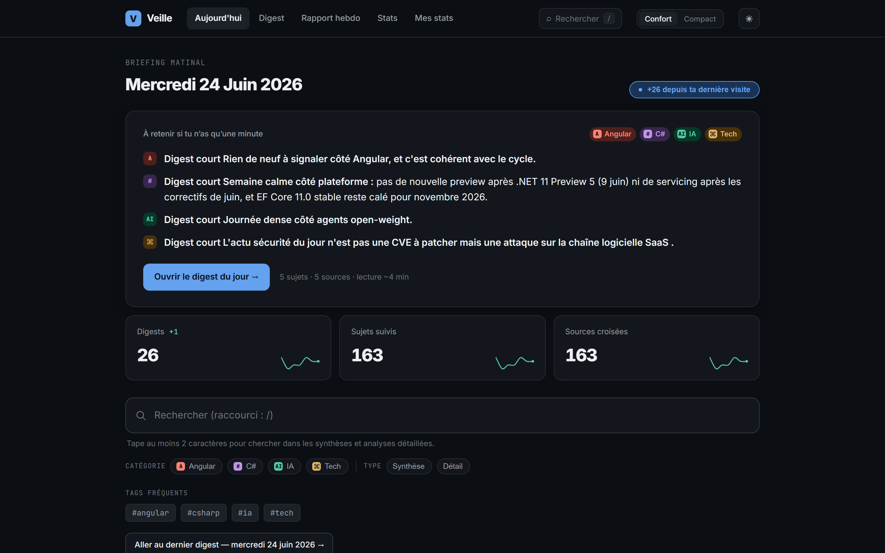
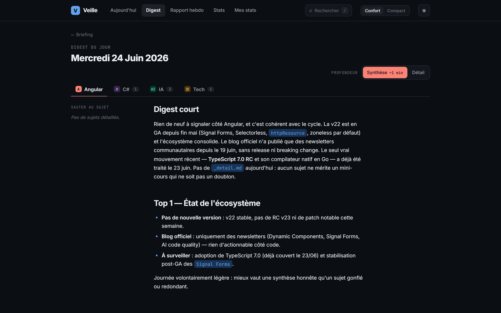
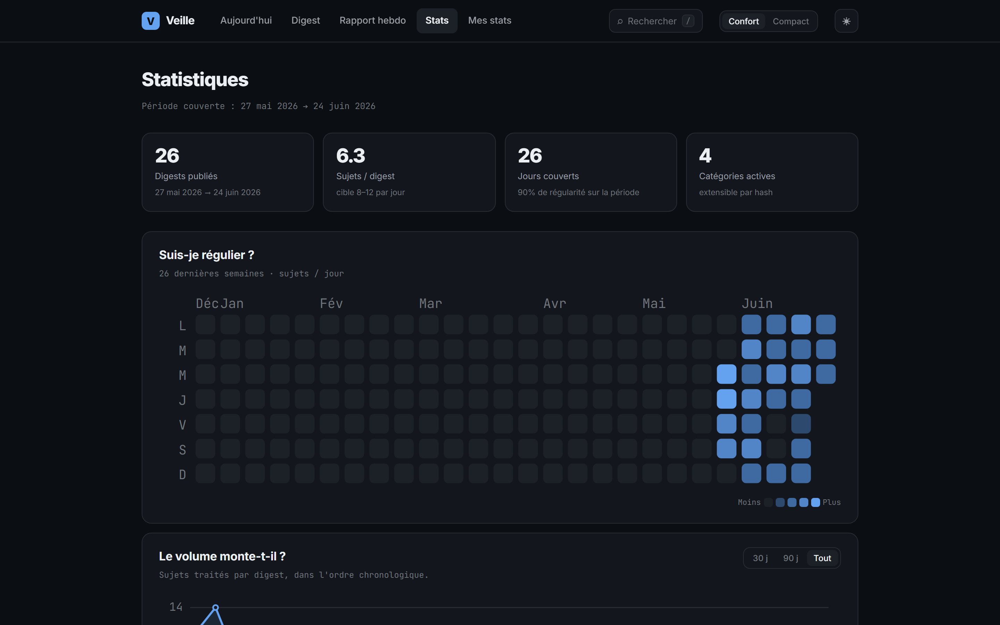
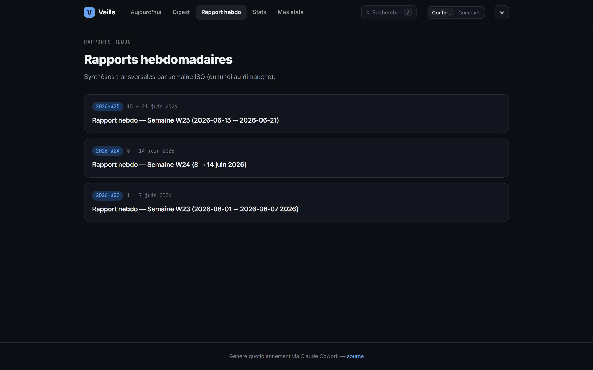
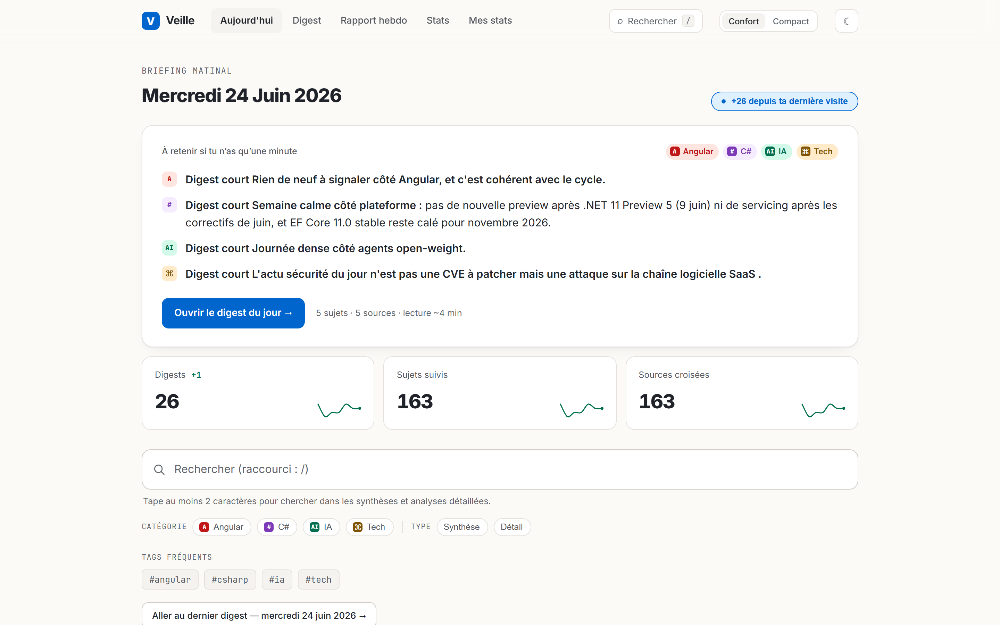
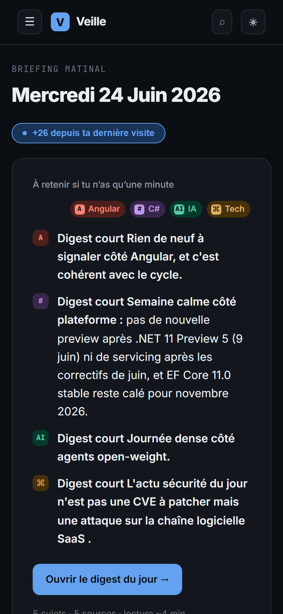

<div align="center">


# Veille

**Veille technologique automatisée, propulsée par Claude (mode Cowork).**

Des routines planifiées parcourent chaque jour l'actualité des thématiques suivies et produisent des rapports en français, versionnés dans ce dépôt et rendus par une application **Angular 20** entièrement statique.

<br/>

<!-- Statut & méta -->
[](https://github.com/LINDECKER-Charles/Veille/actions/workflows/ci-cd-test.yml)
[](LICENSE)
[](https://github.com/LINDECKER-Charles/Veille/commits)
[](https://github.com/LINDECKER-Charles/Veille)
[](https://github.com/LINDECKER-Charles/Veille)
[](https://github.com/LINDECKER-Charles/Veille/pulls)

<!-- Stack technique -->
[](https://angular.dev)
[](https://www.typescriptlang.org)


<br/>

[**Voir le site en ligne**](https://veille.charles-lindecker.com) · [Fonctionnalités](#fonctionnalités) · [Comment ça marche](#comment-ça-marche) · [Lancer en local](#application-web)

</div>

---

<div align="center">
  
</div>

##  En bref

**Veille** est un mono-dépôt qui combine deux natures :

- **Le contenu** — des rapports markdown générés automatiquement par des routines Claude (un digest quotidien par thématique + une synthèse hebdomadaire), versionnés sous `report/`.
- **Le viewer** — une app Angular **prerendue en site statique** (aucun backend), qui lit, parse et rend ces rapports **au build**.

Le tout est déduit du contenu : ajouter une thématique ne demande **aucune ligne de code**.

<details>
<summary><strong>Table des matières</strong></summary>

- [En bref](#en-bref)
- [Aperçu](#aperçu)
- [Fonctionnalités](#fonctionnalités)
- [Comment ça marche](#comment-ça-marche)
- [Structure du dépôt](#structure-du-dépôt)
- [Thématiques suivies](#thématiques-suivies)
- [Application web](#application-web)
- [Déploiement](#déploiement)
- [Documentation](#documentation)
- [Déduplication](#déduplication)
- [Licence](#licence)

</details>

##  Aperçu

| Briefing du jour | Vue détaillée d'un rapport |
|---|---|
|  |  |
| **Statistiques & régularité** | **Rapports hebdomadaires** |
|  |  |

<div align="center">
  
  
</div>

<p align="center"><em>Thème clair/sombre · responsive jusqu'au mobile.</em></p>

##  Fonctionnalités

- **Briefing quotidien** — « à retenir en 1 minute », accès direct au dernier digest, badge « nouveau ».
- **Recherche plein-texte** — index construit au build, snippets surlignés, filtres par catégorie / type (synthèse, détail) / tags.
- **Page rapport** — onglets par catégorie, bascule synthèse ↔ détail, sujets dépliables, sources citées.
- **Statistiques** — heatmap de régularité, courbe de volume, répartition par catégorie, KPIs.
- **Rapports hebdomadaires** — synthèses transversales par semaine ISO.
- **Code & diagrammes** — coloration syntaxique **au build** (Shiki, thème dual light/dark), diagrammes **Mermaid** rendus côté client en lazy.
- **Thème clair/sombre** persistant, mode confort/compact, accessible (axe-core en CI).

##  Comment ça marche

```
Routines Claude (Cowork)  ──►  report/**/*.md  ──►  tools/build-data.mjs  ──►  site statique
   (cadence quotidienne)        (markdown versionné)     (au build : parse,        (dist/, prerendu)
                                                          sanitize, index)
```

Le générateur `web/tools/build-data.mjs` (étape `prebuild`) scanne le contenu, parse une frontmatter YAML optionnelle, rend le markdown en **HTML sanitisé** (`marked` + `isomorphic-dompurify`), découpe les détails en snippets par sujet, construit l'index de recherche, et émet le tout dans `web/src/app/data/generated/` (git-ignoré). Angular prerend ensuite une page HTML par route.

Le format que les routines **doivent** respecter est décrit dans [`DIGEST_FORMAT.md`](DIGEST_FORMAT.md).

##  Structure du dépôt

```
Veille/
├── web/                    # Application web (Angular 20, statique/SSG)
├── report/                 # Contenu généré par les routines
│   ├── weekly/             #   Rapports hebdomadaires  (YYYY-Www_weekly.md)
│   └── categorie/          #   Rapports par thématique
│       ├── Angular/        #     YYYY-MM-DD_synthese.md + YYYY-MM-DD_detail.md
│       ├── CSharp/
│       ├── IA/
│       └── Tech/
├── order/                  # Prompts des routines Claude (source de vérité)
├── docs/                   # Documentation (archi, design, captures)
├── config/                 # Vhosts Apache (templates versionnés)
├── archive/                # Anciens rapports gelés (dont recaps quotidiens)
└── DIGEST_FORMAT.md        # Contrat de format imposé aux routines
```

##  Thématiques suivies

| Dossier | Couverture |
|---|---|
| `report/categorie/Angular/` | Angular, TypeScript, écosystème front |
| `report/categorie/CSharp/` | C#, .NET, ASP.NET, EF Core, Visual Studio |
| `report/categorie/IA/` | LLMs open source, papers, frameworks (vLLM, llama.cpp) |
| `report/categorie/Tech/` | Tech overview, sécurité dev, outils, infra |

### Ajouter une thématique (zéro code)

Architecture **data-driven** :

1. Créer le dossier `report/categorie/<NouvelleCat>/`.
2. *(Optionnel)* Ajouter une entrée dans `web/categories.config.json` pour personnaliser **label / couleur d'accent / icône**. Sinon, fallback déterministe (label = nom du dossier, accent dérivé par hash).
3. Adapter le prompt de la routine ([`order/categorie.md`](order/categorie.md)) pour cibler les sources.
4. Le prochain build indexe automatiquement la nouvelle catégorie (onglet, badge, charts colorés).

##  Application web

App **Angular 20** standalone (signals, control-flow natif, `inject()`), **statique** (SSG/prerender) — aucun backend.

```bash
cd web
npm install
npm run dev      # http://localhost:4200
npm run build    # → web/dist/veille/browser/ (statique)
```

| Script | Rôle |
|---|---|
| `npm run generate` | Lance uniquement le générateur de données |
| `npm run build` | `prebuild` (generate) + `ng build` → site statique |
| `npm test` | Tests unitaires (Karma + ChromeHeadless) + coverage |
| `npm run test:generator` | Tests `node:test` des helpers du générateur |
| `npm run lint` | `ng lint` (angular-eslint, flat config) |
| `npm run e2e` | Build + serveur statique + Playwright (smoke + a11y axe) |
| `npm run lighthouse` | Audit `@lhci/cli` sur le site buildé |

Détails techniques (pipeline de données, registry de catégories, Shiki/Mermaid, architecture des composants) : [`web/README.md`](web/README.md).

##  Déploiement

CI/CD **GitHub Actions → VPS Apache** (site **statique**, sans service Node) :

- push `dev` → **un seul build → déploie test ET prod** (même artefact). Gate avant prod = la CI (build + tests + e2e + lighthouse).
- `CD - Production (manuel)` → redéploiement / hotfix prod à la demande (`workflow_dispatch`).

Configuration Apache (templates) : [`config/README.md`](config/README.md).

##  Documentation

| Doc | Contenu |
|---|---|
| [`DIGEST_FORMAT.md`](DIGEST_FORMAT.md) | Contrat de format des rapports |
| [`web/README.md`](web/README.md) | Détails techniques du viewer Angular |
| [`docs/architecture-report.md`](docs/architecture-report.md) | Rapport d'architecture (migration Svelte → Angular) |
| [`docs/design-analysis.md`](docs/design-analysis.md) | Analyse UX/UI + direction visuelle |
| [`docs/claude-design-brief.md`](docs/claude-design-brief.md) | Brief de redesign pour Claude Design |

##  Déduplication

Chaque sujet déjà couvert dans les **30 derniers jours** est exclu des rapports suivants. La mémoire de déduplication est tenue par les routines planifiées Cowork.

##  Licence

Distribué sous licence **MIT** — voir [`LICENSE`](LICENSE). Vous êtes libre d'utiliser, modifier et redistribuer le code. Le **contenu des rapports** (`report/`, `archive/`) reste la propriété de son auteur.

---

<div align="center">
  <sub>Généré quotidiennement via Claude Cowork · viewer Angular 20 statique.</sub>
</div>
