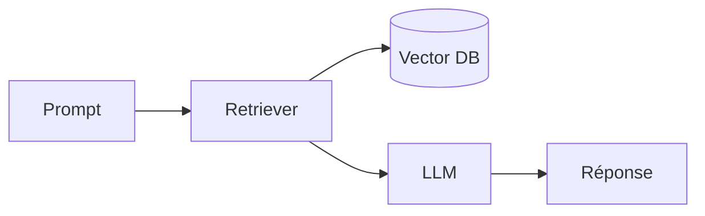

# Routine — Veille par catégorie (quotidienne)

> Prompt de la tâche planifiée Cowork. Produit, chaque matin, pour chaque thématique suivie, une **synthèse** (scan rapide) et un **détail** (analyse approfondie).

## Sortie attendue

Pour chaque catégorie active, deux fichiers du jour :

```
report/categorie/<Cat>/YYYY-MM-DD_synthese.md
report/categorie/<Cat>/YYYY-MM-DD_detail.md
```

Catégories actuelles : `Angular`, `CSharp`, `IA`, `Tech`. Ajouter une catégorie = créer le dossier `report/categorie/<NouvelleCat>/` (+ entrée optionnelle dans `web/categories.config.json` pour label/couleur/icône). Aucun changement de code requis.

| Dossier | Couverture |
|---|---|
| `report/categorie/Angular/` | Angular, TypeScript, écosystème front |
| `report/categorie/CSharp/` | C#, .NET, ASP.NET, EF Core, Visual Studio |
| `report/categorie/IA/` | LLMs open source, papers, frameworks (vLLM, llama.cpp) |
| `report/categorie/Tech/` | Tech overview, sécurité dev, outils, infra |

## Périmètre

- Couvrir les **dernières 24-48 h** précédant la génération.
- Exclure tout sujet déjà traité dans les **30 derniers jours** (dédup).
- Journée creuse : **moins de sujets mais plus denses** > gonfler artificiellement.

## Format — respecter `DIGEST_FORMAT.md`

**`_synthese.md`** (vue condensée, scannable) :
```markdown
# <Cat> — Synthèse du <jour> <date en lettres>

## Digest court
<La story de la journée pour cette thématique, 3-5 phrases.>

## Top <N> — <Sujet principal>
- **<Item>** : <description 1 ligne>
- …

→ Analyse complète : `YYYY-MM-DD_detail.md`
```

**`_detail.md`** (un **mini-cours** par sujet, H2 numéroté) :
```markdown
# <Cat> — Détail du <jour> <date en lettres>

## 1. <Titre court du sujet — nomme versions/produits>

**Source :** <Nom source primaire> — https://url-absolue
**Date :** <date de publication>

### Contexte
<Background : d'où ça vient, quel problème c'est censé résoudre. 1-2 paragraphes.>

### Comment ça marche
<LE CŒUR PÉDAGOGIQUE. Explique le mécanisme / concept PAS À PAS, comme un cours.
Ajoute un diagramme Mermaid (bloc `mermaid`) dès que le sujet touche une archi,
un flux, une séquence ou un modèle de données.>

### En pratique — exemple de code
<AU MOINS un bloc de code commenté (`lang` explicite, ≤ 30 lignes) montrant l'usage réel.
AVANT / APRÈS si c'est une évolution de code. Dis en une phrase ce que fait le code.>

### Pourquoi ça compte pour toi
<Implications pour un dev senior backend. En « tu ». ≤ 80 mots.>

### Pour aller plus loin | Pièges | Limites
<Optionnel.>

---

## 2. <Sujet suivant>
…
```

## Règles dures (sinon le fichier est ignoré / mal rendu par l'app)

- Sujets comptés via `^## \d+\.\s+` → numérotation `## 1.`, `## 2.` séquentielle, **H2 obligatoire**.
- Sources comptées via `^\*\*Source\s*:\*\*` → une ligne `**Source :**` par sujet, singulier, sur sa propre ligne.
- Un seul `# H1` en première ligne. URLs absolues. Séparateur `---` entre sujets.
- Cibles : 2-3 sujets/catégorie, 8-12 sujets/jour, 3-4 catégories — **chacun traité en mini-cours** (en cas d'arbitrage, profondeur > nombre).

## Approche pédagogique — un mini-cours par sujet (OBLIGATOIRE)

**Chaque sujet (`## N.`) du `_detail.md` est un mini-cours, pas une brève.** Objectif : qu'après lecture, tu **comprennes le mécanisme et puisses l'appliquer**, pas juste que tu sois informé. Chaque sujet doit donc porter :

1. **Une explication « Comment ça marche »** qui déroule le concept **pas à pas** (le cours).
2. **Au moins un exemple de code commenté** (` ```lang `, langage explicite, ≤ 30 lignes) montrant l'usage réel — API, config, migration EF Core, commande CLI, usage de lib. Plusieurs blocs autorisés si ça aide.
   - **Évolution de code (nouvelle API, breaking change, migration, refactor) → AVANT / APRÈS** : deux blocs étiquetés, ou un bloc commenté `// Avant` / `// Après`.
3. **Un diagramme Mermaid** (` ```mermaid `, ≤ ~12 nœuds) **dès que le sujet touche une archi / un flux / une séquence / un modèle de données**. Obligatoire pour ce type de sujet ; **fortement recommandé pour l'IA** (pipeline RAG, orchestration d'agents, flux d'inférence) et la Tech/archi. **Max 1 diagramme par sujet.**

**Plancher absolu, jamais en-dessous : 1 exemple de code OU 1 diagramme.** Mais vise le combo **code + schéma + explication pas à pas** — c'est ça, le « cours explicatif ». Le code/diagramme **soutient** l'explication, il ne la remplace pas.

Exemple de combo (CSharp — évolution d'API) :

```csharp
// Avant — EF Core 9 : requête LINQ recompilée à chaque appel
var users = await db.Users.Where(u => u.Active).ToListAsync();

// Après — EF Core 10 : requête compilée nommée, réutilisée (moins d'alloc, plan caché)
var users = await db.Users.GetActiveCompiledAsync();
```



**Longueur** : vise **350-700 mots de prose par sujet** (les blocs de code et diagrammes **ne comptent pas** dans ce budget). Dense et pédagogique — ni brève sèche, ni pavé de trois pages. Rendu : coloration au build + diagramme dans l'app (cf. `DIGEST_FORMAT.md §3.1`).

## Frontmatter optionnel (recommandé)

En tête de fichier, **tout-ou-rien** :
```yaml
---
date: 2026-06-20
category: Angular
type: synthese        # synthese | detail
tags: [framework, signals, release]
importance: high      # high | medium | low
sources_count: 3
---
```
Exploité par l'app pour badges « HIGH IMPACT », filtres par tag, scoring de recherche. Absent ⇒ l'app dérive tout par heuristique (rétrocompatible).

## Commit local automatique (push manuel)

Une fois tous les fichiers du jour générés et la checklist (`DIGEST_FORMAT.md §7`) validée, la routine **commit en local** — **sans `git push`**. C'est Charles qui pousse à la main ensuite.

```bash
# Nettoyer un verrou git resté (le montage interdit parfois l'unlink -> on renomme)
for L in .git/index.lock .git/HEAD.lock; do
  [ -e "$L" ] && { rm -f "$L" 2>/dev/null || mv -f "$L" "$L.stale.$(date +%s)"; }
done
git add report/categorie/
git commit -m "feat(data): categorie YYYY-MM-DD"   # PAS de git push
```

- **Un seul commit** par run quotidien, toutes catégories confondues. **Aucun `git push`** (push manuel par Charles).
- **Rien de neuf** (journée 100 % dédupliquée) → ne rien committer (pas de commit vide).
- Si le commit échoue parce que le dépôt est verrouillé par un éditeur ouvert (`index` tenu par l'IDE), le signaler et ne rien forcer.
- Le push manuel se fait sur `dev` (`git push origin dev`) et **déclenche la CI/CD** (build + tests + e2e + lighthouse → déploie test ET prod).
