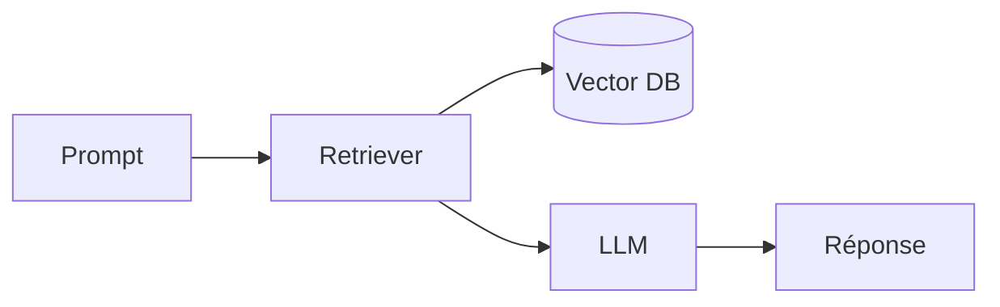

# Routine — Veille par catégorie (quotidienne)

> Prompt de la tâche planifiée Cowork. Produit, chaque matin, pour chaque thématique suivie, une **synthèse** (scan rapide) et un **détail** (analyse approfondie).

## Sortie attendue

Pour chaque catégorie active, deux fichiers du jour :

```
report/categorie/<Cat>/YYYY-MM-DD_synthese.md
report/categorie/<Cat>/YYYY-MM-DD_detail.md
```

Catégories actuelles : `Angular`, `CSharp`, `IA`, `Tech`. Ajouter une catégorie = créer le dossier `report/categorie/<NouvelleCat>/` (+ entrée optionnelle dans `web/categories.config.json` pour label/couleur/icône). Aucun changement de code requis.

| Dossier | Couverture |
|---|---|
| `report/categorie/Angular/` | Angular, TypeScript, écosystème front |
| `report/categorie/CSharp/` | C#, .NET, ASP.NET, EF Core, Visual Studio |
| `report/categorie/IA/` | LLMs open source, papers, frameworks (vLLM, llama.cpp) |
| `report/categorie/Tech/` | Tech overview, sécurité dev, outils, infra |

## Périmètre

- Couvrir les **dernières 24-48 h** précédant la génération.
- Exclure tout sujet déjà traité dans les **30 derniers jours** (dédup).
- Journée creuse : **moins de sujets mais plus denses** > gonfler artificiellement.

## Format — respecter `DIGEST_FORMAT.md`

**`_synthese.md`** (vue condensée, scannable) :
```markdown
# <Cat> — Synthèse du <jour> <date en lettres>

## Digest court
<La story de la journée pour cette thématique, 3-5 phrases.>

## Top <N> — <Sujet principal>
- **<Item>** : <description 1 ligne>
- …

→ Analyse complète : `YYYY-MM-DD_detail.md`
```

**`_detail.md`** (analyses approfondies, un H2 numéroté par sujet) :
```markdown
# <Cat> — Détail du <jour> <date en lettres>

## 1. <Titre court du sujet — nomme versions/produits>

**Source :** <Nom source primaire> — https://url-absolue
**Date :** <date de publication>

### Contexte
<Background nécessaire. 1-2 paragraphes.>

### Ce qui change concrètement
<Détails techniques, bullets bienvenus.>

### Pourquoi ça compte pour toi
<Implications pour un dev senior backend. En « tu ». ≤ 80 mots.>

### Détails techniques | Points de vigilance | Limites
<Optionnel.>

---

## 2. <Sujet suivant>
…
```

## Règles dures (sinon le fichier est ignoré / mal rendu par l'app)

- Sujets comptés via `^## \d+\.\s+` → numérotation `## 1.`, `## 2.` séquentielle, **H2 obligatoire**.
- Sources comptées via `^\*\*Source\s*:\*\*` → une ligne `**Source :**` par sujet, singulier, sur sa propre ligne.
- Un seul `# H1` en première ligne. URLs absolues. Séparateur `---` entre sujets.
- Cibles « digest idéal » : 2-3 sujets/catégorie, 8-12 sujets/jour au total, 3-4 catégories.

## Exemples concrets — OBLIGATOIRE pour chaque sujet

**Chaque sujet (`## N.`) du `_detail.md` doit porter au minimum UN artefact illustratif** — un **diagramme Mermaid** ou un **bloc de code** (les deux si le sujet le justifie). **Jamais zéro.** Choisir selon la nature du sujet :

- **Code** (` ```lang `, langage explicite, ≤ 25 lignes) → par défaut pour une **feature de code** : API, config, migration EF Core, commande CLI, usage de lib.
  - **Évolution de code (nouvelle API, breaking change, migration, refactor) → montrer un AVANT / APRÈS** : deux blocs étiquetés, ou un seul bloc commenté `// Avant` / `// Après`. C'est le format le plus parlant pour « ce qui change concrètement ».

```csharp
// Avant — EF Core 9
var users = await db.Users.Where(u => u.Active).ToListAsync();

// Après — EF Core 10, requête compilée nommée
var users = await db.Users.GetActiveCompiledAsync();
```

- **Diagramme Mermaid** (` ```mermaid `) → pour un sujet **archi / flux / séquence / modèle de données**. **Privilégier le diagramme pour l'IA** (pipeline RAG, orchestration d'agents, flux d'inférence) et la Tech/archi (déploiement, réseau, schéma BDD). ≤ ~12 nœuds.



**Règle de choix** : feature de code → **code** (avant/après si c'est une évolution) ; concept / flux / architecture → **diagramme**. Minimum 1 par sujet, **max 1 diagramme Mermaid par sujet** (un code en plus reste possible). L'artefact illustre, il ne remplace pas l'analyse texte. Rendu : coloration au build + diagramme dans l'app (cf. `DIGEST_FORMAT.md §3.1`).

## Frontmatter optionnel (recommandé)

En tête de fichier, **tout-ou-rien** :
```yaml
---
date: 2026-06-20
category: Angular
type: synthese        # synthese | detail
tags: [framework, signals, release]
importance: high      # high | medium | low
sources_count: 3
---
```
Exploité par l'app pour badges « HIGH IMPACT », filtres par tag, scoring de recherche. Absent ⇒ l'app dérive tout par heuristique (rétrocompatible).

## Commit & push automatiques

Une fois tous les fichiers du jour générés et la checklist (`DIGEST_FORMAT.md §7`) validée, la routine **commit ET push automatiquement** — aucune intervention manuelle :

```bash
git add report/categorie/
git commit -m "feat(data): categorie YYYY-MM-DD"
git push origin dev
```

- **Branche : toujours `dev`.** La pipeline `dev` build une fois puis déploie **test ET prod** (le seul gate avant prod est la CI : build + tests + e2e + lighthouse). Le push **déclenche la CI/CD**.
- **Un seul commit** par run quotidien, toutes catégories confondues.
- **Rien de neuf** (journée 100 % dédupliquée) → ne rien committer (pas de commit vide).
- En cas de conflit au push (`non-fast-forward`), faire `git pull --rebase` puis re-push.
