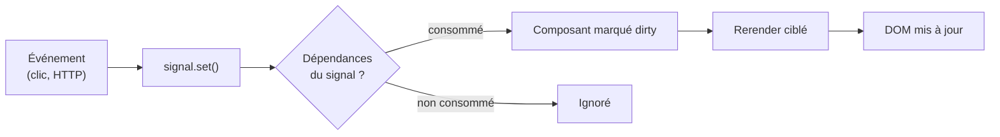

# Angular — Détail du mercredi 27 mai 2026

## 1. Angular 22 RC1 — Signal Forms, zoneless par défaut

**Source :** Angular Release Guide — https://angular.dev/reference/releases
**Date :** 22 mai 2026 (RC1)

### Contexte

Angular pousse depuis la version 16 (mai 2023) son modèle de réactivité basé sur les **signaux**, en alternative à RxJS et à la change detection historique de Zone.js. Les versions 17 à 21 ont migré l'écosystème par paliers : Computed Signals, Signal Inputs, Signal Queries, puis Signal Forms expérimentaux en v21.

La v22 marque l'aboutissement. **Signals devient stable, zoneless devient le défaut des nouveaux composants, et Signal Forms passe production-ready**. C'est la fin officielle de l'ère « Angular avec Zone.js », même si la rétrocompatibilité reste assurée pour des migrations progressives.

### Comment ça marche

Le cœur du changement tient en un mot : **réactivité fine**. Avec Zone.js, Angular patchait toutes les API async du navigateur pour redéclencher la change detection sur l'arbre entier à chaque événement. C'est large et coûteux.

En zoneless, plus de patch global. Quand tu lis un `signal()` dans un template, Angular enregistre une dépendance. Quand ce signal change, seuls les composants qui le consomment sont marqués pour rerender. Le graphe de dépendances pilote la mise à jour, pas un balayage complet.



Les nouveautés s'inscrivent toutes dans ce modèle. Les Signal Forms stockent l'état du formulaire dans un signal au lieu d'un `FormControl` observable. Les Selectorless Components s'importent comme une classe, sans chaîne de selector. Le bundle perd les ≈ 30 Ko gzipped de zone.js.

### En pratique — exemple de code

Migration d'un formulaire Reactive Forms vers Signal Forms.

```typescript
// Avant — Reactive Forms : Subscription, valueChanges, typage faible
form = new FormGroup({
  email: new FormControl('', [Validators.required, Validators.email]),
});
ngOnInit() {
  this.form.get('email')!.valueChanges
    .pipe(takeUntilDestroyed(this.destroyRef))
    .subscribe(v => this.onEmailChange(v)); // v: any | null
}

// Après — Signal Forms : état dans un signal, typage inféré, zéro subscription
model = signal({ email: '' });
emailValid = computed(() =>
  /\S+@\S+\.\S+/.test(this.model().email) // dérivation réactive pure
);
```

Le state vit dans `model()`, les règles deviennent des `computed()`. Plus de `Subscription` à nettoyer, plus de `get('email')?.value` typé `any`.

### Pourquoi ça compte pour toi

Si tu maintiens des apps Angular en prod, c'est la migration la plus structurante depuis les Standalone Components. Tu peux y aller en deux temps : passer v22 en mode compatibilité Zone.js, puis migrer composant par composant vers signals et zoneless. Prévois du temps pour réécrire tes formulaires complexes. Bénéfice : meilleure perf, moins de boilerplate, code plus simple à raisonner.

### Pour aller plus loin | Points de vigilance | Limites

**Libs tierces** — Toutes ne sont pas zoneless-ready. Angular Material l'est depuis la v18, mais des libs plus petites (datepickers custom, wrappers de charts) peuvent dépendre implicitement de Zone.js. Audite avant de désactiver Zone.js globalement.

**RxJS reste pertinent** — Les signaux ne remplacent pas RxJS pour les flux async complexes (websockets, retry/debounce, `combineLatest` sur cinq sources). Les deux coexistent : signals pour le state UI, RxJS pour les flux. Les helpers `toSignal()` et `toObservable()` font le pont.

**Date de release** — RC1 sorti le 22 mai, stable attendue fin mai / début juin 2026.
