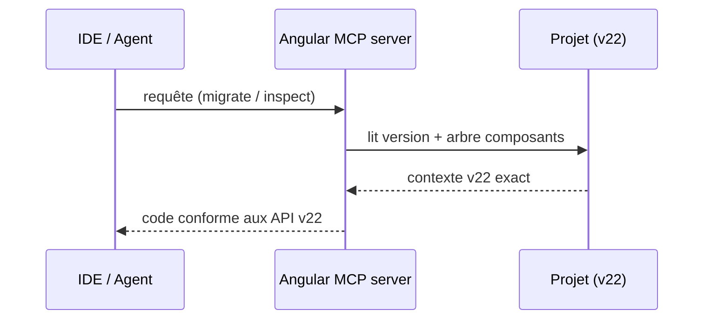
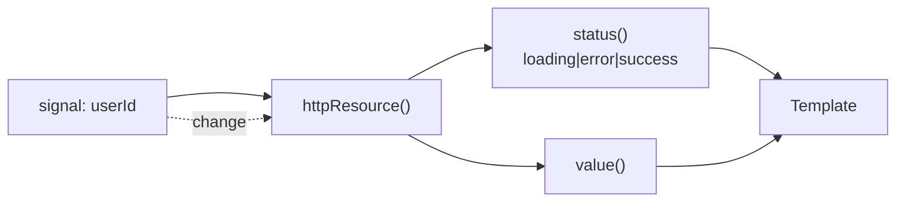

# Angular — Détail du jeudi 28 mai 2026

## 1. Angular 22 passe en stable — MCP intégré dans l'outillage officiel

**Source :** FrontendMinds / Angular blog — https://frontendminds.com/blog/angular-latest-version-2026
**Date :** 20 mai 2026 (release stable)

### Contexte

Le digest d'hier couvrait la **RC1 d'Angular 22**. En réalité, l'équipe a tagué la **release stable dès le 20 mai 2026**, et plusieurs analyses publiées cette semaine (FrontendMinds, HeroDevs, VersionLog) confirment le périmètre final.

La nouveauté la plus structurante pour ton workflow n'est pas dans les features framework déjà connues (Signal Forms, zoneless, Selectorless Components) mais dans **l'intégration native du Model Context Protocol (MCP) dans l'outillage officiel Angular**. C'est un signal clair sur la stratégie de l'équipe vis-à-vis des assistants de code.

### Comment ça marche

Un serveur MCP est un pont normalisé entre ton IDE et une source de contexte. Angular 22 ship ce serveur officiel : ton client (Cursor, Claude Code, Copilot, Cline) s'y connecte et obtient des outils typés au lieu de deviner ta version d'Angular.

Le flux est simple. L'agent émet une requête MCP — « migre ce composant vers les signals », « liste l'arbre de composants ». Le serveur, qui tourne dans ton projet, connaît la version exacte et les API v22. Il répond avec du code juste, pas du code Angular 12 halluciné.



Le reste de la release suit la logique signal-first : Signal Forms stables avec guides de migration, Selectorless production-ready, et **Vitest** comme runner par défaut des nouveaux projets.

### En pratique — exemple de code

Installation du serveur MCP et migration assistée des formulaires.

```bash
# Installe le serveur MCP officiel dans le projet
ng add @angular/mcp

# Migration mécanique Reactive Forms -> Signal Forms sur un dossier
ng generate @angular/forms:signal-form-migration --path src/app/users

# Crée un nouveau projet : Vitest devient le runner par défaut
ng new my-app   # Karma reste dispo mais en mode maintenance
```

Côté client, tu pointes ton IDE vers l'endpoint local exposé (`http://localhost:<port>/mcp`). Dès lors, les suggestions Angular gagnent en justesse : le LLM ne propose plus de `NgModule` quand tu es en standalone.

### Pourquoi ça compte pour toi

Si tu attendais la fin du cycle RC, c'est le moment d'inscrire la migration au planning. Pour les projets v19-21, le path est balisé. **Installe surtout le serveur MCP** : `ng add @angular/mcp` puis configure ton client vers `http://localhost:<port>/mcp`. Tu constateras immédiatement une qualité accrue des suggestions de code Angular dans ton IDE.

### Pour aller plus loin | Points de vigilance | Limites

**Angular 21 reste LTS jusqu'à mai 2027** — Pas d'urgence existentielle, surtout sur des projets en maintenance. Mais la v21 ne reçoit plus que des fixes de sécurité.

**Outillage tiers** — Nx, NgRx, Spartan, PrimeNG ont publié leurs versions compatibles v22 cette semaine. Vérifie la matrice de compatibilité avant de bumper en blind.

---

## 2. Newsletter Angular hebdo — Dynamic Components, HTTP Resources, AI Writing

**Source :** Angular Blog (Medium) — https://blog.angular.dev/mastering-dynamic-components-http-resources-and-ai-writing-assistants-%EF%B8%8F-94c18a911a3a
**Date :** 22 mai 2026

### Contexte

La newsletter hebdomadaire officielle synthétise les contenus communautaires retenus par l'équipe Angular. Cette édition met l'accent sur trois axes complémentaires à la sortie d'Angular 22 : la manipulation programmatique des composants dynamiques, les `HttpResource`, et l'intégration d'assistants AI dans l'écriture de templates.

Le fil rouge reste le pattern signal-first appliqué partout, y compris au data fetching et à la composition runtime.

### Comment ça marche

Un `HttpResource` inverse le modèle classique. Au lieu de `subscribe` puis gérer manuellement loading et erreur, tu déclares une ressource liée à un signal. Quand la dépendance change, la requête se relance et l'état se met à jour seul.

La ressource expose trois signaux : `value()` (la donnée), `status()` (loading / error / success), et se recharge automatiquement. Tu lis ces signaux dans le template ; Angular fait le reste.



Côté Dynamic Components, la nouvelle API `createComponent()` couplée à `viewChild()` remplace `ComponentFactoryResolver` (déprécié). Créer modals, drawers et widgets chargés dynamiquement devient déclaratif et testable.

### En pratique — exemple de code

Un `HttpResource` piloté par un signal, sans aucune subscription.

```typescript
// Fetch réactif : la requête se relance dès que userId() change
userId = signal(1);

user = httpResource(() => ({
  url: `/api/users/${this.userId()}`, // dépend du signal -> auto-refetch
}));

// Dans le template :
//   @if (user.status() === 'loading') { <spinner/> }
//   @if (user.value(); as u) { {{ u.name }} }

next() {
  this.userId.update(id => id + 1); // déclenche le refetch, zéro boilerplate
}
```

Plus de `Subscription`, de `takeUntilDestroyed`, ni de `BehaviorSubject` intermédiaire à orchestrer.

### Pourquoi ça compte pour toi

C'est le signal-first appliqué au fetch : les `HttpResource` éliminent un pan entier de boilerplate. Si tu lances un projet ou refactores une vue, c'est le pattern à privilégier. Pour les Dynamic Components, la nouvelle API mérite d'être adoptée même sur du code existant — elle est plus testable et lisible que `ComponentFactoryResolver`.

### Pour aller plus loin | Points de vigilance | Limites

**HttpResource ne couvre pas tout** — Pour les flux complexes (websockets, retry avec backoff exponentiel, combinaison de plusieurs streams), RxJS reste plus expressif. `toSignal()` et `toObservable()` permettent la cohabitation des deux mondes.
