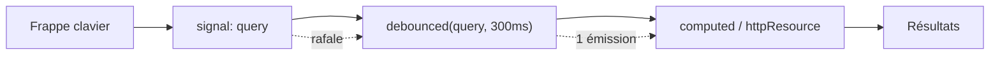

# Angular — Détail du samedi 30 mai 2026

## 1. Angular 22 — l'ère Signal-First en pratique (Selectorless, debounced(), @Service)

**Source :** Marco Martorana (Medium) — https://medium.com/@marcomatto/angular-22-embracing-the-signal-first-era-b1c8803acea6
**Date :** 30 mai 2026

### Contexte

Angular 22 est passé stable cette semaine. Au-delà du MCP intégré déjà couvert, la communauté digère maintenant les changements de fond du modèle de programmation. La v19 est officiellement EOL depuis le 19 mai, ce qui force les retardataires à sauter directement dans le train Signal-First.

L'article de Marco Martorana met en pratique trois nouveautés ergonomiques : Selectorless Components, le signal `debounced()`, et le décorateur `@Service`.

### Comment ça marche

Ces trois ajouts réduisent le boilerplate, chacun sur un axe. **Selectorless** supprime l'indirection du selector string : tu importes la classe du composant et tu l'utilises directement dans le template, ce qui améliore le tree-shaking et le refactor IDE.

**`debounced()`** est un signal dérivé qui retarde la propagation d'une valeur. Quand la source change vite (frappe au clavier), seul le dernier état après le délai se propage aux consommateurs. C'est le debounce d'RxJS, mais en pur signal.



**`@Service`** remplace `@Injectable` dans la majorité des cas : déclaration plus courte d'un service injectable. Enfin, OnPush devient le défaut des nouveaux composants et Vitest remplace Karma comme runner d'unit tests.

### En pratique — exemple de code

Une recherche debouncée sans RxJS, avec `@Service` et Selectorless.

```typescript
// Service simplifié : @Service remplace @Injectable({ providedIn: 'root' })
@Service()
export class SearchStore {
  query = signal('');
  // debounced() retarde la propagation : pas de Subject ni de pipe RxJS
  debouncedQuery = debounced(this.query, 300);
}

// Composant : import direct (selectorless), aucun selector déclaré
import { ResultList } from './result-list';

@Component({
  template: `<ResultList [query]="store.debouncedQuery()" />`, // usage direct
})
export class SearchPage {
  store = inject(SearchStore);
}
```

### Pourquoi ça compte pour toi

Si tu migres une app depuis v19/v20, prépare un plan en deux temps : d'abord la montée de version, ensuite l'adoption progressive de Signal Forms et `debounced()` pour retirer du RxJS superflu. `@Service` et Selectorless allègent ton code mais changent tes conventions d'équipe : documente-les avant de généraliser.

### Pour aller plus loin | Points de vigilance | Limites

- Selectorless ne couvre pas encore tous les cas de directives dynamiques : garde `selector` là où tu fais du runtime resolution.
- Le passage à Vitest peut casser des tests qui dépendaient de spécificités Karma/Jasmine (timers, zones). Audite tes fixtures avant de basculer le runner par défaut.
