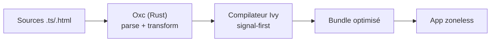

# Angular — Détail du mercredi 3 juin 2026

## 1. Angular 22 — semaine de GA : Signal Forms, Selectorless et httpResource passent stable

**Source :** InfoQ — https://www.infoq.com/news/2026/04/angular-compiler-rust/
**Date :** semaine du 3 juin 2026

### Contexte

La sortie stable d'Angular 22 est calée sur la **première semaine de juin 2026**. Au-delà du numéro de version déjà annoncé en mai, ce qui marque cette semaine est le passage en **stable** d'API longtemps restées expérimentales — l'aboutissement de l'ère « signal-first ».

En parallèle, le compilateur expérimental **Oxc (Rust) de VoidZero** annonce des builds jusqu'à 20× plus rapides, signe que la chaîne d'outils Angular bascule vers des cœurs natifs.

### Comment ça marche

Le passage en stable n'invente rien : il retire les flags expérimentaux d'API déjà éprouvées. Les Signal Forms fusionnent Reactive Forms et signals — état, validation et valeurs dérivées deviennent réactifs. `resource` et `httpResource` apportent le data fetching piloté par signaux. **Angular Aria** stabilise des primitives d'accessibilité.

Le compilateur Oxc, lui, attaque un autre maillon : il réécrit en Rust les passes de parsing et transformation que faisait jusqu'ici du JS/TS. Moins de surcharge runtime, parallélisme natif, d'où les gains annoncés.



L'enjeu opérationnel : « stable » abaisse le risque d'adoption, mais chaque API stabilisée a son guide de migration outillé.

### En pratique — exemple de code

Un `httpResource` stable remplace le couple `HttpClient` + `subscribe` pour un fetch réactif.

```typescript
// Avant — HttpClient + subscribe : gestion manuelle de l'état et du cleanup
products: Product[] = [];
loading = true;
ngOnInit() {
  this.http.get<Product[]>('/api/products')
    .subscribe(p => { this.products = p; this.loading = false; });
}

// Après — httpResource stable : état dérivé, refetch réactif, zéro subscription
products = httpResource<Product[]>(() => ({ url: '/api/products' }));
// template : @if (products.value(); as list) { ... }
//            @if (products.status() === 'loading') { <spinner/> }
```

### Pourquoi ça compte pour toi

Tes formulaires complexes peuvent enfin abandonner `FormGroup` au profit de Signal Forms sans flag expérimental. `httpResource` remplace une bonne partie de ton boilerplate RxJS pour le fetch. Avant de migrer un gros front, valide que tes libs tierces suivent le mode selectorless et zoneless. Commence par un module isolé pour mesurer le gain avant un rollout global.

### Pour aller plus loin | Points de vigilance | Limites

« Stable » ne veut pas dire « migration gratuite » : les guides de migration zoneless et selectorless demandent des passes outillées. Vérifie la compat de tes dépendances UI avant de bumper en CI. Le compilateur Oxc reste expérimental — ne le mets pas sur le chemin critique d'un build de production.
