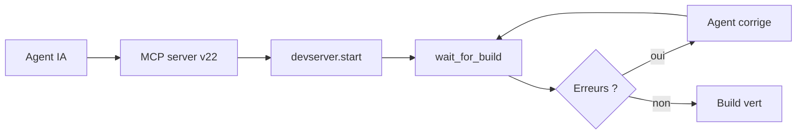
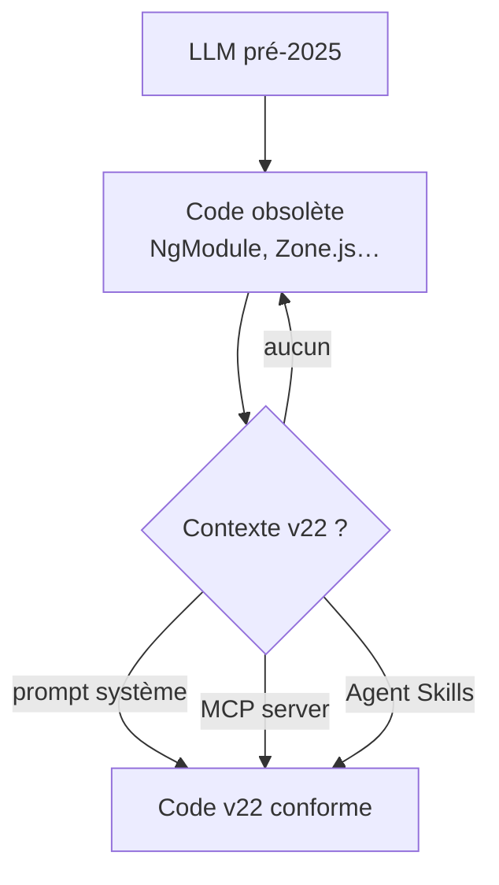

# Angular — Détail du vendredi 5 juin 2026

## 1. MCP + Angular v22 : l'IA transforme le workflow dev au-delà du scaffolding

**Source :** Angular Blog (newsletter officielle) — https://blog.angular.dev/angular-in-2026-mid-year-reality-check-signals-and-ai-code-quality-ff37df480574
**Date :** 5 juin 2026

### Contexte

La newsletter hebdomadaire du 5 juin tombe le lendemain de la GA Angular v22 et fait le bilan de mi-2026. Le sujet le plus concret pour un dev senior est l'article de Sonu Kapoor sur CodeMag — [From Commands to Conversations](https://www.codemag.com/Article/2601071/From-Commands-to-Conversations-How-AI-Assisted-Tooling-Is-Transforming-Angular-Development) — qui documente la transition d'un outillage CLI passif vers un cycle agentique actif, catalysé par le Model Context Protocol passé stable en v22.

### Comment ça marche

Le changement de fond : le MCP server n'expose plus seulement de la connaissance, mais des **outils opérationnels** qui agissent sur le projet. `devserver.start`, `devserver.stop`, `devserver.wait_for_build`, `onpush_zoneless_migration`, `modernize`, plus un AI tutor.

L'agent devient autonome. Il lance le dev server, attend le build, lit les erreurs, corrige, relance — une boucle auto-correctrice sans intervention manuelle. Le MCP connaît les API modernes (Signals, Signal Forms, Angular Aria, `httpResource`, `injectAsync`, `@Service()`) qu'un LLM entraîné avant fin 2025 ignore.



Deux compléments : les **Angular Agent Skills** (`github.com/angular/skills`) injectent du contexte v22 dans n'importe quel agent, même sans MCP. Et **WebMCP** (expérimental, Chrome) expose des outils d'application aux agents directement dans le navigateur.

### En pratique — exemple de code

Préparer un projet v21 au zoneless via l'outil MCP dédié, puis itérer en boucle.

```bash
# Active le serveur MCP dans le projet (Angular CLI v22 requis)
ng add @angular/mcp

# L'agent appelle ensuite les outils MCP, ex. la migration zoneless ciblée :
#   tool: onpush_zoneless_migration   -> bascule OnPush + retire les deps Zone.js
#   tool: devserver.start             -> lance le serveur de dev
#   tool: devserver.wait_for_build    -> bloque jusqu'au build, remonte les erreurs
#   tool: modernize                   -> réécrit les API legacy vers les API v22
```

L'outil `onpush_zoneless_migration` est le point d'entrée le plus direct pour préparer un projet v21 à tourner sans Zone.js en v22.

### Pourquoi ça compte pour toi

Si tu utilises Cursor, Claude Code ou Antigravity avec Angular, configure le MCP server plutôt que de te fier aux complétions brutes du modèle. Tu éviteras les générations de code obsolète et tu bénéficieras des boucles de feedback sur le build. L'outil `onpush_zoneless_migration` prépare directement un projet v21 au zoneless de la v22.

### Pour aller plus loin | Points de vigilance | Limites

- Le MCP server Angular nécessite Angular CLI v22 — vérifie la version globale avant de l'activer dans ton IDE.
- Les outils `devserver.*` ne sont stables qu'en v22 — sur un projet v21 en migration, reste sur les outils expérimentaux documentés sur `angular.dev/ai/mcp`.

---

## 2. "Ton IA code Angular comme en 2022" — LLMs obsolètes, zoneless readiness et correctifs pratiques

**Source :** Angular Blog (newsletter officielle) — https://blog.angular.dev/angular-in-2026-mid-year-reality-check-signals-and-ai-code-quality-ff37df480574
**Date :** 5 juin 2026

### Contexte

Muhammad Ahsan Ayaz publie deux vidéos référencées dans la newsletter : un récap d'Angular v21 et une analyse sur [pourquoi les assistants IA génèrent encore du code Angular obsolète](https://youtu.be/tCROVJMcAF8). Alain Chautard complète avec une checklist — [Is Your Angular App Ready for Zoneless?](https://www.youtube.com/watch?v=mcSR6IIKvEE) — pour évaluer la maturité zoneless d'un projet avant la migration v22. Ces deux ressources forment le guide actionnable de mi-2026.

### Comment ça marche

Le problème est temporel : un LLM figé avant fin 2025 ne connaît que l'Angular d'avant. Il génère donc des patterns devenus obsolètes ou renommés : `NgModule` au lieu de standalone, `ChangeDetectionStrategy.Default` au lieu de `Eager` (renommé en v22), `@Injectable({ providedIn: 'root' })` au lieu de `@Service()`, imports `zone.js` sur des projets zoneless, ou des `FormControl`/`FormGroup` à la place de Signal Forms.

La parade tient en trois leviers : un prompt système explicite, le MCP server qui injecte les conventions v22, et les Agent Skills. En parallèle, la checklist zoneless de Chautard évalue le périmètre réel avant migration.



### En pratique — exemple de code

Le prompt système qui recadre l'agent vers les conventions v22.

```bash
# Prompt système à injecter dans l'agent (Cursor / Claude Code / Copilot)
"Use Angular 22 conventions: @Service() for root services, OnPush by default,
 no Zone.js imports, Signal Forms API from @angular/forms/signals."

# Checklist zoneless (Alain Chautard) — points à auditer dans le code :
#  - appels directs à NgZone dans le code applicatif
#  - ChangeDetectorRef.markForCheck() -> remplacer par mutation de signal
#  - timers / event handlers déclenchés hors contexte Angular
#  - libs tierces compatibles zoneless (Angular Material v22 : OK)
```

### Pourquoi ça compte pour toi

Chaque composant généré sans contexte v22 risque d'introduire `ChangeDetectionStrategy.Eager` implicite ou des imports Zone.js qui annulent les bénéfices de la migration. Trente secondes à configurer un prompt système ou le MCP server t'évitent des heures de refactoring post-review. La checklist zoneless est précieuse avant un sprint de migration : elle donne une estimation réaliste du périmètre.

### Pour aller plus loin | Points de vigilance | Limites

- La migration zoneless n'est pas atomique : Zone.js peut rester dans des dépendances tierces pré-v22 non mises à jour.
- Les tests `TestBed` + zoneless change detection nécessitent une mise à jour des fixtures — `detectChanges()` reste nécessaire mais se comporte différemment (synchrone dans le nouveau mode).
- Le `@boundary` template (error boundaries) est en developer preview pour Q3 2026 — à ne pas utiliser en prod encore.
