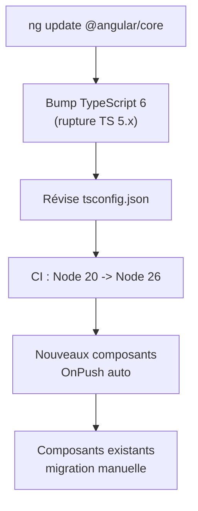

# Angular — Détail du samedi 6 juin 2026

## 1. Angular 22 — Migration communauté : TypeScript 6 obligatoire, OnPush uniquement CLI, httpResource stable

**Source :** Angular Addicts — https://www.angularaddicts.com/p/angular-addicts-48-typescript-6-on-push-as-default
**Date :** 5 juin 2026

### Contexte

Angular 22 est sorti le 3 juin. Trois jours après le GA, la communauté publie ses premiers retours de migration. Ninja Squad, Angular Addicts et AngularArchitects convergent sur les mêmes frictions : le OnPush par défaut est plus ciblé qu'anticipé, et le prérequis **TypeScript 6** constitue la vraie rupture opérationnelle pour les équipes.

S'ajoute une rupture d'infrastructure : Node 20 supprimé, Node 26 recommandé. La migration touche donc autant la CI/CD que le code applicatif.

### Comment ça marche

Le piège de la migration est de croire que `ng update` fait tout. Il ne touche **pas** les fichiers existants. OnPush par défaut ne s'applique qu'aux composants générés *après* la mise à jour via `ng generate component` ; les anciens gardent leur stratégie (Eager). La migration composant par composant reste à la charge de l'équipe.

TypeScript 6 est le vrai mur. `@angular/core` v22 l'exige et casse la compat TS 5.x : `tsconfig.json` à réviser (options disparues ou défauts changés), erreurs de type nouvelles à corriger. `httpResource()` quitte enfin l'expérimental et expose un `Signal<T>` réactif aux changements de route ou de paramètres.



### En pratique — exemple de code

La séquence de montée de version, sur une branche isolée.

```bash
# 1. Monter Node AVANT Angular : Node 20 est supprimé en v22
nvm install 26 && nvm use 26

# 2. Bump TypeScript 6 puis migration outillée du core
npm install -D typescript@^6.0
ng update @angular/core @angular/cli   # gère la plupart des ajustements tsconfig

# 3. Vérifier le build : les erreurs de type TS 6 apparaissent ici
ng build   # corriger les options tsconfig dépréciées avant de merger
```

OnPush par défaut ne touche pas ton code existant ; seuls les `ng generate component` postérieurs l'héritent.

### Pourquoi ça compte pour toi

Tu travailles probablement sur des projets Angular en place depuis plusieurs versions. Bonne nouvelle : OnPush par défaut n'affecte pas ton code existant. L'action urgente est la montée en TypeScript 6 — teste d'abord sur une branche isolée, vérifie les erreurs de type et les options `tsconfig` dépréciées avant de merger. Si tu utilises `HttpClient` directement, commence à évaluer `httpResource` sur un endpoint simple.

### Pour aller plus loin | Points de vigilance | Limites

- Si ton pipeline CI était pinné sur Node 20, la montée en Node 26 peut introduire des incompatibilités dans des dépendances natives (addons npm C++). Valide en local avant.
- Les libs Angular tierces sans version compatible TS 6 peuvent bloquer la migration — consulte la matrice de compatibilité de chaque lib avant de bumper.
