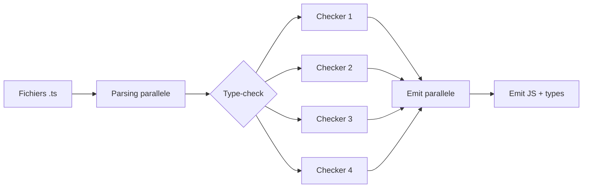

# Angular — Détail du mardi 23 juin 2026

## 1. TypeScript 7.0 RC — le compilateur natif Go devient le `tsc` officiel

**Source :** TypeScript Blog (Microsoft) — https://devblogs.microsoft.com/typescript/announcing-typescript-7-0-rc/
**Date :** 18 juin 2026

### Contexte

Depuis un an, l'équipe TypeScript porte le compilateur — historiquement écrit en TypeScript et compilé en JavaScript — vers **Go**. L'objectif n'est pas un nouveau langage, mais la même sémantique de typage exécutée en code natif, avec du parallélisme à mémoire partagée. Résultat annoncé : TypeScript 7.0 est **environ 10× plus rapide** que la 6.0. La RC du 18 juin est la dernière étape avant une GA prévue « dans le mois ». Elle tourne déjà sur des bases de plusieurs millions de lignes chez Bloomberg, Figma, Google, Slack, Vercel et d'autres. Pour un projet Angular, dont chaque build et chaque frappe dans l'IDE passent par `tsc`, c'est l'amélioration d'outillage la plus tangible de l'année.

### Comment ça marche

Le portage est volontairement « ligne à ligne » : la logique de type-check est structurellement identique à la 6.0, donc tes erreurs de typage restent les mêmes. Le gain vient de l'exécution. Le compilateur découpe le travail en étapes parallélisables. Le **parsing** et l'**emit** sont quasi indépendants par fichier. Le **type-check**, lui, partage des dépendances : la 7.0 crée un nombre fixe de *checker workers* (4 par défaut, réglable via `--checkers`) qui se répartissent les fichiers de façon déterministe — mêmes entrées, mêmes résultats. Pour les monorepos, `--builders` parallélise en plus la compilation de plusieurs projets référencés. Le tout reste reproductible grâce à `stableTypeOrdering` activé en dur.



### En pratique — exemple de code

L'installation se fait sur le package `typescript` habituel ; le binaire `tsc` fourni est désormais celui en Go.

```bash
npm install -D typescript@rc
npx tsc --version                 # Version 7.0.1-rc
npx tsc --checkers 4 --builders 2 # monorepo : ajuste selon CPU/RAM du runner CI
```

Deux défauts changent et surprennent le plus à la migration : `rootDir` vaut maintenant `./` et `types` vaut `[]`. Il faut souvent les réexpliciter.

```diff
  {
    "compilerOptions": {
+     "rootDir": "./src",
+     "types": ["node", "jest"]
    },
    "include": ["./src"]
  }
```

Tant que l'écosystème (typescript-eslint, build tools) n'est pas 100 % prêt, fais cohabiter 6.0 et 7.0 via des alias npm.

```jsonc
{
  "devDependencies": {
    "typescript": "npm:@typescript/typescript6@^6.0.0", // expose tsc6 + l'API 6.0
    "typescript-7": "npm:typescript@rc"                  // npx tsc -> 7.0
  }
}
```

### Pourquoi ça compte pour toi

Tes builds Angular en CI et tes feedbacks d'éditeur reposent sur `tsc`. Diviser le temps de type-check par dix raccourcit chaque pipeline et fluidifie l'autocomplétion sur les gros workspaces. Mais la 7.0 transforme les anciens flags dépréciés (`baseUrl`, `moduleResolution: node`, `target: es5`) en erreurs dures. Teste-la sur une branche, corrige `rootDir`/`types`, et garde l'alias `tsc6` comme filet le temps que tes outils suivent.

### Pour aller plus loin | Pièges

- `module: amd/umd/systemjs` et `baseUrl` ne sont plus supportés : migre vers `esnext`/`bundler` et des `paths` relatifs à la racine.
- L'analyse des fichiers `.js` (JSDoc) est durcie : `@enum`, `@class` et la syntaxe Closure ne sont plus reconnus — voir le `CHANGES.md` du dépôt `microsoft/typescript-go`.
- Les nightlies restent publiées sous `@typescript/native-preview` (binaire `tsgo`).
