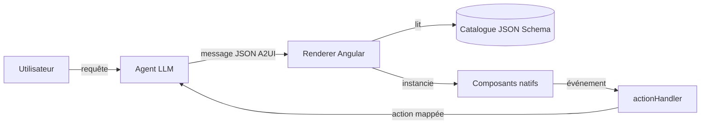

# Angular — Détail du samedi 27 juin 2026

## 1. A2UI 1.0 RC — faire « parler l'UI » à un agent IA depuis Angular

**Source :** Angular Blog — https://blog.angular.dev/demystifying-a2ui-how-to-make-ai-agents-speak-ui-in-your-app-e1ffea2303bd
**Date :** 26 juin 2026

### Contexte

Les agents savent générer du texte ; les faire générer des **interfaces** est plus délicat. Renvoyer du HTML brut produit par un LLM, c'est ouvrir une faille d'injection. **A2UI** (a2ui.org, version 1.0 RC) répond à ça : c'est un **protocole**, pas un framework. Il définit comment un agent et une application cliente s'échangent une **description d'UI** sérialisée en JSON. Le rendu reste à la charge de ta stack — Angular ici — donc tu n'es enfermé dans aucune techno. L'enjeu : des interfaces qui s'adaptent dynamiquement à l'intention utilisateur, portables, et **sans exécution de code arbitraire**.

### Comment ça marche

Le flux est simple à mémoriser. Côté **serveur (agent)**, le LLM produit un message JSON conforme à un schéma : il décrit une arborescence de composants. Côté **client**, un renderer lit ce message et instancie les composants natifs correspondants. Quand l'utilisateur agit (clic, soumission), le client n'exécute rien d'arbitraire : il déclenche une **action mappée** qui renvoie un état structuré à l'agent, lequel répond souvent en appelant des outils.

Quatre briques côté agent structurent tout : le **catalogue** (dictionnaire des composants autorisés, défini en JSON Schema — descriptions, variantes, enfants attendus), la **description d'UI** (consignes en langage naturel : quand utiliser quelle vue), des **exemples** (few-shot prompting pour cadrer le JSON produit), et les **action mappings** (événement utilisateur → requête renvoyée à l'agent). Le point clé de sécurité : tu ne hardcodes pas d'écriture en base dans le client ; tu repasses un *update d'état* à l'IA.



### En pratique — exemple de code

Le message A2UI décrit une arborescence par identifiants (ici une colonne, un titre, une carte, un texte lié à une donnée) :

```json
{
  "version": "v0.9",
  "updateComponents": {
    "surfaceId": "main",
    "components": [
      { "id": "root",    "component": "Column", "children": ["header", "body"] },
      { "id": "header",  "component": "Text",   "text": "Welcome" },
      { "id": "body",    "component": "Card",   "child": "content" },
      { "id": "content", "component": "Text",   "text": { "path": "/message" } }
    ]
  }
}
```

Côté Angular, tu enregistres un renderer dans `app.config.ts` : un catalogue (le basique suffit si tu n'as pas de composants custom) et un `actionHandler` qui relaie l'action à ton service applicatif.

```ts
{
  provide: A2UI_RENDERER_CONFIG,
  useFactory: () => {
    const injector = inject(Injector);
    return {
      catalogs: [new BasicCatalog()],                       // composants standards (Column, Text, Card…)
      actionHandler: (action: A2uiClientAction) =>          // un clic/submit → ton service
        injector.get(Client).handleAction(action),
    };
  },
}
```

### Pourquoi ça compte pour toi

Si tu exposes un agent au-dessus de ton backend .NET ou Symfony, A2UI te donne un contrat **côté UI** aussi propre que tes DTO côté API. Tu déclares les composants autorisés une fois, tu valides le JSON contre ton schéma, et tu évites l'`eval` d'HTML généré. Le pattern « événement → action mappée → requête à l'agent » garde la logique métier serveur-side, où tu peux l'auditer. C'est du GenUI gouvernable.

### Pour aller plus loin

Le catalogue client **doit** matcher exactement les schémas fournis à l'agent : toute dérive produit du JSON irrendérable. Garde une **source de vérité unique** dont tu dérives schéma, exemples et composants. Démarre avec le `BasicCatalog`, ajoute du custom seulement quand un composant standard manque.
