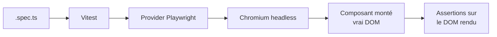

# Angular — Détail du mercredi 8 juillet 2026

## 1. Vitest « Full » Browser Mode — tester tes composants Angular comme un vrai utilisateur

**Source :** Angular Blog (Community Weekly, 7 juillet) — https://blog.angular.dev/community-engineering-agentic-coding-and-real-user-component-testing-%EF%B8%8F-15c768142043
**Date :** 7 juillet 2026

### Contexte

Depuis Angular 21, **Vitest** est le lanceur de tests recommandé, à la place du vieux couple Karma/Jasmine. Par défaut, tes tests unitaires tournent dans **`jsdom`** : une simulation du DOM écrite en JavaScript. C'est rapide, mais `jsdom` ne *rend* rien vraiment. Pas de vrai layout, pas de vraies mesures, un support partiel des APIs navigateur (focus, `IntersectionObserver`, drag, animations).

Younes Jaaidi remet en avant cette semaine le **Browser Mode** de Vitest, en particulier son mode « full » où le composant s'exécute dans un **vrai navigateur** piloté par Playwright. Tu testes alors ce que l'utilisateur voit et manipule réellement, pas une approximation JS.

### Comment ça marche

Le principe est un renversement de la pile de test. Au lieu de `jsdom`, Vitest délègue le rendu à un *provider* (Playwright ou WebdriverIO) qui lance un Chromium headless. Ton `.spec.ts` est compilé, envoyé dans la page, et exécuté **dans** le navigateur. Les interactions passent par de vrais événements du moteur, pas des events synthétiques.

Étape par étape : (1) Vitest lit la config `browser`. (2) Le provider démarre le navigateur. (3) Le composant Angular est monté dans le vrai DOM via TestBed. (4) Tu interagis via l'API `userEvent` (clic, frappe, hover réels). (5) Les assertions portent sur le DOM effectivement rendu, y compris la visibilité CSS.



### En pratique — exemple de code

D'abord, on active le navigateur dans la config Vitest :

```ts
// vitest.config.ts — bascule du jsdom vers un vrai Chromium
import { defineConfig } from 'vitest/config';
import angular from '@analogjs/vite-plugin-angular';

export default defineConfig({
  plugins: [angular()],
  test: {
    browser: {
      enabled: true,
      provider: 'playwright',        // pilote un vrai navigateur
      headless: true,
      instances: [{ browser: 'chromium' }],
    },
  },
});
```

Ensuite, on teste le composant comme le ferait un utilisateur :

```ts
// counter.component.spec.ts
import { render, screen } from '@testing-library/angular';
import { userEvent } from '@vitest/browser/context'; // vrais events navigateur
import { CounterComponent } from './counter.component';

it('incrémente au clic', async () => {
  await render(CounterComponent);               // rendu dans le vrai DOM
  const btn = screen.getByRole('button', { name: /ajouter/i });

  await userEvent.click(btn);                    // clic réel, pas synthétique
  await userEvent.click(btn);

  expect(screen.getByText('Total : 2')).toBeVisible(); // visibilité CSS réelle
});
```

### Pourquoi ça compte pour toi

Tes bugs de front les plus vicieux (focus, z-index, overflow, `IntersectionObserver`) échappent à `jsdom` et passent en prod. Le Browser Mode les attrape dans le pipeline, sans monter une usine E2E. Tu gardes la vitesse du test unitaire mais avec la fidélité d'un vrai navigateur. Réserve-le aux composants « visuels » ; laisse la logique pure en `jsdom`.

---

## 2. Extended Diagnostics du compilateur Angular — attraper les bugs de template au build

**Source :** Angular Blog (Community Weekly, 7 juillet) — https://blog.angular.dev/community-engineering-agentic-coding-and-real-user-component-testing-%EF%B8%8F-15c768142043
**Date :** 7 juillet 2026

### Contexte

TypeScript vérifie ton code `.ts`, mais tes **templates** Angular sont un langage à part. Une faute de frappe dans un binding ne casse pas la compilation TypeScript : elle produit juste un comportement silencieusement faux à l'exécution. Le classique : écrire `([ngModel])` au lieu de `[(ngModel)]` — la « banane dans la boîte » inversée. Le two-way binding ne marche pas, et rien ne t'alerte.

Les **Extended Diagnostics** du compilateur Angular (`ngtsc`) comblent ce trou. Ce sont des vérifications de template au-delà du typage strict, chacune activable en `error`, `warning` ou `suppress`. La *Community Weekly* du 7 juillet remet le sujet en avant via un tutoriel dédié.

### Comment ça marche

Au build (`ng build`, `ng test`), `ngtsc` analyse chaque template et applique les *checks* activés. Chaque diagnostic cible un anti-pattern connu. Quelques exemples parlants : `invalidBananaInBox` détecte le `([...])` mal formé ; `nullishCoalescingNotNullable` repère un `a ?? b` où `a` n'est jamais nul (donc `?? b` est mort) ; `optionalChainNotNullable` signale un `?.` inutile ; `nullishCoalescingNotNullable` et consorts pointent le code défensif qui ment sur les types.

Tu pilotes tout via `angularCompilerOptions.extendedDiagnostics` dans `tsconfig.json` : une catégorie par défaut, plus des surcharges par *check*. En mettant les pièges structurels (comme la banane) en `error`, tu transformes un bug d'exécution silencieux en **échec de build** franc.

### En pratique — exemple de code

La configuration, dans `tsconfig.json` :

```jsonc
// tsconfig.json
{
  "angularCompilerOptions": {
    "strictTemplates": true,
    "extendedDiagnostics": {
      "defaultCategory": "warning",
      "checks": {
        "invalidBananaInBox": "error",          // casse le build si banane inversée
        "nullishCoalescingNotNullable": "warning",
        "optionalChainNotNullable": "suppress"  // trop bruyant sur ce projet
      }
    }
  }
}
```

L'effet concret sur un template, avant/après :

```html
<!-- Avant : banane inversée -> two-way binding cassé, aucun signal -->
<input ([ngModel])="name" />

<!-- Après : invalidBananaInBox=error -> le build échoue tant que ce n'est pas [(...)] -->
<input [(ngModel)]="name" />
```

### Pourquoi ça compte pour toi

C'est de la qualité gratuite : zéro dépendance, déjà dans le compilateur. En CI, un `defaultCategory: "error"` te garantit qu'aucun template douteux ne franchit la barrière. Sur un gros projet Angular hérité, active-les progressivement (d'abord `warning`, puis `error` par *check*) pour éponger la dette de template sans bloquer toute l'équipe d'un coup.
