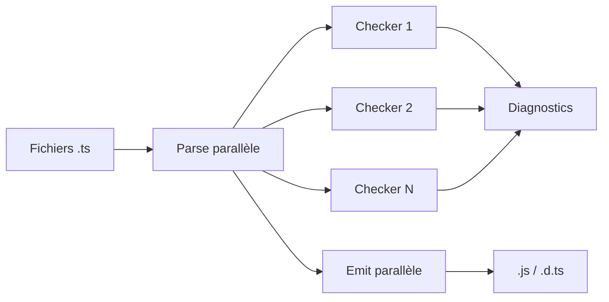

# Angular — Détail du jeudi 9 juillet 2026

## 1. TypeScript 7.0 stable — le compilateur Go est GA, mais Angular reste sur TS 6.0 dans l'éditeur

**Source :** TypeScript Blog (Microsoft) — https://devblogs.microsoft.com/typescript/announcing-typescript-7-0/
**Date :** 8 juillet 2026

### Contexte

Depuis 2012, `tsc` est écrit en TypeScript et tourne sur Node.js. Ça marche, mais ça plafonne : un monorepo réel passe des minutes à type-checker, et le language server peine à charger un gros projet avant que tu aies fini ton café. En mars 2025, l'équipe a annoncé un portage complet du compilateur en **Go**. L'objectif n'était pas de réécrire la logique, mais de la transposer fidèlement, fichier par fichier, pour garantir des résultats identiques entre les deux compilateurs.

Le 8 juillet 2026, ce portage devient **TypeScript 7.0 stable**. Les chiffres publiés parlent d'eux-mêmes : VS Code passe de 125,7 s à 10,6 s de build (11,9×), Sentry de 139,8 s à 15,7 s. Slack rapporte un type-check CI qui tombe de 7,5 min à 1,25 min, et 40 % de temps de merge queue en moins. La consommation mémoire baisse aussi de 6 à 26 %.

Mais TS 7.0 **n'expose pas d'API programmatique**. C'est le point qui te concerne directement : tous les outils qui embarquent le compilateur — `typescript-eslint`, Volar, et donc le **type-checking des templates Angular** — ne peuvent pas encore tourner dessus.

### Comment ça marche

Trois mécanismes expliquent le gain.

**1. Code natif.** Plus de JIT V8, plus de garbage collector JavaScript. Le parsing, la résolution de modules et l'émission se font en Go compilé.

**2. Multithreading à mémoire partagée.** JavaScript est mono-thread ; Go ne l'est pas. TS 7 parallélise le parsing et l'émission, qui sont trivialement indépendants par fichier. Le type-checking, lui, ne l'est pas : chaque fichier dépend des types de ses imports et du scope global.

La solution retenue : **N workers de type-check**, chacun avec sa propre vue du programme. Ils dupliquent un peu de travail commun, mais partitionnent les fichiers **de façon déterministe**. Même entrée → même découpage → mêmes diagnostics. Le défaut est `--checkers 4`. Passer à `--checkers 8` fait grimper VS Code à 16,7× de speedup, au prix de plus de RAM. Sur un runner CI anémique, `--checkers 1` est souvent le bon choix.

**3. `--watch` reconstruit.** L'ancien watcher pollait le disque. TS 7 porte le watcher C++ de Parcel en Go, avec quelques shims assembleur, pour éviter d'ajouter une toolchain C++.



Côté éditeur, TS 7 abandonne le protocole `tsserver` maison au profit de **LSP**, ce qui lui permet de servir plusieurs requêtes simultanément. Les commandes du language server qui échouaient ont chuté de 80 %, les crashs de 60 %.

### En pratique — exemple de code

Le piège n°1 : TS 7.0 adopte les défauts durcis de TS 6.0 et transforme les dépréciations en **erreurs dures**. `rootDir` vaut `./` et `types` vaut `[]`. Deux corrections quasi systématiques :

```jsonc
// tsconfig.json — Avant (TS 6.0, comportement implicite)
{
  "compilerOptions": {
    "target": "es5",              // supprimé en 7.0 → erreur
    "baseUrl": ".",               // supprimé en 7.0 → erreur
    "moduleResolution": "node"    // supprimé → bundler / nodenext
  },
  "include": ["./src"]
}

// tsconfig.json — Après (TS 7.0)
{
  "compilerOptions": {
    "module": "esnext",
    "moduleResolution": "bundler",
    "rootDir": "./src",           // ne vaut plus le dossier commun implicite
    "types": ["node", "jest"]     // défaut = [] : liste tes @types explicitement
  },
  "include": ["./src"]
}
```

Comme Angular ne peut pas encore utiliser TS 7 dans l'éditeur, installe les deux côte à côte via des alias npm :

```json
{
  "devDependencies": {
    "@typescript/native": "npm:typescript@^7.0.2",
    "typescript": "npm:@typescript/typescript6@^6.0.2"
  }
}
```

`npx tsc` utilise alors TS 7 (build rapide en CI), `tsc6` reste disponible pour Volar, `typescript-eslint` et le langage service Angular.

### Pourquoi ça compte pour toi

Sur un front Angular sérieux, le type-check est ta boucle de feedback la plus lente après les tests. Tu peux gagner un ordre de grandeur en CI **dès aujourd'hui**, sans toucher à l'éditeur : `tsc` TS 7 en job de vérification, TS 6.0 pour le language service. Prévois une demi-journée pour purger `baseUrl`, `target: es5` et un `types` explicite. Et surveille TypeScript 7.1 : c'est elle qui débloquera le template type-checking Angular natif.

### Points de vigilance

- **Vue, Svelte, Astro, MDX** sont dans le même bateau qu'Angular : Volar embarque le compilateur, donc TS 6.0 obligatoire.
- Les **types template literal** traitent désormais les emoji comme un seul code point : `HeadTail<"😀abc">` donne `["😀", "abc"]` au lieu de deux moitiés de surrogate pair. Casse les utilitaires `Length<S>` type-level.
- Faire varier `--checkers` peut, dans de rares cas, exposer des diagnostics dépendants de l'ordre. Fige la valeur dans le repo.
