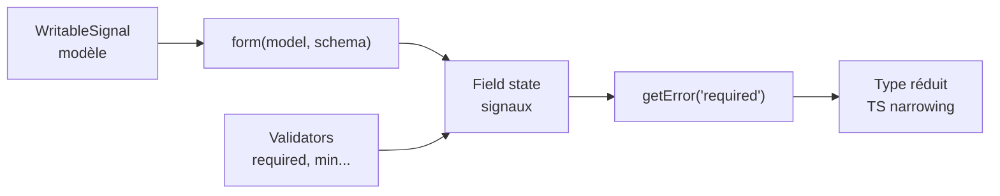

# Angular — Détail du vendredi 10 juillet 2026

## 1. Angular 22 Signal Forms — gestion typée des erreurs avec `getError()`

**Source :** Telerik Blog — https://www.telerik.com/blogs/getting-started-angular-signal-forms
**Date :** 7 juillet 2026

### Contexte

Les **Signal Forms** sont passées **stables dans Angular 22** (annoncé le 3 juin). L'idée fondatrice : un formulaire n'est plus un arbre d'objets `FormControl` piloté par des événements, mais une projection d'un **`WritableSignal`** qui sert de source de vérité unique. Toute modification du champ met à jour le modèle, et inversement, via le graphe réactif des signaux.

Un point douloureux des `Reactive Forms` historiques était la lecture des erreurs : `control.errors?.['required']` renvoyait un type non contraint, souvent traité comme `any`. Tu perdais la complétion et le compilateur ne t'aidait pas. Angular 22 introduit `getError()` avec **narrowing TypeScript** : selon la clé passée, le compilateur connaît la forme exacte de l'objet d'erreur.

### Comment ça marche

Le mécanisme repose sur trois briques. D'abord, `form()` construit un formulaire à partir d'un signal modèle. Ensuite, chaque champ expose un état réactif (valeur, `touched`, `dirty`, erreurs) sous forme de signaux. Enfin, les validateurs sont déclarés dans un schéma associé au champ, et chaque validateur annonce le **type** de l'erreur qu'il peut produire. `getError('required')` exploite ce type pour réduire la valeur de retour.



Le narrowing est un mécanisme purement statique : à la compilation, TypeScript associe le littéral de chaîne `'required'` à la signature du validateur correspondant, et en déduit le type de retour. Tu n'as aucun coût à l'exécution.

### En pratique — exemple de code

Le bloc montre l'évolution : avant, l'accès brut non typé ; après, `getError()` avec un type connu.

```typescript
import { Component, signal } from '@angular/core';
import { form, required, minLength } from '@angular/forms/signals';

@Component({
  selector: 'app-login',
  template: `
    <input [field]="loginForm.email" />
    <!-- Avant : errors['required'] est non typé (any implicite) -->
    @if (loginForm.email().errors()?.['required']) {
      <span>Email requis</span>
    }
    <!-- Après : getError('required') -> type réduit, l'IDE connaît la forme -->
    @if (loginForm.email().getError('required'); as err) {
      <span>{{ err.message }}</span>   <!-- complétion sur err -->
    }
  `,
})
export class LoginComponent {
  // Un seul signal = source de vérité du formulaire
  model = signal({ email: '', password: '' });

  loginForm = form(this.model, (f) => {
    required(f.email, { message: 'Email requis' });
    minLength(f.password, 8);
  });
}
```

### Pourquoi ça compte pour toi

Tu écris des formulaires tous les jours côté front. Le narrowing te rend la complétion et la sécurité de type sur les erreurs, ce que les `Reactive Forms` ne t'offraient pas. Migrer progressivement tes formulaires les plus complexes vers Signal Forms te fait gagner en robustesse : moins de `any`, moins de fautes de frappe sur les clés d'erreur, et un modèle unique de vérité au lieu d'une double synchro `formGroup` / état local.

### Points de vigilance

L'API `@angular/forms/signals` évolue encore vite malgré le statut stable. Épingle ta version d'Angular et relis les notes de release avant une montée mineure ; les noms d'import peuvent bouger.
