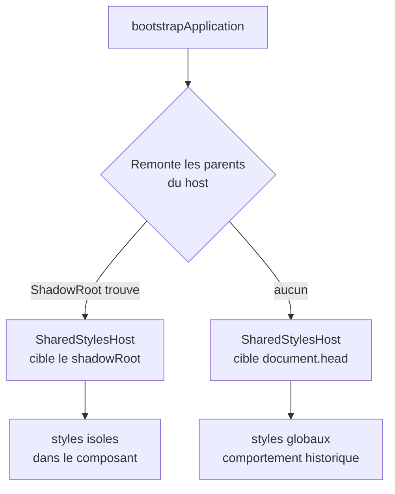
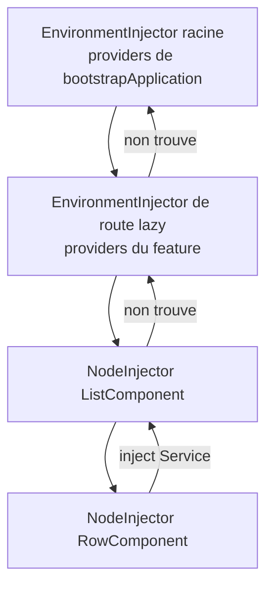

# Angular — Détail du dimanche 26 juillet 2026

## 1. Angular 22.1.0-rc.0 — démarrer une application sous un shadow root

**Source :** GitHub — https://github.com/angular/angular/commit/cdda51a3b2f48d5623acef0c6f54afb7af921b58
**Date :** 22 juillet 2026 (livré dans 22.1.0-rc.0)

### Contexte

Jusqu'ici, embarquer une application Angular dans un Web Component posait un problème de styles. Angular injecte ses feuilles de style via un service interne, `SharedStylesHost`, qui écrit des balises `<style>` dans le `<head>` du document. Or un shadow root est justement conçu pour ne **pas** voir le CSS du document hôte. Résultat : tu bootstrappais une app dans un `shadowRoot`, le DOM se montait correctement, et tout arrivait sans style.

Les contournements existaient — `ViewEncapsulation.ShadowDom` composant par composant, ou une réinjection manuelle des styles — mais ils étaient fragiles et ne couvraient pas les styles globaux ni ceux des bibliothèques tierces. C'est exactement le scénario des micro-frontends : tu veux qu'une équipe livre un bout d'UI Angular qui ne pollue pas et n'est pas pollué par la page hôte.

### Comment ça marche

Le mécanisme se déroule en trois temps.

**Un.** Au démarrage, Angular remonte l'arbre DOM depuis l'élément racine de l'application pour déterminer sa **racine de style**. Concrètement, il cherche le `ShadowRoot` le plus proche en remontant les parents. S'il n'en trouve pas, il retombe sur `document.head` — le comportement historique, inchangé.

**Deux.** Cette racine est mémorisée dans `SharedStylesHost`. Chaque fois qu'un composant demande l'insertion de ses styles, la balise `<style>` est créée dans ce nœud et non dans le `<head>`. Les styles restent donc à l'intérieur de la frontière shadow.

**Trois.** Le nettoyage suit le même chemin. Quand l'application est détruite, les balises sont retirées du shadow root, ce qui évite l'accumulation de styles orphelins si tu montes et démontes plusieurs instances — le cas typique d'un conteneur micro-frontend qui alterne les fragments.

Le point à comprendre : l'isolation obtenue est **bidirectionnelle**. Le CSS de la page hôte ne descend plus dans ton app (hors propriétés héritées et variables CSS), et le tien ne remonte pas. C'est plus fort que `ViewEncapsulation.Emulated`, qui ne fait que préfixer des sélecteurs.



### En pratique — exemple de code

Le custom element crée son shadow root, y place le host Angular, puis bootstrappe dedans.

```ts
// widget-element.ts — un Web Component qui embarque une app Angular isolee
import { bootstrapApplication } from '@angular/platform-browser';
import { WidgetApp } from './widget-app';

class VeilleWidget extends HTMLElement {
  private appRef?: Awaited<ReturnType<typeof bootstrapApplication>>;

  async connectedCallback() {
    // 1. Frontiere shadow : le CSS de la page hote ne descend pas ici
    const shadow = this.attachShadow({ mode: 'open' });

    // 2. Host Angular a l'interieur du shadow root
    const host = document.createElement('widget-app');
    shadow.appendChild(host);

    // 3. Angular remonte jusqu'au shadow root et y enregistre ses styles
    this.appRef = await bootstrapApplication(WidgetApp, { providers: [] });
  }

  disconnectedCallback() {
    // Les balises <style> sont retirees du shadow root, pas du <head>
    this.appRef?.destroy();
  }
}

customElements.define('veille-widget', VeilleWidget);
```

### Pourquoi ça compte pour toi

Si tu exposes des fragments Angular dans une app Symfony ou dans un portail legacy, tu peux enfin livrer un vrai Web Component sans batailler avec le CSS de l'hôte. Ça vaut aussi pour les widgets embarqués chez un client. Attends la 22.1.0 stable avant de miser dessus en production : c'est une RC, et le support des styles globaux tiers mérite un test réel avec ta stack UI.

### Points de vigilance

Les variables CSS et les propriétés héritées traversent la frontière shadow. Si ton design system repose sur des `--tokens` définis au niveau `:root`, ils continueront de s'appliquer — ce qui est souvent souhaitable, mais reste à vérifier consciemment.

---

## 2. `angular:di-graph` — exposer le graphe d'injection de dépendances à un assistant IA

**Source :** GitHub — https://github.com/angular/angular/commit/75f2cb8f566de43a5f2fd27bb2982c796b93490d
**Date :** 22 juillet 2026 (livré dans 22.1.0-rc.0)

### Contexte

Angular v22 avait introduit une notion d'**outils IA in-page** : en mode développement, le framework enregistre dans la page des fonctions que peut appeler un assistant — extension navigateur, agent MCP, DevTools augmenté. L'idée est de donner à la machine un accès structuré à l'état du runtime plutôt que de la laisser deviner à partir du DOM ou du code source.

`angular:di-graph` est le premier outil sérieux de cette famille. Il retourne **le graphe d'injection de dépendances complet** de l'application. Sur une app d'entreprise avec des injecteurs d'environnement, des providers de route, des `inject()` disséminés et trois niveaux de lazy loading, c'est précisément l'information la plus coûteuse à reconstruire à la main.

### Comment ça marche

Le graphe DI d'Angular est une hiérarchie d'**injecteurs**. À la racine, l'`EnvironmentInjector` créé par `bootstrapApplication`. En dessous, les injecteurs d'environnement des routes lazy. Encore en dessous, les `NodeInjector` attachés aux éléments du template, qui suivent la structure du DOM et non celle des modules.

Quand tu appelles `inject(MonService)` dans un constructeur, Angular remonte cette chaîne : d'abord le `NodeInjector` du composant courant, puis ses ancêtres dans le template, puis les injecteurs d'environnement jusqu'à la racine. Le premier qui déclare un provider gagne. C'est ce parcours qui explique les bugs pénibles — deux instances d'un service censé être singleton, ou un `NullInjectorError` sur un service pourtant fourni « quelque part ».

L'outil sérialise cette hiérarchie : pour chaque injecteur, son type (environnement ou nœud), son parent, et la liste des tokens qu'il fournit. Un assistant reçoit donc en un appel ce que tu obtenais avant en cliquant nœud par nœud dans DevTools. Il peut alors répondre à « pourquoi ce service est-il instancié deux fois ? » en raisonnant sur la structure, pas sur des suppositions.



### En pratique — exemple de code

Le contraste avec l'API de debug historique montre l'écart de granularité.

```ts
// Avant — ng.getInjector : un noeud a la fois, exploration manuelle
const el = document.querySelector('app-row')!;
const injector = (window as any).ng.getInjector(el);
console.log(injector.get(MonService));   // il faut deja savoir quoi chercher

// Apres — angular:di-graph : tout le graphe en un appel, en mode dev
const tools = (window as any).ng.getAiTools?.() ?? {};
const graph = await tools['angular:di-graph']();

// Reponse structurée : chaque injecteur, son parent, ses providers
for (const node of graph.injectors) {
  console.log(node.type, node.name, '->', node.providers.map((p: any) => p.token));
}
```

Le nom exact de l'accesseur peut bouger d'ici la 22.1.0 stable ; le commit fait foi. L'outil n'est enregistré qu'en mode développement, jamais dans un bundle de production.

### Pourquoi ça compte pour toi

Sur une app Angular d'entreprise, les erreurs DI coûtent cher en temps de diagnostic. Avoir le graphe en une requête change la donne, que tu lises la sortie toi-même ou que tu la passes à un agent. Vérifie quand même que ton build de production strippe bien ces outils — c'est une surface d'introspection que tu ne veux pas exposer.
