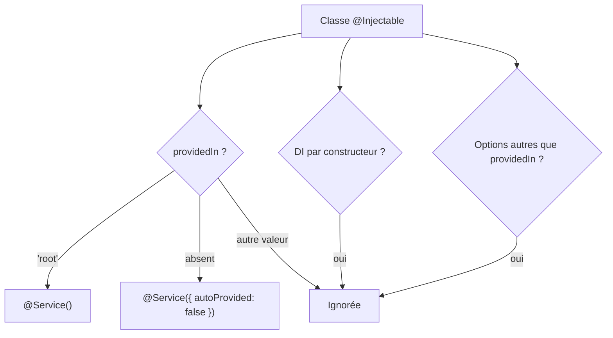
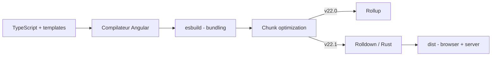

# Angular — Détail du samedi 1er août 2026

## 1. Angular 22.1.0 — `linkedSignal` accepte un setter personnalisé

**Source :** Ninja Squad — https://blog.ninja-squad.com/2026/07/29/what-is-new-angular-22.1
**Date :** 29 juillet 2026

### Contexte

`linkedSignal` comble un trou entre `signal` et `computed`. Un `computed` dérive une valeur d'autres signaux mais reste en lecture seule. Un `signal` est inscriptible mais ne se recalcule jamais tout seul. Beaucoup d'écrans ont besoin des deux : une sélection qui se réinitialise quand la liste change, mais que l'utilisateur peut aussi modifier à la main.

Jusqu'ici, `linkedSignal` gérait ce cas dans un seul sens. Tu déclarais une fonction de dérivation, Angular la rejouait quand une dépendance changeait, et tes `set()` écrivaient dans le signal dérivé sans jamais toucher la source. Résultat : la source et la valeur dérivée pouvaient diverger silencieusement. Angular 22.1 ajoute une option `set` qui te laisse décider ce qu'écrire dans la source.

### Comment ça marche

Décomposons le cycle en trois temps.

**Temps 1 — la dérivation.** Tu passes une fonction de calcul à `linkedSignal`. Elle lit un ou plusieurs signaux sources. Angular enregistre ces lectures comme dépendances, exactement comme pour un `computed`.

**Temps 2 — l'invalidation.** Quand une source change, Angular rejoue la fonction de dérivation et remplace la valeur courante du `linkedSignal`. Toute écriture manuelle précédente est écrasée. C'est le comportement voulu : la sélection redevient cohérente avec la nouvelle liste.

**Temps 3 — l'écriture.** C'est là que 22.1 change la donne. Sans option `set`, un appel à `selectedItem.set(x)` ne touche que la valeur locale. Avec l'option `set`, Angular exécute ta fonction, qui reçoit la valeur écrite et peut à son tour modifier les signaux sources. Tu transformes une dérivation à sens unique en boucle contrôlée.

Le point important : c'est **toi** qui écris la logique de retour. Angular n'infère rien. Si ton setter ne modifie aucune source, le comportement reste celui de la v22.0. Si ton setter modifie une source lue par la dérivation, la dérivation sera rejouée — attention aux boucles, ta fonction doit converger.

### En pratique — exemple de code

```ts
// Avant — v22.0 : selectedItem se réinitialise, mais set() n'informe jamais items
readonly items = signal<Array<ItemModel>>([]);
protected readonly selectedItem = linkedSignal(() => this.items()[0]);

protected selectItem(item: ItemModel) {
  this.selectedItem.set(item); // items reste inchangé, même si item n'y est pas
}

// Après — v22.1 : le setter écrit en retour dans la source
protected readonly selectedItemV22_1 = linkedSignal(() => this.items()[0], {
  set: (item: ItemModel) => {
    const items = this.items();
    // si l'item sélectionné n'existe pas dans la liste, on l'y ajoute en tête
    if (items.indexOf(item) < 0) {
      this.items.set([item, ...items]);
    }
  }
});
```

### Pourquoi ça compte pour toi

Tu as sûrement des composants où une sélection et sa liste se désynchronisent, et tu compenses avec un `effect()` de recollage. Ce setter supprime cet effet parasite : la règle de cohérence vit dans la déclaration du signal, pas dans un side effect ailleurs dans la classe. Moins de code implicite, plus facile à tester.

### Points de vigilance

Ton setter peut déclencher une re-dérivation. Écris-le idempotent : vérifie avant de muter, comme dans l'exemple. Un setter qui écrit systématiquement dans la source produira une boucle de recalcul.

---

## 2. Angular 22.1.0 — migration `@Injectable` → `@Service` et intercepteurs untracked

**Source :** Ninja Squad — https://blog.ninja-squad.com/2026/07/29/what-is-new-angular-22.1
**Date :** 29 juillet 2026

### Contexte

Angular v22 avait introduit le décorateur `@Service()` pour remplacer `@Injectable()`, et le CLI générait déjà les nouveaux services avec. Mais aucune migration automatique n'existait : ton code historique restait en `@Injectable`, et tu te retrouvais avec deux conventions dans le même dépôt. La v22.1 livre le schematic manquant.

En parallèle, un bug de réactivité subtil est corrigé. Un `effect()` qui déclenche une requête HTTP capturait, comme dépendances, tous les signaux lus **dans les intercepteurs** exécutés au passage. Un intercepteur qui lit un signal d'authentification ou de langue rendait l'effet dépendant de ce signal, avec des re-exécutions inexpliquées à la clé.

### Comment ça marche

Le schematic `@angular/core:service` fait une réécriture AST conservatrice. Il parcourt les classes décorées `@Injectable`, classe chaque cas, et ne convertit que ce qu'il sait convertir sans risque.



Trois familles sont volontairement laissées de côté : les classes qui utilisent l'injection par constructeur plutôt qu'`inject()`, celles qui passent des options autres que `providedIn`, et celles dont `providedIn` vaut autre chose que `'root'`. Tu devras les traiter à la main — le schematic préfère te laisser un reste à faire plutôt que produire une conversion douteuse.

Côté effets, la correction est plus mécanique. Angular exécute maintenant la chaîne d'intercepteurs dans un contexte `untracked`. Les signaux lus pendant l'interception ne sont plus enregistrés comme dépendances de l'`effect()` appelant. Le comportement observable devient celui que tu attendais depuis le début.

### En pratique — exemple de code

```bash
# Lance la migration sur tout le workspace
ng generate @angular/core:service
```

```ts
// Avant
import { Injectable } from '@angular/core';

@Injectable({ providedIn: 'root' })
export class UserService {
  private readonly http = inject(HttpClient);
}

// Après — @Service() implique providedIn: 'root'
import { Service } from '@angular/core';

@Service()
export class UserService {
  private readonly http = inject(HttpClient);
}

// Un @Injectable() nu devient explicitement non auto-fourni
@Service({ autoProvided: false })
export class LegacyTokenStore {}
```

### Pourquoi ça compte pour toi

Passe le schematic maintenant, pendant que ton diff reste lisible, plutôt que sous pression à la v23. Et si tu traînais des `effect()` qui se re-déclenchaient sans raison autour de tes appels HTTP, teste-les à nouveau : la cause était probablement un signal lu dans un intercepteur. Garde quand même le réflexe `untracked()` dans tes effets.

---

## 3. Angular 22.1.0 — Rolldown stable, cadence annuelle et JSONP déprécié

**Source :** Ninja Squad — https://blog.ninja-squad.com/2026/07/29/what-is-new-angular-22.1
**Date :** 29 juillet 2026

### Contexte

Le chunk optimization d'Angular date de la v18.1. C'est l'étape qui, après le bundling esbuild, regroupe et redécoupe les chunks JavaScript pour réduire le nombre de requêtes et la taille transférée. Elle s'appuyait sur Rollup. En v22.0, Rolldown — la réécriture en Rust de Rollup — était disponible derrière la variable d'environnement `NG_BUILD_CHUNKS_ROLLDOWN`. En v22.1, Rolldown devient le défaut.

Deuxième changement structurant, indépendant du code : Angular passe à **une majeure par an, en juin**. La v23 arrive en juin 2027 et non en novembre 2026. Les mineures sortent toutes les deux mois, quatre à six fois par an, et une majeure est supportée deux ans au lieu de dix-huit mois.

### Comment ça marche

Le pipeline de build Angular enchaîne trois étages, et seul le troisième change.



L'étage de chunk optimization ne recompile rien : il réorganise des modules déjà transformés. C'est pour ça que le swap Rollup → Rolldown est un changement de moteur à sortie équivalente, avec un gain sur le temps de build et non sur le bundle produit. Nouveauté associée : l'optimisation s'applique désormais aussi aux **builds serveur**. Elle en était exclue parce qu'elle cassait le preloading ; ce point est résolu.

Troisième point, JSONP. La technique consiste à injecter une balise `<script>` pointant vers un domaine tiers et à exécuter la réponse comme du JavaScript dans le contexte global. Elle contourne la same-origin policy — c'était son intérêt avant CORS — mais aussi ta Content Security Policy, et elle transforme n'importe quelle réponse compromise en XSS. Angular la déprécie : `withJsonpSupport()` déclenche un warning en mode dev, et la suppression est annoncée.

### En pratique — exemple de code

```bash
# v22.1 : Rolldown par défaut pour le chunk optimization
ng build

# Repli explicite sur Rollup si tu constates une régression
NG_BUILD_CHUNKS_ROLLDOWN=false ng build
```

```ts
// Avant — JSONP, déprécié en v22.1 (warning en dev)
provideHttpClient(withJsonpSupport());

// Après — requête HTTP standard ; l'API tierce doit exposer du CORS
provideHttpClient(withFetch());
// puis, côté service :
// this.http.get<Rates>('https://api.exemple.com/rates')
```

### Pourquoi ça compte pour toi

La cadence annuelle change ta planification : une seule fenêtre de breaking changes par an, en juin, et deux ans de support. Tu peux étaler tes montées de version au lieu de les subir deux fois l'an. Côté build, teste Rolldown sur ta CI avant de propager — le repli est une variable d'environnement. Et si tu as encore du JSONP, c'est le moment de le retirer.

### Pour aller plus loin

La v22.1 stabilise aussi trois outils MCP du CLI (`run_target`, `devserver.start`, `devserver.stop`, `devserver.wait_for_build`), enregistrés par défaut au démarrage du serveur MCP. Le cache de build est partagé entre worktrees git, ce qui accélère les workflows où un agent travaille dans un worktree séparé.
