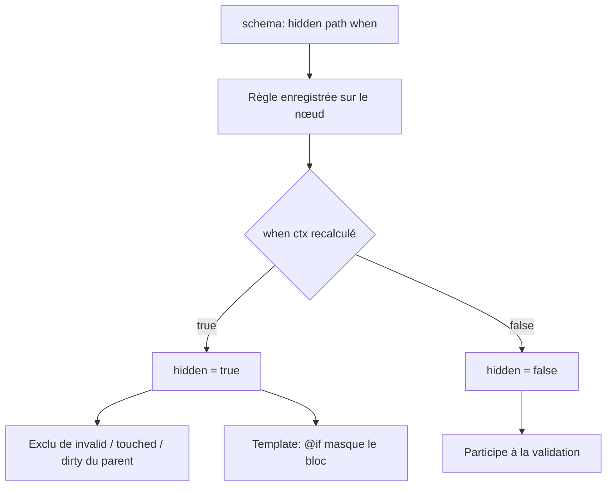
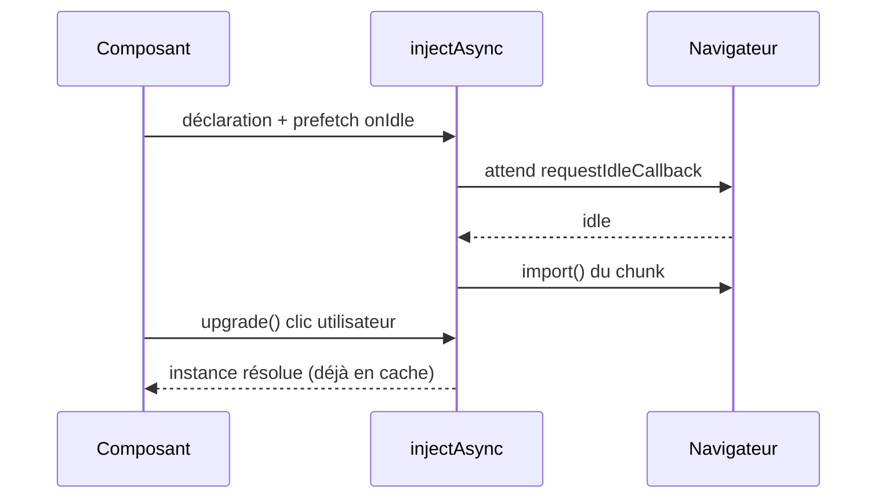

# Angular — Détail du lundi 3 août 2026

## 1. Signal Forms — `hidden`, `disabled` et `readonly` passent à l'option `when`

**Source :** ANGULARarchitects (Manfred Steyer) — https://www.angulararchitects.io/en/blog/angular-22-the-most-important-new-features-at-a-glance/
**Date :** article du 3 juin 2026, tenu à jour pour Angular 22

### Contexte

Signal Forms est stable depuis Angular 22. Le principe : tu déclares un schéma de règles sur un arbre de champs (`FieldTree`), et chaque règle est une fonction réactive recalculée quand un signal source change. Les validateurs (`required`, `minLength`, `validateAsync`) forment la première famille de règles. La seconde famille, moins connue, contrôle l'état d'interaction : `disabled`, `readonly` et `hidden`.

Ces trois fonctions ont été introduites en v21 avec une signature positionnelle : `hidden(path, logic)`. La documentation de référence encore servie pour la v21 montre cette forme. Le problème est que `disabled` avait besoin de retourner davantage qu'un booléen — une raison affichable à l'utilisateur — et qu'une signature positionnelle ne laisse pas de place pour ajouter des options plus tard. Angular 22 a donc uniformisé les trois fonctions autour d'un objet d'options portant une propriété `when`. C'est une évolution d'API silencieuse : elle ne casse pas au runtime, elle casse à la compilation, et elle passe facilement sous le radar si tu suis un tutoriel v21.

### Comment ça marche

Le mécanisme se déroule en trois temps. D'abord, à la construction du formulaire, `form(model, schema)` exécute le schéma une seule fois. Les appels à `hidden(path, …)` n'évaluent rien : ils enregistrent une règle sur le nœud désigné par `path`. Ensuite, quand tu lis `flightForm.delay().hidden()` dans le template, Angular évalue la lambda `when` dans un contexte réactif. Le paramètre `ctx` expose `valueOf(otherPath)`, ce qui permet des conditions croisées entre champs sans passer par le modèle brut. Enfin, le résultat est mémorisé comme un `computed` : la lambda n'est réexécutée que si l'un des signaux qu'elle lit change.

Le point à retenir concerne la propagation. Un champ marqué `hidden` est retiré de l'agrégation de son parent : il ne contribue plus à `invalid()`, ni à `touched()`, ni à `dirty()`. C'est ce qui rend le pattern utilisable — un champ conditionnel invalide ne bloque plus la soumission. En revanche, la valeur reste dans le modèle. Si ton API refuse un champ inattendu, tu dois nettoyer le payload avant l'envoi.

Deuxième point : `hidden` ne touche pas au DOM. La directive `[formField]` n'applique aucun attribut `hidden` sur l'élément. Angular assume ce choix, car masquer un champ implique presque toujours de masquer aussi son `<label>`, son message d'erreur et son conteneur. Tu gardes donc un `@if` dans le template.



### En pratique — exemple de code

Le formulaire ci-dessous n'affiche le champ « minutes de retard » que si la case « vol retardé » est cochée.

```ts
// Avant (v21) — condition positionnelle, pas d'options possibles
hidden(path.delay, (ctx) => !ctx.valueOf(path.delayed));

// Après (v22) — objet d'options, aligné sur disabled et readonly
import { disabled, hidden, readonly } from '@angular/forms/signals';

hidden(path.delay, {
  when: (ctx) => !ctx.valueOf(path.delayed), // caché tant que le vol n'est pas retardé
});

readonly(path.flightNumber, {
  when: (ctx) => ctx.valueOf(path.locked),
});

// disabled peut retourner une chaîne : elle sert de raison affichable
disabled(path.delay, {
  when: (ctx) => (ctx.valueOf(path.delayed) ? false : 'Vol non retardé'),
});
```

Côté template, le garde reste obligatoire — sinon l'input reste visible et éditable :

```html
@if (!flightForm.delay().hidden()) {
  <label for="delay">Retard (min)</label>
  <input id="delay" type="number" [formField]="flightForm.delay" />
}
```

### Pourquoi ça compte pour toi

Si tu portes un back-office de formulaires métier vers Signal Forms, tu vas écrire des dizaines de règles conditionnelles. Adopte tout de suite la forme `{ when }` : les exemples v21 que tu croiseras encore ne compilent plus. Retiens surtout que `hidden` ne masque rien tout seul — c'est une règle d'état, pas une directive de rendu. Oublier le `@if` produit un champ visible qui n'est plus validé : le pire des deux mondes.

### Points de vigilance

La valeur d'un champ caché reste dans le modèle sérialisé. Filtre ton payload avant l'appel API si le backend rejette les propriétés inattendues.

---

## 2. `injectAsync` et `onIdle` — charger un service à la demande, le précharger sans le bloquer

**Source :** ANGULARarchitects (Manfred Steyer) — https://www.angulararchitects.io/en/blog/angular-22-the-most-important-new-features-at-a-glance/
**Date :** article du 3 juin 2026, tenu à jour pour Angular 22

### Contexte

Le lazy loading Angular a longtemps été un mécanisme de routeur : tu découpais par route via `loadComponent` ou `loadChildren`. Ça marche bien pour des pages, mal pour des dépendances transverses. Le cas typique : un service qui embarque une grosse librairie — export PDF, éditeur de code, moteur de graphes — et qui n'est utilisé que si l'utilisateur clique sur un bouton précis. Le mettre en `providedIn: 'root'` le fait entrer dans le bundle initial même si personne ne l'appelle jamais.

`injectAsync` déplace le découpage au niveau de l'injecteur. Tu décris comment obtenir le service plutôt que de l'obtenir tout de suite. Angular renvoie une fonction qui, au premier appel, déclenche l'import dynamique, résout le service dans l'injecteur courant, puis mémorise le résultat.

### Comment ça marche

`injectAsync` prend une lambda qui retourne une `Promise` de classe de service. Elle doit être appelée dans un contexte d'injection — champ d'instance d'un composant, `inject()` classique, ou fonction d'initialisation. Ce qu'elle retourne n'est pas le service mais un « thunk » asynchrone : `() => Promise<T>`.

Au premier appel de ce thunk, trois choses se produisent en séquence. L'import dynamique est déclenché, ce qui fait charger le chunk correspondant au navigateur. La classe résolue est ensuite passée à l'injecteur pour instanciation — d'où la contrainte d'auto-provisionnement : Angular doit pouvoir créer l'instance sans provider explicite, donc le service porte `@Service()` ou `@Injectable({ providedIn: 'root' })`. Enfin la promesse est mémorisée : les appels suivants ne rechargent rien.

Reste le coût du premier appel : l'utilisateur clique et attend le téléchargement du chunk. C'est le rôle de l'option `prefetch`. Elle reçoit une fonction qui retourne une `Promise` ; dès que celle-ci se résout, Angular lance le chargement en tâche de fond. `onIdle` est l'implémentation fournie : elle s'appuie sur `requestIdleCallback` et retombe sur `setTimeout` quand le navigateur ne le supporte pas. Tu peux borner l'attente avec `onIdle({ timeout: 100 })`, pour garantir que le préchargement finit par partir même sur une page qui ne devient jamais inactive.



### En pratique — exemple de code

```ts
import { injectAsync, onIdle } from '@angular/core';

@Component({ /* ... */ })
export class CheckinPage {
  // Le chunk d'UpgradeService n'entre pas dans le bundle initial.
  private readonly upgradeService = injectAsync(
    () => import('./upgrade-service').then((m) => m.UpgradeService),
    { prefetch: () => onIdle({ timeout: 2000 }) }, // préchargé au repos, 2 s max
  );

  protected async upgrade(): Promise<void> {
    // Premier appel : résout (ou attend) le chunk, puis mémorise l'instance.
    const svc = await this.upgradeService();
    svc.upgrade(this.checkinFormModel().ticketId);
  }
}
```

Le service cible doit rester auto-provisionné :

```ts
import { Service } from '@angular/core';

@Service() // équivalent ergonomique de @Injectable({ providedIn: 'root' })
export class UpgradeService {
  upgrade(ticketId: string): void { /* ... */ }
}
```

### Pourquoi ça compte pour toi

Tu peux enfin découper un bundle par dépendance et pas seulement par route. Repère dans ton app les services lourds appelés par un seul bouton : export Excel, génération PDF, éditeur riche. Chacun devient un `injectAsync` avec `prefetch: onIdle` — coût zéro au démarrage, latence quasi nulle au clic. Attention au piège : si tu passes un service provisionné au niveau route ou composant, la résolution échoue.

### Limites

`injectAsync` ne fonctionne pas pour un service dont le provider dépend d'un token dynamique ou d'une factory locale. Dans ce cas, garde l'import statique.
