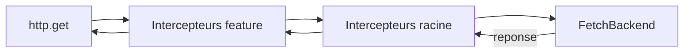
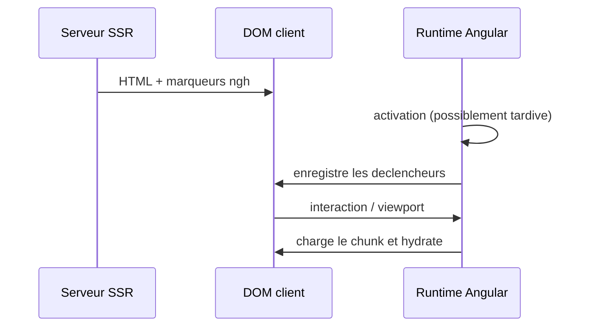

# Angular — Détail du samedi 8 août 2026

## 1. Angular 22.2.0-next.1 — les intercepteurs racine passent dans la chaîne terminale

**Source :** angular/angular (GitHub Releases) — https://github.com/angular/angular/releases/tag/v22.2.0-next.1
**Date :** 7 août 2026

### Contexte

Depuis Angular 22, `HttpClient` utilise `FetchBackend` par défaut : plus de `XMLHttpRequest`, plus de `HttpXhrBackend`. Ce changement a l'air cosmétique côté API, mais il déplace du code dans la chaîne d'exécution des requêtes. Or cette chaîne est empilée : Angular compose les intercepteurs en une suite de fonctions, chacune recevant `next` pour passer la main à la suivante, la dernière appelant le backend.

Angular distingue deux familles d'intercepteurs. Ceux déclarés à la racine, via `provideHttpClient(withInterceptors([...]))` sur l'injecteur applicatif. Et ceux déclarés plus bas, sur une route ou un composant, via `withInterceptors` dans les `providers` d'une feature. Jusqu'à cette version, un intercepteur racine pouvait s'exécuter en dehors de la chaîne terminale — celle qui aboutit réellement au backend. Résultat : ton intercepteur d'authentification voyait une requête, mais pas forcément *la* requête envoyée sur le réseau. La 22.2.0-next.1 corrige cet ordonnancement.

### Comment ça marche

Décomposons la chaîne, étape par étape.

1. Tu appelles `http.get('/api/orders')`. Angular crée un `HttpRequest` immuable.
2. Angular récupère la liste des intercepteurs visibles depuis l'injecteur courant. Un composant lazy-loadé a son propre injecteur, enfant de l'injecteur racine.
3. Angular replie cette liste de droite à gauche en une seule fonction `handle(req)`. Chaque intercepteur reçoit `(req, next)`.
4. Le dernier maillon n'est pas un intercepteur : c'est le backend. En v22, `FetchBackend`.
5. La requête descend la chaîne, le backend émet la réponse, et celle-ci **remonte** la même chaîne en sens inverse.

Le point subtil est l'étape 2. Comme les injecteurs sont hiérarchiques, un intercepteur de feature vit dans un injecteur enfant, et l'intercepteur racine dans le parent. Le correctif garantit que les intercepteurs racine sont bien insérés dans la chaîne qui se termine par le backend, et non dans une chaîne parallèle qui s'arrête avant. Concrètement : ton `authInterceptor` racine voit maintenant la requête telle qu'un intercepteur de feature l'a modifiée, pas la version d'origine.



Deux autres correctifs du même lot touchent `FetchBackend` directement. Le premier : le backend n'appelle plus `AbortController.abort()` sur une requête déjà complétée. Avant, un `unsubscribe()` tardif — typiquement un `switchMap` qui bascule après réception — déclenchait un `abort()` inutile, et selon le navigateur un `AbortError` remontait dans ta télémétrie. Le second : le décodeur de texte respecte désormais le paramètre `charset` du header `Content-Type`. Si ton API legacy renvoie `text/plain; charset=iso-8859-1`, tu récupérais des caractères cassés parce que le décodage était forcé en UTF-8.

### En pratique — exemple de code

```ts
// Avant — l'intercepteur racine pouvait ne pas voir les mutations d'une feature
export const authInterceptor: HttpInterceptorFn = (req, next) => {
  const token = inject(TokenStore).value();
  // req.headers pouvait être la version d'origine, sans le header ajouté plus bas
  return next(req.clone({ setHeaders: { Authorization: `Bearer ${token}` } }));
};

// Après — 22.2.0-next.1 : la chaîne terminale garantit l'ordre
// L'intercepteur racine reçoit la requête telle que la feature l'a laissée.
bootstrapApplication(App, {
  providers: [
    provideHttpClient(withInterceptors([authInterceptor])), // racine
  ],
});

// Dans une route lazy — s'exécute AVANT l'intercepteur racine
export const routes: Routes = [{
  path: 'orders',
  providers: [provideHttpClient(withInterceptors([tenantInterceptor]))],
  loadComponent: () => import('./orders.page'),
}];
```

### Pourquoi ça compte pour toi

Si tu empiles auth au niveau racine et contexte métier au niveau route, l'ordre décide de ce que ton backend reçoit. Vérifie tes tests d'intégration HTTP après montée en 22.2 : un intercepteur qui lisait `req.headers` peut maintenant voir des en-têtes qu'il ne voyait pas. Et purge tes alertes `AbortError` — elles devraient disparaître d'elles-mêmes.

### Points de vigilance

C'est une pre-release (`next.1`). Teste-la sur une branche, pas sur `dev`. Le correctif de `charset` peut changer le contenu décodé d'endpoints legacy : si tu avais un contournement maison qui re-décodait la réponse, il devient un double décodage.

---

## 2. Angular 22.2.0-next.1 — les déclencheurs d'hydratation attendent l'activation tardive du runtime

**Source :** angular/angular (GitHub Releases) — https://github.com/angular/angular/releases/tag/v22.2.0-next.1
**Date :** 7 août 2026

### Contexte

L'hydratation incrémentale permet à un bloc `@defer` rendu côté serveur de rester du HTML inerte tant qu'un déclencheur ne s'est pas produit : survol, entrée dans le viewport, interaction. Angular installe pour cela des écouteurs légers sur le DOM sérialisé, avant même que le code du composant ne soit chargé. Cette mécanique repose sur un ordre précis : le runtime Angular s'active, puis il enregistre les déclencheurs sur les régions marquées dans le HTML.

Le problème corrigé ici concerne l'activation tardive du runtime. Sur une page lourde, ou avec un chargement de script différé, le bundle Angular peut démarrer plusieurs centaines de millisecondes après le premier rendu. Dans ce créneau, la séquence d'initialisation pouvait tenter d'enregistrer les déclencheurs avant que le runtime ne soit prêt. Les écouteurs partaient dans le vide et le bloc `@defer` ne s'hydratait jamais : visible, mais mort au clic.

### Comment ça marche

Reprenons pas à pas ce que fait l'hydratation incrémentale.

1. Le serveur rend le composant, y compris le contenu de `@defer`, et sérialise dans le HTML des marqueurs de nœuds (`ngh`) décrivant la structure attendue.
2. Le client charge le HTML. Rien n'est interactif : ni composants instanciés, ni listeners applicatifs.
3. Angular démarre et, via `provideClientHydration(withIncrementalHydration())`, parcourt les marqueurs pour retrouver les régions différées.
4. Pour chaque région, il installe un déclencheur natif (`IntersectionObserver` pour `on viewport`, écouteur d'événement pour `on interaction`).
5. Quand le déclencheur se déclenche, Angular charge le chunk du bloc, instancie les composants et rattache l'état au DOM existant — sans recréer les nœuds.

Le correctif porte sur la transition 3 → 4 : l'initialisation des déclencheurs est maintenant repoussée après l'activation effective du runtime. Deux autres garde-fous complètent le lot. Un avertissement de développement est émis quand un binding `[style.propriété]` reçoit une valeur invalide, au lieu d'être silencieusement ignoré. Et `parseCookieValue` retire les guillemets doubles autorisés par la RFC 6265 et attrape les `URIError` levées par `decodeURIComponent` sur un cookie mal encodé — ce dernier point évite qu'un cookie tiers pourri fasse planter la lecture du jeton XSRF.



### En pratique — exemple de code

```ts
// bootstrap : hydratation incrémentale + event replay
bootstrapApplication(App, {
  providers: [
    provideClientHydration(
      withIncrementalHydration(), // active les déclencheurs sur les @defer SSR
      withEventReplay(),          // rejoue les clics survenus avant hydratation
    ),
  ],
});
```

```html
<!-- Le bloc est rendu par le serveur, puis hydraté au premier survol.
     Avant le correctif, une activation tardive du runtime pouvait
     laisser ce bloc visible mais définitivement inerte. -->
@defer (hydrate on interaction) {
  <app-order-editor [order]="order()" />
} @placeholder {
  <app-order-skeleton />
}
```

### Pourquoi ça compte pour toi

Si tu fais du SSR Angular avec `@defer (hydrate ...)`, tu as peut-être des blocs qui « ne réagissent pas » de façon intermittente en production, surtout sur mobile ou réseau lent. C'est exactement ce profil de bug. Ajoute `withEventReplay()` si ce n'est pas fait : il conserve les clics arrivés pendant la fenêtre morte et les rejoue après hydratation.

### Limites

Le correctif n'est disponible que dans la pre-release 22.2.0-next.1. Les branches 21.x et 20.x ne l'ont pas reçu à ce stade.
