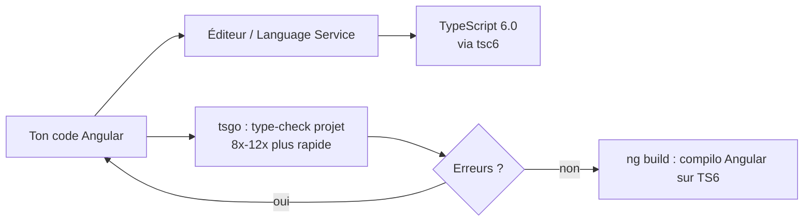

# Angular — Détail du dimanche 9 août 2026

## 1. TypeScript 7.0 GA — le compilateur natif `tsgo` et ce que ça change pour Angular

**Source :** TypeScript Blog — https://devblogs.microsoft.com/typescript/announcing-typescript-7-0/
**Date :** 8 juillet 2026 (adoption outillage en cours, août 2026)

### Contexte

Depuis dix ans, `tsc` est écrit en TypeScript et tourne sur Node. Sur un gros monorepo Angular, le type-check et l'IDE deviennent lents : ouvrir un fichier avec erreur dans le dépôt VS Code prenait ~17,5 s. Microsoft a réécrit le compilateur **de zéro en Go** (nom de code « tsgo »). Objectif : garder exactement la même sémantique de types, mais avec la vitesse du code natif et le vrai multi-threading. Le résultat est sorti en GA le 8 juillet, et l'écosystème (Rider 2026.2, Visual Studio 2026) l'intègre depuis.

### Comment ça marche

Le gain vient de trois leviers : (1) code natif compilé au lieu de JS interprété, (2) **mémoire partagée multi-thread** — impossible proprement en JS — pour paralléliser le check des fichiers, (3) un serveur de langage bâti sur **LSP**. Résultat annoncé : **8× à 12×** sur un build complet, et l'exemple VS Code passe de 17,5 s à moins de 1,3 s.

Le piège : `tsgo` **n'expose pas encore l'API programmatique** (`ts.createProgram`, `ts.transform`, `ts.factory`). Or c'est précisément cette API qu'utilisent typescript-eslint, les compilateurs de templates de Vue/Svelte/Astro **et le compilateur Angular** (AOT, langage de template). Tant qu'elle n'est pas là (prévue en **7.1**), ces outils ne peuvent pas s'appuyer sur `tsgo`. Microsoft fournit un pont : le package `@typescript/typescript6` réexporte l'API 6.0 via un binaire `tsc6`, pour que l'outillage existant continue de tourner.



### En pratique — exemple de code

Approche hybride recommandée aujourd'hui : `tsgo` valide vite en CLI/CI, l'éditeur et `ng build` restent sur TS6.

```jsonc
// package.json — installe les deux et lance un check rapide en parallèle du build
{
  "devDependencies": {
    "typescript": "6.0.x",          // éditeur + compilateur Angular (stable)
    "@typescript/native-preview": "7.0.x" // fournit le binaire tsgo
  },
  "scripts": {
    // Avant : check lent via tsc (Node)
    "check:old": "tsc --noEmit -p tsconfig.app.json",
    // Après : même vérif, native, en une fraction du temps
    "check": "tsgo --noEmit -p tsconfig.app.json",
    "build": "ng build"             // reste sur TypeScript 6 pour l'instant
  }
}
```

`tsgo --noEmit` ne génère rien : il ne fait que la vérification de types, idéale en pre-commit et en CI où le temps compte.

### Pourquoi ça compte pour toi

Tu n'as rien à migrer dans Angular 22 : garde TypeScript 6 pour l'éditeur et `ng build`. Mais branche `tsgo --noEmit` dans ta CI dès maintenant : sur un gros front, un type-check qui passe de plusieurs minutes à quelques secondes raccourcit chaque boucle de feedback. Quand TS 7.1 livrera l'API et qu'Angular rétroportera le support, la bascule complète sera indolore car tu connaîtras déjà le gain réel sur ton dépôt.

### Pour aller plus loin

Vue, Svelte et typescript-eslint sont dans le même bateau : tous attendent 7.1. Ce n'est pas une limite d'Angular mais de l'API `tsgo`.
