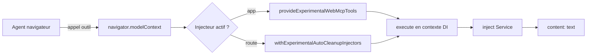

# Angular — Détail du mercredi 12 août 2026

## 1. Angular 22 — WebMCP expérimental : exposer des outils typés aux agents du navigateur

**Source :** Angular Docs — https://angular.dev/ai/webmcp
**Date :** 10 août 2026 (documentation v22.1.1, relayée par InfoQ)

### Contexte

Les agents IA qui tournent dans le navigateur pilotent aujourd'hui les applications web par le DOM. Ils cherchent un bouton, simulent un clic, lisent un texte. C'est fragile : un changement de classe CSS ou un rendu conditionnel casse l'automatisation. C'est aussi coûteux, parce que l'agent doit consommer l'arbre DOM entier comme contexte avant d'agir.

**WebMCP** est un standard web émergent, poussé par le groupe `webmachinelearning`. Son idée : l'application déclare elle-même des **outils** — nom, description, schéma d'entrée, fonction d'exécution — que l'agent appelle directement via `navigator.modelContext`. Plus de scraping. L'exemple canonique de la doc Angular est parlant : au lieu de faire naviguer un agent dans un wizard d'inscription en cinq écrans, tu exposes un outil `createUser` qu'il appelle en une fois.

Angular 22 ajoute un support **expérimental** de ce standard. Le point d'intérêt n'est pas le protocole lui-même, mais la façon dont Angular le branche sur son système d'injection de dépendances.

### Comment ça marche

Le mécanisme tient en trois niveaux, du plus statique au plus dynamique.

**Niveau application.** Tu passes `provideExperimentalWebMcpTools([...])` dans les providers de `bootstrapApplication`. Angular enregistre les outils quand l'application démarre, et les désenregistre quand elle est détruite. Le callback `execute` est invoqué **dans le contexte d'injection** de l'injecteur associé. Tu peux donc appeler `inject(MonService)` directement à l'intérieur, sans passer par un champ de classe.

**Niveau route.** Tu mets le même `provideExperimentalWebMcpTools` dans les `providers` d'une route. L'outil n'existe alors que pendant que cette route est active. Attention au piège documenté : sans `withExperimentalAutoCleanupInjectors()` sur `provideRouter`, l'injecteur de route n'est pas détruit à la navigation, et l'outil **reste exposé à l'agent** sur toutes les pages suivantes.

**Niveau service.** `declareExperimentalWebMcpTool({...})` enregistre un outil depuis n'importe quel contexte d'injection et le retire quand ce contexte meurt. Pratique, mais WebMCP impose des noms d'outils uniques : deux enregistrements du même nom lèvent une erreur au runtime. D'où la recommandation de la doc — préférer les providers d'application, de route, ou les services root, et éviter les constructeurs de composants susceptibles d'être instanciés plusieurs fois.

Le typage est le point agréable. Tu décris `inputSchema` en JSON Schema, et Angular **infère les types TypeScript** des paramètres de `execute`. Mettre `required: ['query']` retire `undefined` du type de `query` ; `additionalProperties: false` restreint l'objet d'arguments aux seules propriétés déclarées.

Dernier point, et il est important : **Angular ne valide pas les entrées**. Le schéma sert à décrire l'outil à l'agent et à typer ton code. Rien ne garantit que ce qui arrive dans `execute` respecte le contrat. La doc te demande explicitement de valider à la main.



### En pratique — exemple de code

Un outil applicatif avec paramètres typés, puis un outil limité à une route.

```ts
// main.ts — outil global, typé par JSON Schema
bootstrapApplication(AppRoot, {
  providers: [
    provideExperimentalWebMcpTools([{
      name: 'searchCatalog',
      description: 'Cherche des produits dans le catalogue.',
      inputSchema: {
        type: 'object',
        properties: {
          query: {type: 'string', description: 'Mots-clés.'},
          maxResults: {type: 'number', description: 'Nombre max de résultats.'},
        },
        required: ['query'],          // => `query: string`, plus `string | undefined`
        additionalProperties: false,  // => aucun autre argument accepté côté types
      },
      execute: ({query, maxResults}) => {
        // Valide toi-même : le schéma n'est PAS appliqué au runtime par Angular.
        if (typeof query !== 'string') throw new Error(`query invalide: ${query}`);
        const catalog = inject(CatalogService); // contexte d'injection disponible ici
        return {content: [{type: 'text', text: catalog.search(query, maxResults ?? 5)}]};
      },
    }]),
  ],
});
```

```ts
// app.config.ts — sans cette option, l'outil de route survit à la navigation
export const appConfig: ApplicationConfig = {
  providers: [provideRouter(routes, withExperimentalAutoCleanupInjectors())],
};
```

### Pourquoi ça compte pour toi

Tu écris déjà des serveurs MCP côté back. WebMCP déplace une partie du contrat vers le front, dans le navigateur de l'utilisateur, avec sa session et ses cookies. Traite chaque outil exposé comme un endpoint public : valide les entrées, applique tes règles d'autorisation dans `execute`, et vérifie que `withExperimentalAutoCleanupInjectors` est actif. Un outil oublié après navigation, c'est une surface d'attaque silencieuse.

### Points de vigilance

API expérimentale : elle peut changer **hors** d'une version majeure. Ne la mets pas sur un chemin critique en production sans plan de repli.

---

## 2. Signal Forms en outil WebMCP implicite — le schéma JSON inféré du modèle

**Source :** InfoQ — https://www.infoq.com/news/2026/08/angular-v22-released/
**Date :** 10 août 2026

### Contexte

Angular v22 stabilise Signal Forms : le typage fort des reactive forms, l'ergonomie des template-driven forms, le tout piloté par des signaux. InfoQ note que la même release embarque WebMCP, et que les deux se croisent sur un point précis — un formulaire peut devenir un **outil d'agent sans que tu écrives de schéma JSON**.

L'idée mérite qu'on s'y arrête. Écrire un `inputSchema` à la main pour chaque formulaire est fastidieux et se désynchronise du modèle à la première évolution. Or Angular connaît déjà la forme du modèle, ses validateurs et son action de soumission. Il a tout ce qu'il faut pour générer le schéma.

### Comment ça marche

Deux étapes. D'abord `provideExperimentalWebMcpForms()` dans les providers racine, qui active la fonctionnalité. Ensuite l'option `experimentalWebMcpTool` passée à `form()`, avec un nom et une description.

À partir de là, Angular **inspecte la valeur initiale** du signal modèle pour construire le schéma :

1. Chaque propriété du modèle devient un paramètre. `firstName: ''` donne `{type: 'string'}`, `age: 0` donne `{type: 'number'}`.
2. Les validateurs `required(f.firstName)` marquent le champ comme requis dans le schéma.
3. `hobbies: ['Web Development']` devient un tableau de chaînes, de longueur libre — l'agent peut en fournir autant qu'il veut.

D'où deux contraintes structurelles, explicitement documentées. Angular ne peut rien inférer de `null` ou `undefined` : il faut des **valeurs initiales concrètes**. Et il ne peut rien inférer d'un tableau vide : il faut **au moins un élément** dans la valeur initiale.

Le point vraiment intéressant est la boucle de retour. Angular ne se contente pas de générer le schéma d'entrée. Il **connecte l'outil à la logique de validation et au handler de soumission**. Quand l'agent appelle l'outil avec des valeurs invalides, il reçoit les messages d'erreur du formulaire. Quand `submission.action` échoue, il le voit aussi. L'agent peut donc corriger et réessayer, au lieu d'échouer en silence.

Une limite à connaître : les **validateurs asynchrones ne sont pas déclenchés** par ce chemin. Si ta vérification d'unicité d'e-mail vit dans un validateur async, l'agent passera à travers. La doc renvoie la responsabilité vers l'action de soumission.

### En pratique — exemple de code

```ts
// user-registration.ts
readonly userForm = form(
  this.model,                               // signal({firstName: '', lastName: '', age: 0, hobbies: ['Web Development']})
  (f) => {
    required(f.firstName, {message: 'Le prénom est obligatoire.'});
    required(f.lastName,  {message: 'Le nom est obligatoire.'});
  },
  {
    // Enregistre implicitement un outil `registerUser`.
    // Schéma déduit du modèle : firstName/lastName string requis, age number, hobbies string[].
    experimentalWebMcpTool: {
      name: 'registerUser',
      description: 'Inscrit un nouvel utilisateur.',
    },
    submission: {
      // L'agent voit l'échec de cette action et peut réessayer.
      // Mets ici tes contrôles asynchrones : ils ne sont PAS joués par les validateurs async.
      action: async (formValue) => this.api.createUser(formValue),
    },
  },
);
```

```ts
// main.ts — sans ce provider, l'option experimentalWebMcpTool ne fait rien
bootstrapApplication(AppRoot, {
  providers: [provideExperimentalWebMcpForms()],
});
```

### Pourquoi ça compte pour toi

Le schéma d'entrée de ton API agentique devient dérivé du modèle de formulaire. C'est élégant, et c'est aussi un risque : toute propriété du modèle est exposée par défaut. Relis tes modèles avant d'activer l'option, surtout ceux qui portent des champs techniques ou des identifiants internes. Et déplace tes règles métier critiques dans `submission.action`, pas dans un validateur async.

### Limites

Le composant qui porte le formulaire ne doit être rendu **qu'une seule fois** à la fois : deux instances simultanées enregistrent le même nom d'outil et lèvent une erreur.
