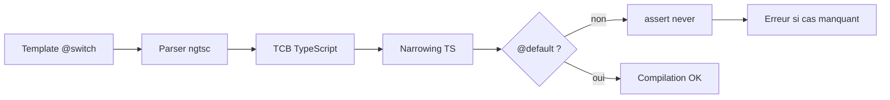

# Angular — Détail du vendredi 14 août 2026

## 1. Angular v22 — `@switch` exhaustif par `never`, spread/rest et arrow functions dans les templates

**Source :** InfoQ — https://www.infoq.com/news/2026/08/angular-v22-released/
**Date :** 10 août 2026

### Contexte

Angular v22 a beaucoup communiqué sur Signal Forms stables, `OnPush` par défaut et le décorateur `@Service()`. Un lot est passé plus discrètement : le travail d'ergonomie sur le langage de template. Ce n'est pas cosmétique. Le template Angular n'est pas du HTML interprété au runtime, c'est un DSL compilé en instructions par le compilateur `ngtsc`, avec une passe de type-checking qui génère un fichier TypeScript fantôme — le TCB, *Type Check Block*. Tout ce que le compilateur sait exprimer dans le TCB devient une erreur au build, pas un bug en production.

Le problème que ça résout est concret. Un `@switch` sur une union de chaînes ne t'avertit jamais quand tu ajoutes un membre à l'union. Tu ajoutes `'archived'` à ton `type Statut`, tu oublies le `@case`, et l'utilisateur voit une case vide. Avec du TypeScript pur tu réglerais ça par un `assertNever`. Dans un template, tu n'avais aucun équivalent.

### Comment ça marche

Déroulons la mécanique, étape par étape.

**Étape 1 — le compilateur parse le template** et construit un AST. Chaque bloc `@switch`/`@case` devient un nœud typé, avec l'expression de sélection et la liste des valeurs de cas.

**Étape 2 — génération du TCB.** Le compilateur émet, pour chaque composant, une fonction TypeScript invisible qui reproduit les expressions du template dans un contexte typé. Pour un `@switch`, il émet désormais un `switch` TypeScript réel plutôt qu'une chaîne de `if`.

**Étape 3 — le narrowing fait le travail.** Comme le TCB contient un vrai `switch`, TypeScript applique son *control-flow narrowing* : dans la branche `@default`, le type de l'expression est réduit aux membres non couverts. Si tous les cas sont couverts, ce type devient `never`.

**Étape 4 — l'assertion d'exhaustivité.** Quand tu n'écris **pas** de `@default`, Angular émet une assertion `never` sur le reste. Un membre d'union non couvert produit alors une erreur de compilation, avec le nom du membre manquant dans le message.

Le multi-cas `@case (A, B)` suit la même logique : le TCB émet deux étiquettes `case` qui tombent sur le même bloc, donc le narrowing reste correct.

Le spread/rest est une transformation différente. `[...props]` sur un composant est résolu à la compilation : le compilateur regarde le type de l'objet, l'intersecte avec la surface d'entrée du composant cible, et génère un binding par propriété correspondante. Rien n'est fait au runtime par réflexion — c'est ce qui permet de garder l'analyse statique et le tree-shaking.

Les arrow functions inline sont compilées en fonctions du contexte de vue. Attention : elles créent une nouvelle référence à chaque évaluation, donc les passer à un `@Input` d'un composant `OnPush` déclenche une détection de changement à chaque cycle.



### En pratique — exemple de code

Le `@switch` exhaustif : ajoute `'archived'` à l'union et le build casse tout seul.

```html
<!-- Avant (v21) : ajouter un statut à l'union passe silencieusement -->
@switch (statut()) {
  @case ('brouillon') { <span>Brouillon</span> }
  @case ('publie')    { <span>Publié</span> }
  @default            { <span>Inconnu</span> }
}

<!-- Après (v22) : pas de @default => le compilateur exige l'exhaustivité.
     @case multi-valeurs regroupe deux membres dans la même branche. -->
@switch (statut()) {
  @case ('brouillon', 'relecture') { <span>En cours</span> }
  @case ('publie')                 { <span>Publié</span> }
  @case ('archive')                { <span>Archivé</span> }
  <!-- retirer une ligne ci-dessus => erreur de build, pas un bug runtime -->
}
```

Le spread, côté appelant, pour un composant qui expose `label`, `icone` et `disabled` :

```html
<!-- Avant : un binding par propriété, à maintenir à la main -->
<app-bouton [label]="cfg.label" [icone]="cfg.icone" [disabled]="cfg.disabled" />

<!-- Après : le compilateur déplie l'objet sur les entrées du composant.
     Une propriété absente de la surface d'entrée est une erreur de type. -->
<app-bouton [...cfg] />
```

### Pourquoi ça compte pour toi

Tu viens du backend typé : c'est l'équivalent template du `switch` exhaustif que le compilateur C# te donne sur un `enum` ou une union C# 15. Concrètement, tu peux enrichir un type d'état côté modèle et laisser le build te lister les templates à mettre à jour. Migre tes `@switch` critiques en supprimant le `@default` fourre-tout — c'est un gain de sûreté immédiat, sans refactor. Attention au spread : il masque les dépendances au *code review*.

### Points de vigilance

Retirer un `@default` change le comportement en production : sans branche par défaut et avec une valeur inattendue au runtime (données API non validées), rien ne s'affiche. Garde un `@default` explicite quand la donnée vient d'une source non fiable, et réserve l'exhaustivité aux unions que tu maîtrises de bout en bout.

---

## 2. Angular 22.2.0-next.2 — le scoping du CSS imbriqué et `::ng-deep` sur le sélecteur parent

**Source :** GitHub — angular/angular Releases — https://github.com/angular/angular/releases
**Date :** 13 août 2026

### Contexte

`22.2.0-next.2` est une pre-release de correctifs, dont plusieurs touchent le même endroit : le *ShadowCss*, la brique du compilateur qui implémente `ViewEncapsulation.Emulated`. C'est l'encapsulation par défaut d'Angular depuis toujours, et elle n'utilise pas le Shadow DOM natif : elle réécrit ton CSS à la compilation.

Le déclencheur, c'est le CSS imbriqué natif. Depuis que les navigateurs supportent le nesting sans préprocesseur, on écrit du CSS imbriqué directement dans les `styles` du composant. Le réécriveur d'Angular avait été conçu à une époque où le nesting était aplati par Sass avant d'arriver. D'où une série de cas où les règles imbriquées n'héritaient pas de l'attribut de scope, ou au contraire en recevaient un alors qu'un parent en `::ng-deep` demandait explicitement de percer l'encapsulation.

### Comment ça marche

L'encapsulation émulée repose sur deux attributs générés :

**`_nghost-xxx`** est posé sur l'élément hôte du composant. **`_ngcontent-xxx`** est posé sur chaque élément du template du composant. Le suffixe `xxx` est un identifiant stable dérivé du composant.

Le compilateur prend ensuite chaque sélecteur de ta feuille de style et lui ajoute `[_ngcontent-xxx]`. `.carte .titre` devient `.carte[_ngcontent-xxx] .titre[_ngcontent-xxx]`. Résultat : la règle ne peut plus atteindre le DOM d'un composant enfant, puisque cet enfant porte un autre suffixe.

`::ng-deep` est l'échappatoire. Le compilateur voit le pseudo-sélecteur, **retire** le `[_ngcontent-xxx]` de tout ce qui le suit, et supprime le `::ng-deep` du CSS émis. La règle traverse alors les frontières de composants.

Le bug corrigé porte sur la combinaison des deux. Avec du nesting, le réécriveur traitait chaque règle imbriquée isolément et ne remontait pas le contexte du parent. Deux symptômes en découlaient. Premier cas : une règle imbriquée ne recevait aucun attribut de scope et fuyait hors du composant. Second cas : un sélecteur imbriqué sous un parent contenant `::ng-deep` se retrouvait quand même encapsulé, donc n'atteignait pas l'enfant visé — le classique « mon style ne s'applique pas sur le composant de la lib ».

Le correctif fait remonter l'état d'encapsulation le long de l'arbre de règles avant la réécriture.

### En pratique — exemple de code

```scss
/* Composant hôte, ViewEncapsulation.Emulated (défaut) */
.panneau {
  padding: 1rem;

  /* Avant 22.2.0-next.2 : cette règle imbriquée pouvait perdre le scope
     et fuir sur les .titre d'autres composants de la page. */
  .titre { font-weight: 600; }

  /* Cible un composant tiers depuis le parent. Avant le fix, la règle
     imbriquée était réencapsulée => elle n'atteignait jamais .mat-mdc-card. */
  ::ng-deep {
    .mat-mdc-card { box-shadow: none; }
  }
}
```

CSS effectivement émis après correctif — c'est ce que tu dois vérifier dans l'inspecteur :

```css
/* Le nesting est aplati ET scopé correctement */
.panneau[_ngcontent-abc] { padding: 1rem; }
.panneau[_ngcontent-abc] .titre[_ngcontent-abc] { font-weight: 600; }

/* Sous ::ng-deep : plus aucun attribut de scope, la règle traverse */
.panneau[_ngcontent-abc] .mat-mdc-card { box-shadow: none; }
```

### Pourquoi ça compte pour toi

Si tu styles Angular Material ou une lib de composants depuis un parent, tu as probablement déjà contourné ce bug avec `:host ::ng-deep` à plat, ou pire avec `!important`. Sur `22.2.0-next.2`, tu peux réécrire ces feuilles en nesting propre. Vérifie surtout ta CI visuelle avant de monter : un scope qui redevient correct **retire** des styles qui fuyaient et que ton design compensait peut-être sans le savoir.

### Limites

C'est une `next`, donc pas destinée à la production. Le canal `22.2` n'est pas encore stable et `::ng-deep` reste déprécié depuis longtemps, sans remplacement officiel tant que les *scoped custom properties* ne couvrent pas le besoin. Traite ces correctifs comme un signal de trajectoire, pas comme une invitation à multiplier les `::ng-deep`.
