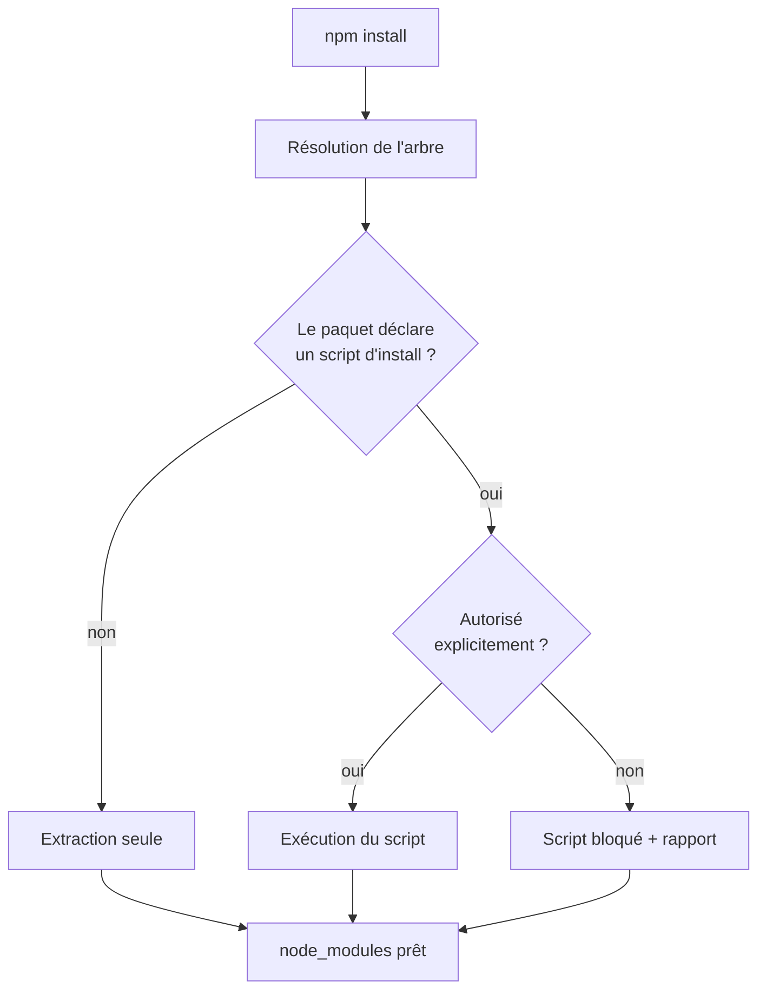

# Angular — Détail du samedi 15 août 2026

## 1. npm 12 — les scripts d'installation sont désactivés par défaut

**Source :** InfoQ — https://www.infoq.com/news/2026/08/npm-12-released/
**Date :** 14 août 2026

### Contexte

Depuis dix ans, la même faiblesse revient dans chaque post-mortem de supply chain JavaScript : `npm install` exécute du code arbitraire. Un paquet compromis déclare un `postinstall`, et ce script tourne avec les droits de ton utilisateur ou de ton runner CI, avant même que tu aies importé une seule ligne. Les vagues de paquets malveillants de ces derniers mois ont toutes utilisé ce vecteur, jusqu'aux variantes qui se déclenchent au `require()` pour contourner les défenses centrées sur `postinstall`.

npm 12 renverse la valeur par défaut. Les scripts de cycle de vie liés à l'installation ne s'exécutent plus automatiquement. Il faut les autoriser, explicitement, paquet par paquet. Le registre bascule d'un modèle de confiance implicite — tout ce que tu installes peut s'exécuter — vers un modèle de confiance déclarée. Les sources non-registre, typiquement les dépendances pointant vers un dépôt Git ou une archive distante, sont également restreintes.

### Comment ça marche

Il faut d'abord comprendre ce que npm appelle « script d'installation ». Ce sont les hooks du cycle de vie déclenchés par la résolution de l'arbre de dépendances : `preinstall`, `install`, `postinstall`, plus `prepare` dans certains cas. Ils existent pour une raison légitime : compiler une extension native, télécharger un binaire pour ta plateforme, générer du code. `sharp`, `esbuild`, les drivers PostgreSQL natifs, les navigateurs headless de test s'en servent.

Le mécanisme de npm 12 s'insère juste après la résolution et avant l'extraction-exécution. Le client construit l'arbre, repère chaque paquet qui déclare un script d'installation, puis compare cette liste à une politique d'autorisation. Ce qui n'est pas autorisé n'est pas exécuté — le paquet est bien installé, ses fichiers sont sur le disque, mais son script est simplement sauté. Tu obtiens un rapport des scripts bloqués au lieu d'un shell silencieux.

La conséquence pratique est en deux temps. Sur une dépendance pure JS, ne rien exécuter ne change rien : le paquet fonctionne. Sur une dépendance à build natif, sauter le script laisse un paquet installé mais inutilisable — le binaire n'a jamais été compilé. L'erreur ne remonte pas à l'installation, elle remonte au premier `import`, souvent en CI, souvent avec un message peu parlant. C'est le piège de migration principal.

Le second temps concerne la CI. Un runner éphémère refait l'install à chaque build. Ta politique d'autorisation doit donc vivre dans le dépôt, versionnée, pas dans le `~/.npmrc` de ta machine. Sinon tu obtiens un build qui passe en local et casse sur le runner, ou l'inverse.



### En pratique — exemple de code

Le réflexe utile est d'auditer d'abord, d'autoriser ensuite, et de figer le tout dans le dépôt.

```bash
# 1. Lister ce qui voudrait s'exécuter — à faire AVANT de migrer
npm ls --all --json | node -e "
const t=JSON.parse(require('fs').readFileSync(0));
// parcours simple de l'arbre : on veut juste les noms à vérifier
console.log(Object.keys(t.dependencies ?? {}).join('\n'));
"

# 2. Installer sans rien exécuter (comportement npm 12 par défaut)
npm install

# 3. Autoriser explicitement les paquets à build natif dont tu as besoin
npm install --foreground-scripts sharp
```

Côté configuration versionnée, la bascule ressemble à ceci :

```ini
# .npmrc — AVANT (npm 11) : tout s'exécutait, on bricolait un opt-out global
ignore-scripts=false

# .npmrc — APRÈS (npm 12) : le défaut est sûr, on déclare les exceptions
# Les paquets autorisés vivent dans le manifeste, pas dans un flag global.
# On garde ce fichier committé pour que la CI ait la même politique que toi.
audit-signatures=true
```

### Pourquoi ça compte pour toi

Ton `package.json` Angular embarque probablement `esbuild`, un runner de tests et des outils de lint qui posent des binaires. Le jour où tu passes en npm 12, ton pipeline CI/CD `dev` va casser au premier build — pas à l'install. Fais l'inventaire des scripts d'installation maintenant, autorise-les nommément, et commite la politique. Tu transformes une régression surprise en une décision documentée.

### Points de vigilance

Une dépendance transitive peut aussi déclarer un script. Tu peux devoir autoriser un paquet que tu n'as jamais installé directement. C'est inconfortable, mais c'est exactement l'information que le modèle précédent te cachait.

---

## 2. Astro 7 — compilateur Rust, pipeline Markdown natif et Vite 8

**Source :** InfoQ — https://www.infoq.com/news/2026/08/astro-7-release-speed/
**Date :** 13 août 2026

### Contexte

Astro n'est pas ton framework, mais sa release de cette semaine raconte l'histoire dans laquelle Angular est déjà engagé. Depuis deux ans, chaque brique lente du tooling JavaScript est réécrite en langage natif : esbuild en Go, SWC et Rolldown en Rust, `tsgo` pour TypeScript, Rolldown comme bundler stable côté Angular. Astro 7 achève ce mouvement sur sa propre chaîne : compilateur en Rust, pipeline Markdown en Rust, et Vite 8 comme socle de build.

Le gain annoncé est de **jusqu'à 61 %** de temps de build en moins sur des sites orientés contenu. Le prix à payer est classique : des règles HTML plus strictes qui font échouer des fichiers qui passaient avant, et des retours d'utilisateurs sur le nombre de dépendances tirées.

### Comment ça marche

Le point pédagogique n'est pas « Rust est rapide ». C'est *où* le gain se situe. Un build de site ou d'application fait trois choses coûteuses : parser, transformer, écrire. Le parsing en JavaScript souffre d'un problème structurel : chaque nœud d'AST est un objet, chaque objet est alloué sur le tas, et le ramasse-miettes finit par dominer le profil sur les gros arbres. Un parseur natif alloue dans des arènes contiguës, libère tout d'un coup, et ne paie jamais ce coût.

Le second levier est le parallélisme réel. Node.js est mono-thread pour l'exécution JS ; paralléliser signifie forker des processus et payer la sérialisation entre eux. Un compilateur Rust utilise des threads système qui partagent la mémoire. Sur un site de 2 000 fichiers Markdown, la différence n'est pas marginale, elle est structurelle.

Le troisième levier, souvent sous-estimé, est la **fusion des passes**. Quand le compilateur et le pipeline Markdown vivent dans le même binaire, l'AST n'a plus besoin d'être sérialisé en JSON pour traverser une frontière de langage. C'est précisément la limite qu'atteignent les plugins JS greffés sur un cœur natif : chaque aller-retour reconstruit une représentation. D'où la règle empirique de migration — plus tu as de plugins JS custom dans ta chaîne, moins tu captes le gain annoncé.

Les règles HTML plus strictes découlent du même choix. Un parseur natif conforme à la spec refuse ce qu'un parseur JS permissif tolérait : balises mal imbriquées, attributs non échappés, fragments ambigus. Ce n'est pas une régression, c'est une dette qui devient visible.

### En pratique — exemple de code

Le schéma de migration est le même que celui que tu appliqueras sur `tsgo` côté Angular : mesurer, basculer, comparer, isoler les plugins JS restants.

```bash
# Avant — mesurer la baseline, pas une impression
time npx astro build          # 48,2 s sur 2 100 pages Markdown

# Après — même commande, compilateur natif
npm install astro@7
time npx astro build          # ~19 s : le gain vient du parsing + parallélisme

# Isoler ce qui retient le build en JS : les plugins Vite/Remark custom
npx astro build --verbose | grep -i "plugin"
```

```js
// astro.config.mjs — le point à auditer après migration
export default {
  markdown: {
    // Chaque plugin JS force un aller-retour hors du binaire natif.
    // Vérifie s'il existe un équivalent intégré avant de le garder.
    remarkPlugins: [],   // AVANT : [remarkToc, remarkSlug, remarkCustom]
    syntaxHighlight: 'shiki', // traité côté natif, pas de hook JS
  },
};
```

### Pourquoi ça compte pour toi

Tu ne migreras pas vers Astro, mais tu vivras la même bascule sur Angular avec Rolldown et `tsgo`. Retiens la méthode : le gain natif s'évapore dès qu'un plugin JS custom reste dans la chaîne, et les parseurs stricts exposent une dette HTML/TS que tu ignorais. Avant toute montée de version majeure du tooling, mesure une baseline chiffrée et inventorie tes plugins. Sinon tu ne sauras pas si tu as gagné.

### Limites

Le chiffre de 61 % vient de projets orientés contenu, dominés par le parsing Markdown. Sur une application riche en composants et en logique TypeScript, la part du build qui bascule en natif est plus faible — attends-toi à un gain réel, mais nettement inférieur à l'affiche.
