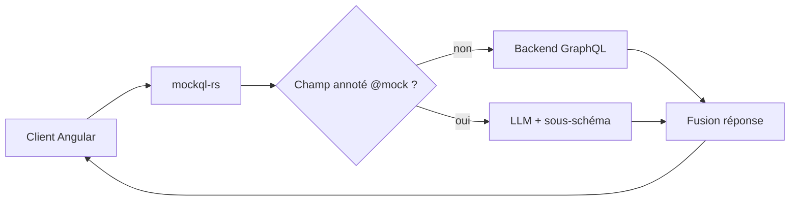

# Angular — Détail du dimanche 16 août 2026

## 1. `mockql-rs`, `@generateMock` et la RFC `@mock` — trois façons de générer des fixtures GraphQL par LLM

**Source :** InfoQ — https://www.infoq.com/news/2026/08/graphql-llm-mocking-spec/
**Date :** 14 août 2026

### Contexte

Tu connais la scène : le back n'a pas encore livré le resolver, et tu écris à la main deux cents lignes de JSON pour que ton composant s'affiche. Le lendemain, le schéma bouge d'un champ et ta fixture est morte. Ce coût de maintenance, invisible dans les métriques, est ce que trois équipes ont attaqué en six mois.

Expedia Group a ouvert `mockql-rs`, un CLI Rust qui génère les réponses GraphQL manquantes au moment de la requête. Airbnb avait publié en avril sa directive `@generateMock`, qui fait le même travail mais à la compilation. Et la GraphQL Foundation a ouvert en février une RFC qui définit, elle aussi, une directive `@mock`. Trois architectures différentes, deux qui se disputent le même nom.

Le pari commun est élégant : un *selection set* GraphQL **est déjà une spécification**. Samuel Vazquez, ingénieur chez Expedia, résume l'inversion — les modèles sont mauvais pour inventer une forme, bons pour la remplir. Le schéma leur offre cette forme gratuitement.

### Comment ça marche

Prends `mockql-rs`. Il ne s'installe ni dans ton client ni dans ton serveur : c'est un processus autonome que tu places entre les deux. Le choix du CLI est délibéré — n'importe quel test runner, job CI ou script de build sait lancer un processus, sans dépendance à un SDK.

Le pipeline se déroule en cinq temps. Le proxy parse l'opération et la valide contre le schéma avec `apollo-compiler`. Il sépare ensuite les champs annotés `@mock` des champs réels. Les champs réels partent vers le vrai backend. Les champs annotés partent vers le modèle, avec l'opération et un sous-ensemble du schéma en contexte. Enfin, les deux moitiés sont fusionnées dans une seule réponse.

Conséquence directe : une même réponse peut porter des données live du backend **à côté** de données générées pour un champ dont le resolver n'existe pas. C'est précisément ce qui rend l'outil utile en développement, et précisément ce qui doit t'alerter : rien dans la charge utile ne marque quelle moitié est réelle.



Airbnb prend l'angle opposé. `@generateMock` est traité pendant la codegen Niobe, au build. Il émet un fichier JSON de données et des accesseurs typés, utilisables en demo app, snapshot test et test unitaire. Le générateur préserve volontairement les éditions manuelles des développeurs entre deux passes.

La RFC, elle, pose `@mock` sur **l'opération** et non sur le champ, avec un argument `name` pour choisir entre plusieurs réponses nommées. Elle exige qu'un client conforme rende le mock **sans émettre la moindre requête réseau**. Les réponses vivent dans un répertoire `__graphql_mocks__` adjacent au fichier source, avec une clé réservée `__default__`.

Cette divergence compte plus que la syntaxe. La RFC impose que le client détecte la dérive d'un mock devenu invalide pour son opération, et que les mocks soient validés dans la suite de tests. Les données d'Expedia sont produites à neuf à chaque exécution : cohérence contextuelle excellente, **répétabilité nulle**. Or un snapshot test vit de répétabilité. Aucun des deux billets n'aborde ce que des fixtures non déterministes signifient en CI.

### En pratique — exemple de code

Tu n'annotes que le champ qui n'est pas prêt ; le reste de la requête reste une vraie requête.

```graphql
# Le resolver "recommendations" n'existe pas encore côté back.
# property part vraiment en amont, recommendations est généré.
query TripDetails($id: ID!) {
  trip(id: $id) {
    property {
      name
      address
    }
    recommendations @mock(hint: "5 most popular nearby restaurants") {
      title
      description
      distance
    }
  }
}
```

La réponse mélange les deux sources sans les distinguer :

```json
{
  "data": {
    "trip": {
      "property": {
        "name": "Hotel Palazzo Pischedda",
        "address": "Via Roma, 09089 Bosa OR, Italy"
      },
      "recommendations": [
        {
          "title": "Ristorante Sa Pischedda",
          "description": "Cuisine sarde authentique, dans l'hôtel.",
          "distance": "0.0 miles"
        }
      ]
    }
  }
}
```

Le nom et l'adresse viennent du backend. Les restaurants sortent du modèle. Rien ne le signale.

### Pourquoi ça compte pour toi

Si ton front Angular consomme du GraphQL, tu gagnes à débloquer un composant sans attendre le resolver. Mais garde ces mocks hors des tests de non-régression : leur non-déterminisme casse tout snapshot. Et méfie-toi du nom `@mock` — la RFC est en Stage 0, sans champion. En adoptant l'implémentation d'Expedia aujourd'hui, tu standardises sur une lecture propriétaire d'un identifiant que la spec revendique aussi.

### Points de vigilance

- Le pattern émerge en GraphQL et pas en REST pour une raison : seul un schéma borne la sortie du modèle assez pour la rendre exploitable plutôt que plausible.
- Rien ne marque la provenance dans la réponse fusionnée. Si tu logges ces payloads, tu logges des données inventées avec la même autorité que les vraies.
