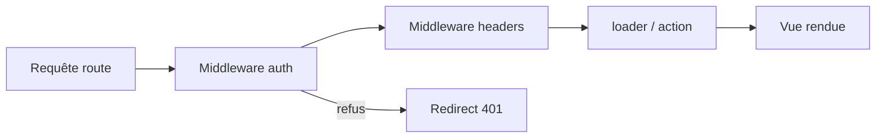

# Angular — Détail du mercredi 19 août 2026

## 1. React Router v8 — build ESM-only, middleware par défaut et fin de `react-router-dom`

**Source :** InfoQ — https://www.infoq.com/news/2026/08/react-route-v8/
**Date :** 19 août 2026 (release du 17 juin 2026)

### Contexte

React Router est la bibliothèque de routage la plus installée de l'écosystème React — plus de 50 millions de téléchargements npm par semaine — et elle sert désormais de socle au framework Remix depuis la fusion des deux projets. Elle est maintenue par l'équipe Shopify sous un modèle de gouvernance ouverte. La v8, sortie le 17 juin 2026 et couverte par InfoQ hier, s'inscrit dans une stratégie assumée : Brooks Lybrand, Developer Relations Manager, explique que l'objectif des dernières majeures est de les rendre « aussi ennuyeuses que possible », avec une cadence annuelle prévisible.

Le pari est simple. Chaque rupture de la v8 était déjà activable en v7 via un *future flag*. Si tu avais fait ton travail de migration progressive, la v8 se réduit à un `npm install`. Ce modèle — les ruptures d'abord derrière un drapeau, puis activées par défaut à la majeure suivante — est exactement ce qu'Angular pratique avec ses migrations `ng update` et ses dépréciations sur deux versions. La différence tient au périmètre : React Router touche ici deux sujets structurants pour tout l'écosystème front, pas seulement pour ses utilisateurs.

### Comment ça marche

Deux changements méritent d'être compris pas à pas.

**Premier changement : le passage en ESM-only.** Historiquement, un paquet npm publiait deux builds — un bundle CommonJS (`require`) et un bundle ES Modules (`import`) — exposés via le champ `exports` du `package.json`. Cette dualité coûte cher : elle double la surface de test, provoque le problème de la « double instance » (une lib chargée deux fois, une par format, avec deux états séparés) et bloque les optimisations de tree-shaking statique. React Router v8 arrête de publier le build CommonJS. En parallèle, les champs `target` et `lib` du `tsconfig` passent à ES2022, ce qui remonte le plancher de syntaxe émise.

La conséquence pratique n'est pas dans ton code applicatif, qui utilise déjà `import`. Elle est dans ta chaîne d'outillage : un fichier de configuration Jest en CommonJS, un script Node de build, un plugin ESLint ancien, ou toute couche qui fait un `require('react-router')` implicite cassera. Les nouveaux planchers annoncés sont Node 22.22.0+, React 19.2.7+ et Vite 7+.

**Deuxième changement : le middleware devient un comportement de base.** Les *future flags* `v8_middleware` et `v8_viteEnvironmentApi` sont supprimés et leur comportement devient le défaut ; `splitRouteModules` remonte en option de configuration de premier niveau, activée par défaut. Le middleware s'exécute avant les `loader` et `action` d'une route, en chaîne, ce qui donne un point unique pour l'authentification, les en-têtes de sécurité et le logging. Roman Fedyskyi résume l'enjeu ainsi : « beaucoup d'incidents front sont des incidents de politique », pas des incidents de logique métier.



### En pratique — exemple de code

Le point de migration le plus mécanique est la disparition du paquet `react-router-dom`, absorbé dans `react-router` :

```ts
// Avant — v7 : deux paquets, deux points d'import
- import { Link, useLocation } from "react-router-dom";

// Après — v8 : un seul paquet ; les API DOM vivent dans le sous-chemin /dom
+ import { Link, useLocation } from "react-router";
+ import { RouterProvider } from "react-router/dom";
```

Le middleware, lui, ressemble à un intercepteur Angular — même rôle, même position dans la chaîne :

```ts
// Middleware de route : s'exécute AVANT le loader, peut court-circuiter.
// Équivalent conceptuel d'un CanActivate + HttpInterceptor fusionnés.
export const middleware = [
  async ({ request, context }, next) => {
    const user = await resolveSession(request);   // 1. politique d'accès
    if (!user) throw redirect("/login");          // 2. court-circuit
    context.set(userContext, user);               // 3. contexte typé aval
    const response = await next();                // 4. suite de la chaîne
    response.headers.set("X-Frame-Options", "DENY"); // 5. en-tête sortant
    return response;
  },
];
```

### Pourquoi ça compte pour toi

Deux leçons transposables. D'abord, si tu publies une lib TypeScript interne, planifie ton passage ESM-only maintenant : c'est la direction de l'écosystème, et tes consommateurs préféreront une rupture annoncée à une double-instance silencieuse. Ensuite, la politique transverse — auth, en-têtes, corrélation de logs — appartient à une couche unique. Côté Angular tu as déjà `HttpInterceptor` et les guards ; vérifie qu'aucun composant ne les contourne.

### Points de vigilance

Toutes les réactions ne sont pas positives : byteiota avertit que « trois ruptures vont prendre des équipes au dépourvu » sur un paquet à 50 M de téléchargements hebdomadaires. Et la fin de vie de React Router v6 et Remix v2 signifie zéro correctif de sécurité : si un de tes projets legacy y est encore, c'est une dette à chiffrer ce trimestre. Le guide officiel de montée de version recommande l'ordre suivant : mettre à jour les peer dependencies, activer les future flags en v7, retirer les API dépréciées, puis seulement installer la v8.
