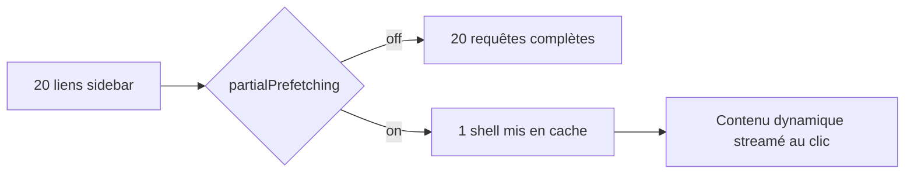
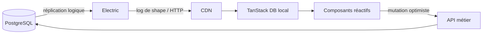

# Angular — Détail du vendredi 21 août 2026

## 1. Next.js 16.3 — Instant Navigations, Turbopack et SSR sur streams Node

**Source :** InfoQ — https://www.infoq.com/news/2026/08/vercel-next-js-16-3/
**Date :** 20 août 2026

### Contexte

Depuis l'arrivée des React Server Components, Next.js traîne un reproche récurrent : une navigation « se sent » plus lente qu'une SPA classique. Chaque changement de route déclenche un aller-retour serveur, même quand la coquille de la page est identique. Les équipes qui viennent d'Angular avec un router purement client trouvent ça régressif.

Vercel publie **Next.js 16.3**, la plus grosse mise à jour depuis la 16.0 de novembre dernier. Le release mélange deux natures de gains. D'un côté des optimisations qui s'appliquent à toute application existante sans rien changer. De l'autre, un ensemble opt-in baptisé **Instant Navigations**, qui cherche à récupérer la réactivité d'une SPA tout en gardant le rendu serveur.

### Comment ça marche

Commence par la partie gratuite. Turbopack active désormais par défaut un **cache disque** et une **éviction mémoire**. Concrètement, le graphe de modules compilés n'est plus intégralement retenu en RAM : les entrées froides partent sur disque et sont relues à la demande. Vercel mesure son propre dashboard passant de 21,5 Go à 2 Go pendant `next dev`. Le même cache disque sert les builds : sur CI, un build répété est jusqu'à 5,5 fois plus rapide.

Le rendu serveur a été réécrit sur les **streams Node natifs** au lieu des Web Streams. Moins de couches d'adaptation, moins d'allocations par requête : Vercel annonce +22 % de requêtes encaissées à charge égale. Corollaire assumé, le runtime edge est déprécié.

Vient ensuite Instant Navigations. Le mécanisme s'appuie sur la directive `'use cache'` introduite en 16.0 et se pilote par deux drapeaux. `cacheComponents` autorise Next à mettre en cache le résultat d'un composant serveur indépendamment de la requête. `partialPrefetching` change la granularité du prefetch : au lieu de précharger la réponse complète de chaque lien, Next découpe la route en une **coquille statique** (layout, navigation, squelettes) et un **contenu dynamique**. La coquille est prefetchée une seule fois et réutilisée par tous les liens qui partagent la route.

L'exemple donné par Roboto Studio est parlant : une sidebar de vingt liens passe de vingt prefetches à un seul shell mis en cache. Au clic, la coquille s'affiche immédiatement depuis le cache client, et seul le contenu dynamique est streamé.



Côté outillage, de nouveaux DevTools **Instant Insights** signalent automatiquement chaque navigation qui n'est pas instantanée, et un helper Playwright `instant()` permet d'en faire une assertion de test.

### En pratique — exemple de code

Activation des deux drapeaux dans `next.config.ts`, puis bascule du type-check sur TypeScript 7 :

```typescript
// next.config.ts — Instant Navigations est opt-in, route par route de préférence
import type { NextConfig } from 'next';

const nextConfig: NextConfig = {
  // Autorise la mise en cache du rendu d'un composant serveur
  cacheComponents: true,
  // Découpe chaque route en shell statique prefetché + contenu dynamique
  partialPrefetching: true,
};

export default nextConfig;
```

```bash
# next build sait déléguer le type-check au compilateur natif TypeScript 7 (~10x plus rapide)
pnpm add -D typescript@^7
```

### Pourquoi ça compte pour toi

Tu ne fais pas de Next.js, mais le pattern te concerne. La coquille statique prefetchée une fois puis réutilisée, c'est exactement ce que tu peux monter en Angular avec `@defer`, la préconnexion des routes et un `httpResource` mis en cache. Le vrai enseignement est ailleurs : la latence perçue vient du réseau, pas du rendu. Regarde aussi la migration Web Streams → streams Node : +22 % sans toucher au code applicatif.

### Points de vigilance

La discussion de feedback GitHub liste trois pièges connus : les exports statiques ne fonctionnent pas avec Partial Prefetching, les styles globaux `styled-jsx` peuvent fuiter entre routes, et l'auto-hébergement sur SST avec `cacheComponents` peut casser le rendu serveur. Le conseil général est d'adopter les defaults tout de suite et Instant Navigations route par route.

---

## 2. Sync engines côté front — Electric et TanStack DB remplacent le fetch impératif

**Source :** InfoQ — https://www.infoq.com/presentations/local-first-sync-engine/
**Date :** 20 août 2026

### Contexte

James Arthur, fondateur d'Electric, défend une thèse simple : le `fetch` est le dernier morceau impératif d'une stack front devenue entièrement déclarative. Tu déclares ton UI, tu déclares ton état réactif, puis tu écris à la main quand appeler l'API, comment gérer le loading, comment invalider le cache et comment recoller les morceaux après une mutation optimiste.

L'approche **local-first sur sync engine** propose de supprimer cette couche. Le serveur pousse les changements, un store local reste synchronisé, et l'UI se contente de lire ce store. La réactivité ne s'arrête plus à la frontière du navigateur : elle traverse le réseau jusqu'à PostgreSQL.

### Comment ça marche

Le mécanisme se déroule en quatre temps.

**Un.** Le client déclare une *shape* : un sous-ensemble de lignes qu'il veut voir répliquées localement, exprimé comme une requête (une table, un filtre, éventuellement des relations). Ce n'est pas une requête ponctuelle mais un abonnement durable.

**Deux.** Le sync engine — Electric, placé devant PostgreSQL — lit le flux de réplication logique de la base. Chaque `INSERT`, `UPDATE` ou `DELETE` qui touche la shape devient un message dans un log par shape, servi en HTTP et cachable par un CDN. C'est le point clé de l'architecture : le fan-out est un problème de cache HTTP, pas un problème de WebSocket.

**Trois.** Côté client, TanStack DB matérialise ces messages dans des collections en mémoire. Tu écris des requêtes typées contre ces collections, avec jointures et agrégats, et le résultat est un signal réactif. Aucun état de chargement à gérer : la donnée est là ou elle arrive.

**Quatre.** Les écritures partent en **mutation optimiste**. Le store local applique le changement immédiatement, envoie la mutation à ton API métier habituelle, puis réconcilie quand le changement revient par le flux de réplication. Ton backend garde sa logique, ses validations et ses permissions.



Le compromis est explicite : tu échanges de la simplicité de fetch contre un budget mémoire client et une vraie discipline sur le périmètre des shapes. Répliquer une table de 500 000 lignes chez chaque utilisateur ne marche pas.

### En pratique — exemple de code

Avant / après sur un écran de liste filtrée, en TypeScript :

```typescript
// Avant — fetch impératif : loading, erreur, invalidation, refetch après mutation
const [items, setItems] = useState<Todo[]>([]);
const [loading, setLoading] = useState(true);
useEffect(() => {
  fetch('/api/todos?done=false')
    .then(r => r.json()).then(setItems).finally(() => setLoading(false));
}, []);
```

```typescript
// Après — shape déclarative : Electric réplique, TanStack DB expose une requête réactive
const todos = createCollection({
  shape: { url: '/v1/shape', params: { table: 'todos', where: 'done = false' } },
});

// Requête typée sur la collection locale — pas d'état de chargement à gérer
const open = useLiveQuery(q => q.from({ todos }).orderBy(t => t.created_at));
```

### Pourquoi ça compte pour toi

Tu es sur PostgreSQL : Electric se branche sur la réplication logique que tu as déjà, sans toucher au schéma. Ton API .NET ou Symfony reste le chemin d'écriture, avec ses permissions. Le gain se voit sur les écrans collaboratifs et les tableaux de bord filtrés, là où tu multiplies les endpoints de lecture. Le risque à surveiller : le périmètre des shapes, et le fait que la sécurité en lecture se déplace vers la définition de shape.

### Limites

Le modèle suppose que chaque client peut héberger son sous-ensemble de données en mémoire. Les rapports agrégés sur de gros volumes, les exports et les recherches full-text restent du ressort d'un endpoint serveur classique. Le sync engine complète le fetch, il ne le supprime pas partout.
