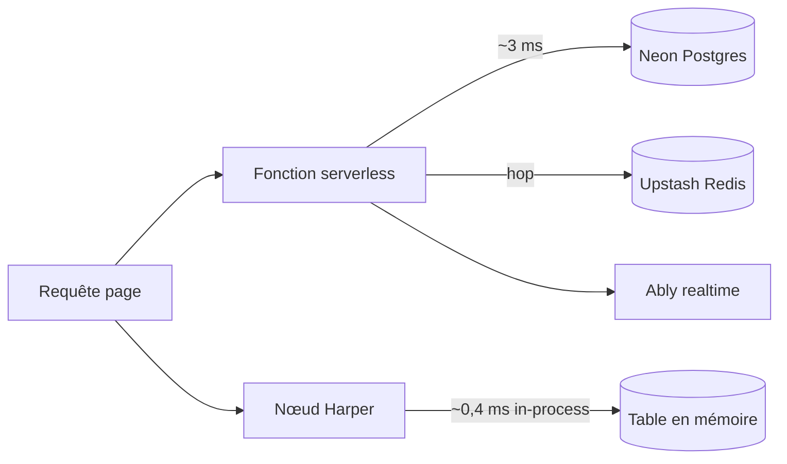

# Angular — Détail du samedi 22 août 2026

## 1. Harper 5.2 vs stack Vercel — le coût réel du saut réseau vers la base

**Source :** InfoQ — https://www.infoq.com/news/2026/08/harper-vercel-benchmark/
**Date :** 20 août 2026

### Contexte

La plupart des stacks web modernes éclatent le chemin de données en trois systèmes : une base, un cache, un runner de jobs ou de temps réel. Chacun ajoute un saut réseau et une brique à opérer. C'est le modèle par défaut du serverless : la fonction est éphémère et sans état, donc la donnée vit ailleurs. Databricks a poussé cette logique encore plus loin en février avec Lakebase, un Postgres qui sépare le calcul du stockage.

Harper prend le pari inverse : effondrer ces couches dans un seul runtime. L'éditeur vient de publier un benchmark qui compare la même application, écrite deux fois derrière un contrat `DataSource` partagé. Une version tourne sur Harper, l'autre sur Vercel Functions + Neon Postgres + Upstash Redis + Ably. Le code applicatif et l'UI sont identiques ; seule l'architecture varie. Le sujet t'intéresse même si tu ne toucheras jamais à Harper : il chiffre proprement ce que coûte le hop réseau que tu paies à chaque lecture personnalisée.

### Comment ça marche

Le raisonnement se déroule en trois temps.

**Premier temps — d'où vient la latence.** Dans un stack éclaté, un rendu personnalisé enchaîne : fonction serverless → cache Redis → base Postgres → retour. Chaque flèche est un aller-retour TCP/TLS. Harper mesure ce hop à environ 3 ms là où son accès in-process tourne à environ 0,4 ms. Un seul read, l'écart est invisible. Une page qui agrège vingt fragments personnalisés, il devient structurant.

**Deuxième temps — pourquoi le fan-out amplifie.** Le coût n'est pas linéaire dans le ressenti utilisateur. Le fan-out sérialise partiellement les appels, et chaque hop porte sa propre variance. La p99 domine le rendu perçu, pas la moyenne. Harper annonce jusqu'à ~14× d'écart sur les chemins live : read simple, valeur injectée en direct, streaming côté serveur, fraîcheur write-to-read, fan-out à charge normale.

**Troisième temps — où le modèle casse.** Sous fan-out soutenu et forte concurrence, l'autoscaling serverless de Vercel dépasse le nœud Harper unique, qui plafonne en débit. Le CDN de Vercel gagne aussi tout le contenu cacheable et le realtime broadcast-only. La conclusion honnête du benchmark : chacun gagne la moitié du web pour laquelle il a été conçu.

Le protocole : 8 scénarios, 2 régions américaines, 474 tests de charge sur 3 essais.



### En pratique — exemple de code

Le même contrat `DataSource`, câblé des deux côtés. La différence tient au fait que la version colocalisée n'a pas de client réseau du tout.

```ts
// Avant — stack multi-systèmes : chaque lecture personnalisée = 1 à 2 hops
async function getProduct(id: string, userId: string) {
  const cached = await redis.get(`p:${id}:${userId}`);      // hop 1 (~1 ms)
  if (cached) return JSON.parse(cached);
  const row = await sql`SELECT * FROM products WHERE id = ${id}`; // hop 2 (~3 ms)
  await redis.set(`p:${id}:${userId}`, JSON.stringify(row), { ex: 60 });
  return row;
}

// Après — runtime colocalisé : la lecture est un appel de fonction sur une table locale
async function getProduct(id: string, userId: string) {
  // tables.Product vit dans le même process ; pas de sérialisation, pas de socket
  const row = await tables.Product.get(id);                 // ~0,4 ms
  return personalize(row, userId);                          // cache in-process
}
```

Une page qui agrège 20 fragments : 20 × ~3 ms sérialisés partiellement contre 20 × ~0,4 ms. C'est là que l'écart devient visible pour l'utilisateur.

### Pourquoi ça compte pour toi

Tu ne vas pas remplacer PostgreSQL par Harper. Mais le chiffre te sert d'outil de diagnostic : sur tes écrans Angular les plus lents, compte le nombre de hops par rendu avant d'optimiser les requêtes SQL. Souvent le problème n'est pas la base, c'est le nombre d'allers-retours. Les leviers restent classiques côté .NET : batcher les appels, remonter l'agrégation dans un seul endpoint, mettre un cache en mémoire dans le process API plutôt qu'un Redis distant.

### Points de vigilance

Le dataset du benchmark est chaud et tient entièrement en mémoire — l'avantage se réduit dès que le working set dépasse la RAM. Le benchmark précède la 5.2 et n'a pas été rejoué. Enfin, c'est un benchmark d'éditeur : les scénarios ont été choisis par la partie qui gagne la majorité d'entre eux. La partie la plus réutilisable reste la méthodologie — même app, même contrat, une seule variable.
