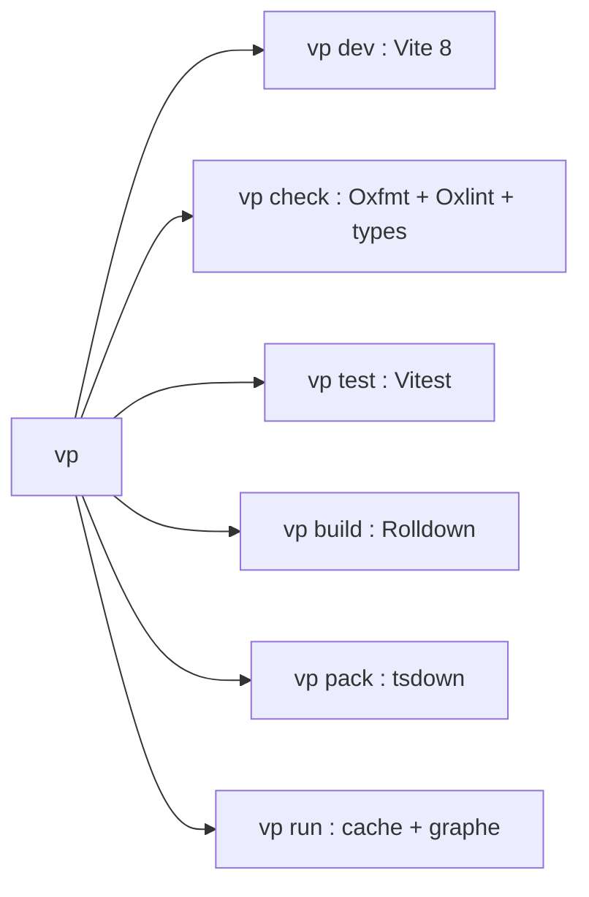

# Angular — Détail du dimanche 23 août 2026

## 1. Vite+ bêta (VoidZero) — toute la chaîne d'outils front derrière la commande `vp`

**Source :** InfoQ — https://www.infoq.com/news/2026/08/vite-plus-beta/
**Date :** 22 août 2026

### Contexte

Un projet front moderne empile une demi-douzaine d'outils indépendants : un bundler, un serveur de dev, un runner de tests, un linter, un formateur, un compilateur de librairie, plus un orchestrateur de tâches si tu es en monorepo. Chacun a son cycle de release, son fichier de configuration et sa version de TypeScript supportée. Le coût n'est pas dans l'usage quotidien, il est dans la maintenance : chaque montée de version rouvre une matrice de compatibilité que personne n'a envie de tester.

VoidZero, la société fondée par Evan You (créateur de Vite et Vue), attaque le problème par le haut. Vite+ ne réinvente pas ces outils, il les emballe. La bêta publiée le 22 août réunit Vite 8, Vitest, Rolldown, tsdown, Oxlint et Oxfmt derrière une seule commande, `vp`, avec un task runner intégré et une gestion du runtime et du gestionnaire de paquets. Le tout est open source sous licence MIT et agnostique du framework : bibliothèques, CLI et applications web sont traitées de la même façon.

### Comment ça marche

Le principe directeur est simple : **une commande par intention, pas une commande par outil**. Tu n'appelles plus `eslint` puis `prettier --check` puis `tsc --noEmit` ; tu appelles `vp check`, qui enchaîne formatage, lint et vérification de types en un seul passage. Derrière, ce sont bien Oxfmt, Oxlint et le type checker qui travaillent, mais leurs versions sont épinglées et testées ensemble par VoidZero.

Le découpage des commandes suit le cycle de vie d'un projet. `vp create` initialise un projet ou un monorepo. `vp dev` démarre un serveur de développement à rechargement à chaud propulsé par Vite 8. `vp test` exécute Vitest. `vp build` produit le bundle de production. `vp pack` empaquette une librairie via tsdown. `vp run` exécute des tâches de monorepo à travers un runner conscient du cache et du graphe de dépendances — c'est la brique qui remplace Turborepo ou Nx pour les cas simples.

La migration passe par `vp migrate`, qui prévisualise les changements avant de les appliquer. L'équipe prévient que les configurations complexes demanderont encore une reprise manuelle. Depuis l'alpha, plus de 500 pull requests ont été fusionnées sur une douzaine de releases : cache plus fin pour `vp run`, couverture de migration élargie, fonctions entreprise comme les modèles d'organisation et le HTTP sensible au proxy, et plus de 180 correctifs.

L'adoption suit : plus de 1 300 dépôts publics dépendent déjà du paquet, parmi lesquels Dify, l'éditeur type Notion BlockNote, et `vinext`, la couche compatible Next.js de Cloudflare.

Le débat, lui, s'est cristallisé sur un billet de Jared Wilcurt qui qualifie une bonne partie de Vite+ « d'abstraction au-dessus des scripts npm », désigne le gestionnaire de versions Node `vp env` comme le maillon le plus faible, et alerte sur le risque d'enfermement dans l'écosystème VoidZero. La réponse de VoidZero tient en deux points : les plugins Vite restent des plugins Vite, et un projet peut conserver son propre gestionnaire de paquets en dessous. La discussion s'est conclue sur ce que son auteur appelle « l'éléphant Rust dans la pièce » : la plupart des projets VoidZero sont des réécritures Rust d'outils existants plutôt que des remises à plat du problème.



### En pratique — exemple de code

Voici ce que devient un cycle de développement complet, réduit à quatre commandes.

```bash
vp create        # échafaude un projet ou un monorepo
vp dev           # serveur de dev à rechargement à chaud
vp check         # formate, lint et vérifie les types en une passe
vp test          # exécute les tests unitaires Vitest
```

Et voici le déplacement concret sur un `package.json`, avant puis après adoption.

```json
// Avant — chaque outil a son script, sa version, sa config
{
  "scripts": {
    "dev": "vite",
    "build": "vite build",
    "test": "vitest run",
    "lint": "eslint . --ext .ts,.html",
    "format": "prettier --check \"src/**/*.{ts,html,scss}\"",
    "typecheck": "tsc --noEmit -p tsconfig.json"
  }
}
```

```json
// Après — une intention, une commande ; le lot est versionné ensemble
{
  "scripts": {
    "dev": "vp dev",
    "build": "vp build",
    "test": "vp test",
    "check": "vp check"
  }
}
```

### Pourquoi ça compte pour toi

Ton front Angular passe déjà par Vite et Rolldown via le CLI ; Vite+ ne touche pas à ce build-là, il attaque tout ce qui l'entoure. Le gain réel est en monorepo : si tu ranges ton front Angular et tes outils TypeScript sous un même dépôt, `vp run` te donne un task runner sensible au cache sans ajouter Nx. Reste que le CLI Angular garde la main sur le build applicatif — traite Vite+ comme un remplaçant de ta couche lint/format/test, pas de `ng build`.

### Points de vigilance

- La bêta n'est pas une 1.0 : l'équipe annonce prioriser compatibilité et retours communauté avant stabilisation.
- `vp migrate` prévisualise, mais ne garantit rien sur une configuration Angular non standard — garde ta config d'origine sous contrôle de version.
- Le risque d'enfermement est réel à l'échelle d'une organisation : vérifie que chaque outil du lot reste utilisable seul avant de l'imposer à plusieurs équipes.
