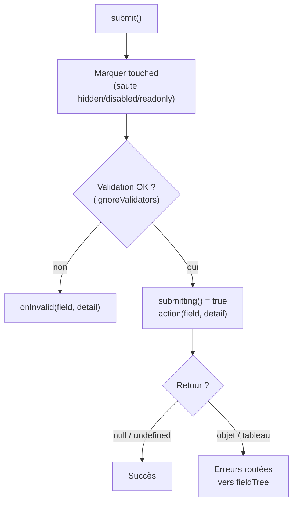
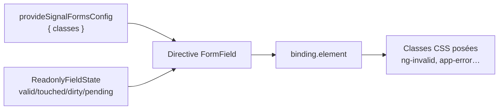

# Angular — Détail du samedi 29 août 2026

## 1. Angular 22 — `FormRoot` et `FormOptions.submission` : la soumission déclarative des Signal Forms

**Source :** Angular Docs — https://angular.dev/guide/forms/signals/form-submission
**Date :** doc v22 (relayée par le roundup Angular du 28 août 2026)

### Contexte

Les Signal Forms sont arrivées en v21 avec une fonction `submit()` qui orchestre tout le cycle de soumission. Le problème, c'est qu'il fallait la câbler soi-même, et toujours de la même façon. Trois gestes mécaniques revenaient dans chaque composant : un binding `(submit)="onSubmit($event)"` dans le template, un `event.preventDefault()` en tête de handler, et l'attribut `novalidate` posé à la main pour neutraliser la validation native du navigateur.

Ce boilerplate est du code que personne ne relit. Or oublier le seul `preventDefault()` provoque un rechargement complet de page, qui efface l'état de l'application. Second grief : la logique de soumission vivait dans une méthode à part, loin de l'appel à `form()`. Le formulaire n'était plus auto-descriptif.

Angular a répondu avec la directive `FormRoot`, sélecteur `[formRoot]`, introduite en 21.2.0-next.3 et documentée comme chemin recommandé en v22. Le parallèle avec `formGroup` des Reactive Forms est assumé : une directive qui relie déclarativement le `<form>` du DOM au modèle. Son pendant côté classe est le troisième argument de `form()`, l'objet `FormOptions` et sa propriété `submission`.

### Comment ça marche

Tu importes `FormRoot` depuis `@angular/forms/signals`, tu écris `<form [formRoot]="monForm">`, et tu supprimes `(submit)` **et** `novalidate`. La directive fait trois choses seule : elle pose `novalidate`, elle appelle `preventDefault()`, elle invoque `submit()`.

Le « quoi faire » se déclare alors dans `form(model, schemaFn, { submission: { … } })`. La propriété `action` est une fonction `async (field, detail)` : `field` est le field tree, `detail` expose `root` et `submitted` — utile quand tu soumets un sous-formulaire.

La séquence exécutée par `submit()` est fixe et vaut la peine d'être connue :



Trois points comptent. D'abord, si une règle de validation a échoué, `action` **ne s'exécute pas du tout**. Ensuite, le contrat de retour est inversé par rapport à l'intuition : `null`, `undefined` ou un `return;` nu valent succès ; retourner un objet vaut erreur. Enfin, une erreur sans `fieldTree` est affectée au champ soumis, tandis que `{ fieldTree: field.email }` la route vers ce champ précis. Un tableau permet de reporter plusieurs erreurs serveur en une passe.

Ces erreurs de soumission s'auto-effacent dès que l'utilisateur édite le champ concerné — contrairement aux erreurs de validation, qui se recalculent réactivement. Elles apparaissent tout de même dans le signal `errors()` du champ.

Le signal `submitting()` s'expose sur l'état du formulaire et se branche directement sur `[disabled]` du bouton. `submission.onInvalid` reçoit les mêmes arguments et s'exécute **après** le marquage `touched`, donc les erreurs sont déjà visibles quand tu scrolles ou poses le focus.

Reste le gating, piloté par `submission.ignoreValidators` : `'pending'` est le défaut et soumet même si des validateurs asynchrones tournent encore, `'none'` les laisse bloquer, `'all'` soumet toujours — pratique pour un brouillon. Dernier détail rassurant : tant qu'une soumission est en cours, tout `submit()` sur le même formulaire ou un de ses parents retourne `false` immédiatement, sans exécuter l'action.

### En pratique — exemple de code

```ts
// AVANT — câblage manuel : 3 gestes mécaniques, dont un oubli = rechargement de page
@Component({ imports: [FormField], template: `
  <form (submit)="onSubmit($event)" novalidate>
    <input [formField]="form.email" />
    <button type="submit">Envoyer</button>
  </form>` })
export class Contact {
  model = signal({ email: '' });
  form = form(this.model, (s) => { required(s.email); });

  onSubmit(event: Event) {
    event.preventDefault();                 // oubli fréquent = état de l'app perdu
    submit(this.form, async (f) => {
      const r = await saveContact(f().value());
      return r.ok ? undefined : { kind: 'serverError', message: 'Échec' };
    });
  }
}

// APRÈS — déclaratif : le template ne porte plus que la liaison
@Component({ imports: [FormField, FormRoot], template: `
  <form [formRoot]="form">
    <input [formField]="form.email" />
    <button type="submit" [disabled]="form().submitting()">Envoyer</button>
  </form>` })
export class Contact {
  model = signal({ email: '' });
  form = form(this.model, (s) => { required(s.email); }, {
    submission: {
      action: async (f) => {
        const r = await saveContact(f().value());
        if (r.ok) return;                                  // undefined = succès
        return { kind: 'taken', message: r.message, fieldTree: f.email };
      },
      onInvalid: (f) => f().errorSummary()[0]?.fieldTree().focusBoundControl(),
      ignoreValidators: 'none',                            // bloque sur async pending
    },
  });
}
```

### Pourquoi ça compte pour toi

Tu écris des API .NET qui renvoient des erreurs de validation par champ. `fieldTree` te donne enfin un point de branchement propre : tu mappes ta réponse `ValidationProblemDetails` sur un tableau d'erreurs et Angular les route seul. Change aussi `ignoreValidators` en `'none'` si tu as des validateurs async — le défaut soumet pendant qu'ils tournent.

### Points de vigilance

- Ne cumule pas `novalidate` ou `(submit)` avec `[formRoot]` : la directive les gère déjà.
- Avec `formRoot`, tu perds l'accès direct à la `Promise<boolean>` de `submit()`. Tous les effets de bord (navigation, toast) doivent vivre **dans** `action`.
- Le binding de champ est `[formField]` en v22. Les articles de fin 2025 utilisent encore `[field]`.
- Pour un wizard multi-étapes, un auto-save ou un déclencheur hors du `<form>`, reste sur `submit()` direct.

---

## 2. Angular 22 — `provideSignalFormsConfig({ classes })` et `NG_STATUS_CLASSES`

**Source :** Angular Docs — https://angular.dev/api/forms/signals/SignalFormsConfig
**Date :** stable depuis v22.0

### Contexte

Depuis toujours, les Reactive Forms et les Template-Driven Forms posent automatiquement des classes `ng-*` sur les éléments liés à un contrôle : `ng-valid`, `ng-invalid`, `ng-touched`, `ng-untouched`, `ng-dirty`, `ng-pristine`, `ng-pending`. Des générations de feuilles de style reposent dessus, du classique `input.ng-touched.ng-invalid { border-color: red }` aux design systems maison.

Les Signal Forms ont délibérément supprimé ce comportement. La directive `FormField` n'applique aucune classe d'état, choix motivé par la propreté du markup. L'effet de bord est brutal : une migration Reactive → Signal casse silencieusement le style de tous tes formulaires. Le HTML est identique, les champs réagissent correctement, mais plus aucune bordure rouge. La parade manuelle — `[class.ng-touched]="f.username().touched()"` sur chaque input — devient ingérable au-delà de deux champs.

La réponse d'Angular va plus loin qu'une simple restauration : `provideSignalFormsConfig` rend la liste des classes et leurs conditions entièrement redéfinissables.

### Comment ça marche

L'interface est `SignalFormsConfig`, exposée par `@angular/forms/signals`, avec une seule propriété : `classes`, une map dont chaque **clé** est un nom de classe CSS littéral et chaque **valeur** un prédicat évalué réactivement.

Le prédicat ne reçoit pas l'état directement, mais un objet `FormFieldBinding` qui expose `element: HTMLElement`, `injector: Injector`, `state: Signal<ReadonlyFieldState<…>>` et `focus(options?)`. D'où la forme canonique de la doc : `({ state }) => state().valid()`. Tu déstructures, puis tu appelles **deux fois** — `state()` pour lire le `ReadonlyFieldState`, puis `.valid()` pour le signal d'état. C'est la source d'erreur numéro un.



La config se fournit une seule fois, dans le tableau `providers` de `bootstrapApplication` : portée application entière, zéro binding dans les templates. Le preset de compatibilité est la constante `NG_STATUS_CLASSES`, importée depuis le sous-chemin distinct `@angular/forms/signals/compat` — pas depuis le barrel principal. Une ligne suffit alors à restituer tout le jeu `ng-*`.

L'intérêt réel arrive quand tu sors du preset. Comme le prédicat est une fonction arbitraire, tu peux préfixer selon ta charte plutôt que subir `ng-`. Surtout, tu peux **composer** plusieurs états dans une seule condition, ce qui était impossible en Reactive Forms : `({ state }) => state().invalid() && state().touched()` centralise la règle « ne montrer l'erreur qu'après interaction » au lieu de la dupliquer via un sélecteur `.ng-touched.ng-invalid` dans chaque feuille de style.

L'accès à `injector` dans le binding ouvre la porte à des prédicats qui injectent un service — thème, feature flag — même si la doc n'en montre pas d'exemple. Les deux symboles sont marqués stable depuis v22.0 : ce ne sont plus des APIs en developer preview.

### En pratique — exemple de code

```ts
// main.ts — variante 1 : restaurer à l'identique le comportement Reactive Forms
import { bootstrapApplication } from '@angular/platform-browser';
import { provideSignalFormsConfig } from '@angular/forms/signals';
import { NG_STATUS_CLASSES } from '@angular/forms/signals/compat'; // sous-chemin /compat

bootstrapApplication(App, {
  providers: [provideSignalFormsConfig({ classes: NG_STATUS_CLASSES })],
});

// variante 2 : map custom — le prédicat reçoit un FormFieldBinding, d'où ({ state })
bootstrapApplication(App, {
  providers: [
    provideSignalFormsConfig({
      classes: {
        'ng-valid':   ({ state }) => state().valid(),
        'ng-invalid': ({ state }) => state().invalid(),
        'ng-touched': ({ state }) => state().touched(),
        'ng-dirty':   ({ state }) => state().dirty(),
        // règle UX centralisée une fois : inexprimable ainsi en Reactive Forms
        'app-error':  ({ state }) => state().invalid() && state().touched(),
      },
    }),
  ],
});
```

### Pourquoi ça compte pour toi

Si tu migres un formulaire Reactive vers Signal, ajoute cette ligne à ta checklist : sans elle, ton CSS casse sans erreur console, et tu le découvriras en recette. Profites-en pour remplacer tes sélecteurs `.ng-touched.ng-invalid` dupliqués par une classe `app-error` unique, décidée au bootstrap.

### Points de vigilance

- **La signature du prédicat a changé entre v21 et v22.** Les tutoriels de fin 2025 montrent `s => s.touched()` ; la v22 impose `({ state }) => state().touched()`. Un copier-coller ne compile pas.
- `NG_STATUS_CLASSES` vient de `@angular/forms/signals/compat`, pas du barrel principal.
- Ce n'est pas un défaut : sans `provideSignalFormsConfig`, aucune classe n'est posée. C'est un opt-in explicite.
- La config est globale. Aucune surcharge par composant n'est documentée — pour des conventions différentes selon les zones, compose les prédicats (par exemple en testant `binding.element`).
- Le nom `compat` signale l'intention : le preset `ng-*` sert la transition, pas la cible. Pour du neuf, préfère des noms propres à ton design system.
- Les classes sont posées sur l'élément portant `[formField]`. Pour styler un wrapper `.form-group`, il te faudra toujours `:has()` ou un binding manuel.
