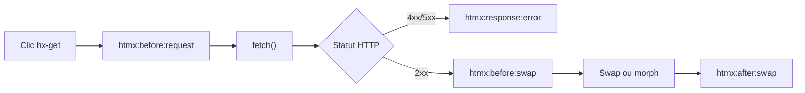
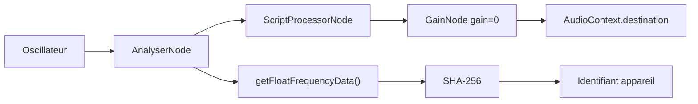

# Angular — Détail du dimanche 30 août 2026

## 1. htmx 4.0.0 — héritage explicite, événements renommés et historique sans `localStorage`

**Source :** htmx (Big Sky Software) — https://four.htmx.org/announcements/2026-08-28-htmx-4.0.0-is-released
**Date :** 28 août 2026

### Contexte

htmx a toujours reposé sur `XMLHttpRequest`, par compatibilité historique. Carson Gross explique que l'idée de htmx 4 est née pendant l'écriture de **fixi**, un projet où il s'est familiarisé avec `fetch()` et la programmation asynchrone moderne. Un échange avec Christian Tanul sur le **streaming HTML** a fini de convaincre l'équipe : basculer les internals sur `fetch()` simplifiait à la fois la bibliothèque et les cas d'usage de streaming.

Huit mois plus tard, la 4.0.0 sort. Le point important pour toi : du point de vue utilisateur, htmx 4 est **presque identique** à htmx 2. Les divergences sont peu nombreuses mais délibérées. Trois d'entre elles changent le comportement de ton code existant. htmx 2 reste supporté indéfiniment et garde le tag npm `latest` jusqu'à début 2027 — la 4.0 est publiée sous `next`. Aucune URL CDN non versionnée ne va donc basculer sous tes pieds.

### Comment ça marche

**L'héritage d'attributs devient opt-in.** En htmx 2, poser `hx-confirm` sur un `<div>` parent appliquait la confirmation à tous les descendants déclencheurs. Ce comportement venait d'intercooler.js et s'inspirait de CSS. Il en a hérité les mêmes défauts : puissant, mais difficile à tracer quand ça déraille. En htmx 4, rien n'est hérité sauf si tu ajoutes le suffixe `:inherited` au nom de l'attribut. Corollaire : `hx-disinherit` et ses variantes n'ont plus de raison d'être et doivent être supprimés.

**Les événements suivent une grammaire.** Ils avaient poussé de façon organique. Ils suivent désormais le motif `htmx:phase:action[:sub-action]`. `htmx:beforeRequest` devient `htmx:before:request`, `htmx:configRequest` devient `htmx:config:request`, et ainsi de suite. Deux familles disparaissent : les `htmx:xhr:*`, sans objet puisque le transport est `fetch()`, et les `htmx:validation:*`, remplacés par la validation native du navigateur. La plupart des événements d'erreur convergent vers `htmx:error` ; une réponse HTTP en erreur déclenche `htmx:response:error`.

**L'historique refait une requête.** htmx 2 stockait un snapshot de page dans `localStorage` pour le restaurer au retour arrière. Problème structurel : le snapshot capturait aussi les mutations DOM faites par Alpine.js ou d'autres libs tierces. À la restauration, le DOM muté revenait mais la logique JavaScript qui allait avec, non. htmx 4 ne cache plus rien : au retour arrière, il refait une requête réseau et swappe la réponse dans `<body>`, ou dans l'élément `[hx-history-elt]` si tu en déclares un. Avec un bon cache HTTP, c'est rapide. Si tu tiens au cache local, l'extension `hx-history-cache` le restaure depuis `sessionStorage`.



Deux nouveautés méritent le détour. Les **morph swaps** sont intégrés d'office : Michael West a repris l'algorithme d'idiomorph et l'a amélioré, ce qui évite de recréer les nœuds identiques et préserve le focus et l'état du formulaire. La balise **`<hx-partial>`** généralise les swaps out-of-band : au lieu de deviner la cible depuis l'`id` du fragment, tu déclares explicitement `hx-target` et `hx-swap` sur chaque partie de la réponse.

### En pratique — exemple de code

```html
<!-- Avant — htmx 2 : hx-confirm descend implicitement sur le bouton -->
<div hx-confirm="Êtes-vous sûr ?">
    <button hx-delete="/item/1">Supprimer</button>
</div>

<!-- Après — htmx 4 : sans :inherited, la confirmation ne s'applique plus -->
<div hx-confirm:inherited="Êtes-vous sûr ?">
    <button hx-delete="/item/1">Supprimer</button>
</div>
```

Le piège le plus coûteux est un `hx-headers` portant un token CSRF sur un conteneur : sans `:inherited`, l'en-tête n'atteint plus les enfants et ton serveur rejette la requête. L'outil de migration le signale nommément :

```bash
# Scanne tes templates et liste, ligne par ligne, ce qu'il faut corriger
npx htmx.org@4.0.0 upgrade-check -- ./templates

# templates/index.html:1: [inheritance] hx-headers needs :inherited suffix
#   (this looks like a CSRF token; without :inherited the header does not reach
#    child elements and the server rejects the request)
# templates/index.html:4: [removed-attr] hx-vars is removed -> use hx-vals with js: prefix
# templates/index.html:9: [old-event] "htmx:afterRequest" -> "htmx:after:request"
```

L'outil couvre `.html`, `.php`, `.js`, `.ts`, `.jinja`, `.erb`, `.hbs`, et accepte `--ext` pour ajouter `.vue` ou `.svelte`. Il flague aussi les renommages (`hx-disable` → `hx-ignore`), les suppressions (`hx-vars`, `hx-prompt`) et les APIs retirées comme `htmx.addClass()`.

### Pourquoi ça compte pour toi

Si tu maintiens un back Symfony ou ASP.NET qui rend du HTML avec htmx, la migration n'est pas une simple bump de version. Lance `upgrade-check` avant toute chose : un `hx-headers` CSRF non marqué `:inherited` casse silencieusement toutes tes mutations. Le passage de l'historique en refetch change aussi ta charge serveur — vérifie tes en-têtes `Cache-Control` sur les pages navigables.

### Points de vigilance

L'installation se fait via `htmx.org@4.0.0` explicitement, ou `https://unpkg.com/htmx.org@4.0.0/dist/htmx.min.js`. Un bundle `htmax.js` regroupe htmx avec les extensions les plus courantes (`hx-preload`, `hx-download`, `hx-alpine-compat`, `hx-history-cache`) si tu ne veux pas arbitrer. Trois extensions de streaming existent désormais : `hx-sse` (`text/event-stream`), `hx-ws` (WebSockets) et `hx-multipart` (`multipart/mixed`).

---

## 2. Fingerprinting audio sur AliExpress — deux `AudioContext` silencieux et un Bluetooth cassé

**Source :** InfoQ — https://www.infoq.com/news/2026/08/alibaba-audio-fingerprinting/
**Date :** 28 août 2026

### Contexte

Matt Callaghan débogue un problème banal : son casque Bluetooth multipoint, connecté au PC et au téléphone, coupe l'audio du téléphone dès qu'un onglet AliExpress est ouvert. Fermer l'onglet corrige immédiatement. Couper le son de l'onglet, de Firefox ou de Windows ne change rien. Aucun `<audio>`, aucun `<video>`, aucune requête média, `navigator.mediaSession.playbackState` reste à `none`.

Il instrumente donc la page avant chargement en wrappant le constructeur `AudioContext`. Résultat : **deux contextes audio créés en état `running`**, avec des nœuds connectés à `AudioContext.destination`. Les stack traces désignent `collina.js` et `fireyejs.js`, servis depuis `assets.aliexpress-media.com/g/AWSC/` — le répertoire d'outillage anti-abus d'Alibaba. Ce n'est pas de la lecture audio : c'est du **device fingerprinting**.

### Comment ça marche

Le principe tient en cinq étapes. **Un** : la page instancie un oscillateur qui génère une forme d'onde parfaitement déterministe. Callaghan observe une onde en dents de scie (`sawtooth`) ; les reconstructions publiques du pattern canonique utilisent souvent une onde `triangle` à 10 kHz passée dans un `DynamicsCompressorNode`. **Deux** : le signal traverse la chaîne de traitement numérique du navigateur — compression, analyse, FFT. **Trois** : un `AnalyserNode` expose les données du domaine fréquentiel via `getFloatFrequencyData()` dans un `Float32Array`. **Quatre** : ce buffer est haché, typiquement en SHA-256. **Cinq** : le hash devient un identifiant stable, reproductible d'une session à l'autre sur le même appareil.

D'où vient la variance entre appareils ? Des routines DSP qui ne s'évaluent pas à l'identique selon l'unité flottante, le jeu d'instructions (AVX sur x86, NEON sur ARM), le moteur de mixage de l'OS et les pilotes du fabricant. Les micro-écarts numériques suffisent à discriminer.

L'effet de bord sur le Bluetooth vient du `GainNode` réglé à zéro. Le graphe est **inaudible**, mais toujours **connecté à `destination`** : le navigateur traite activement le graphe, ce qui ouvre un flux audio au niveau plateforme et empêche l'OS de passer en idle. Le routage multipoint se verrouille sur le PC. Comme aucun élément média n'est impliqué, le bouton « couper le son de l'onglet » n'a aucune prise.



Le fingerprint audio n'est qu'un signal parmi une quinzaine relevés dans les mêmes bundles : canvas `toDataURL()`, renderer WebGL et précision des shaders, `devicePixelRatio`, `hardwareConcurrency`, `deviceMemory`, formats média supportés, comportement WebRTC, événements de device motion. Le tout est sérialisé, chiffré, puis expédié via `fetch()` et `sendBeacon()`.

### En pratique — exemple de code

Le wrapper d'instrumentation qui a permis la découverte tient en dix lignes. Tu peux le coller dans une extension ou un userscript pour auditer n'importe quel site.

```js
// Intercepte toute création d'AudioContext et journalise la pile d'appels
const OriginalAudioContext = window.AudioContext;
window.AudioContext = class extends OriginalAudioContext {
    constructor(...args) {
        super(...args);
        console.log("AudioContext created", {
            state: this.state,          // 'running' = le graphe tourne déjà
            stack: new Error().stack    // identifie le script fautif
        });
    }
};
```

Côté blocage, deux règles uBlock Origin suffisent, à coller dans l'onglet « My filters ». Attention : bloquer le script n'arrête pas un `AudioContext` déjà créé — ferme les onglets AliExpress ouverts après application.

```text
! AliExpress AWSC fingerprinting scripts
||assets.aliexpress-media.com/g/AWSC/uab/*/collina.js$script,domain=aliexpress.com
||assets.aliexpress-media.com/g/AWSC/fireyejs/*/fireyejs.js$script,domain=aliexpress.com
```

### Pourquoi ça compte pour toi

Si tu intègres un SDK anti-fraude tiers dans une app front, tu embarques peut-être ce type de graphe sans le savoir. Instrumente `AudioContext` en préproduction et regarde ce qui se crée au chargement. Côté conception : un `AudioContext` ne demande aucune permission et n'affiche aucun indicateur navigateur quand l'amplitude est nulle. Ce que tu ne vois pas dans la barre d'adresse ne prouve pas l'absence d'activité.

### Limites

Brave neutralise la technique par « farbling » : injection de bruit pseudo-aléatoire déterministe dans les buffers de rendu, ce qui rend le hash imprévisible sans casser les usages audibles. Firefox rend la sortie WebAudio quasi constante depuis la version 118 — la télémétrie montre **99,24 % des utilisateurs répartis sur trois valeurs seulement**, corrélées à l'architecture CPU (x86 et x64 sans FMA, x64 avec FMA, ARM avec NEON). Sur ces navigateurs, le fingerprinting WebAudio ne discrimine quasiment plus rien. Le blocage réseau reste efficace partout, au prix de CAPTCHA supplémentaires possibles au login ou au paiement, ces scripts étant liés à l'anti-fraude.
