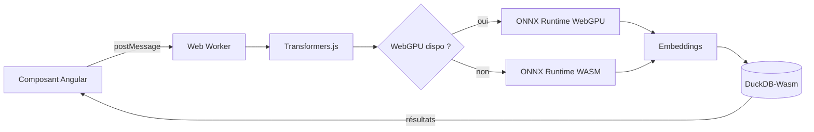

# Angular — Détail du mardi 1er septembre 2026

## 1. Inférence locale dans le navigateur — WebGPU, Transformers.js et DuckDB-Wasm

**Source :** InfoQ (présentation QCon London 2026, James Hall) — https://www.infoq.com/presentations/local-ai-browser-inference-privacy/
**Date :** 31 août 2026

### Contexte

Faire tourner un modèle côté client était longtemps une curiosité de démo. Trois choses ont changé. WebGPU est désormais disponible dans les navigateurs de bureau et permet d'adresser le GPU sans passer par WebGL. Les modèles utiles ont fondu : un embedder ou un classifieur de quelques dizaines de mégaoctets suffit pour la recherche sémantique, l'extraction d'entités ou le tri de documents. Et le coût des API distantes se voit désormais dans les budgets.

L'argument décisif n'est pourtant pas le prix. Quand l'inférence se fait dans l'onglet, aucune donnée utilisateur ne traverse le réseau. Pour un formulaire médical, un contrat ou un export comptable, ça supprime toute la discussion sur le sous-traitant, la localisation des données et la durée de rétention. Tu passes d'un problème juridique à un problème d'ingénierie.

### Comment ça marche

Le pipeline se décompose en quatre étages, et chacun a son piège.

**1. Le backend de calcul.** Transformers.js s'appuie sur ONNX Runtime Web, qui expose deux exécuteurs : WASM (CPU, universel, lent) et WebGPU (rapide, mais dépendant du matériel et du navigateur). Tu détectes la disponibilité au démarrage et tu bascules. WebGPU n'est pas garanti : sur mobile et sur certains pilotes Linux, tu retombes sur WASM.

**2. Le chargement des poids.** Un modèle quantifié en `q4` pèse typiquement 4 à 8 fois moins que le `fp32`. Transformers.js télécharge les shards ONNX depuis le Hub puis les stocke via la Cache API du navigateur. Le premier chargement est lent — plusieurs secondes à plusieurs dizaines de secondes ; les suivants lisent le cache disque. C'est un warm-up, pas une latence récurrente.

**3. Le thread.** L'inférence est bloquante. Si tu l'exécutes sur le thread principal, tu gèles le rendu Angular : plus de détection de changement, plus d'animations, plus de saisie. La règle est absolue — le pipeline vit dans un Web Worker, et tu communiques par messages.

**4. La donnée.** DuckDB-Wasm complète le tableau : il lit du Parquet ou du CSV en local et exécute du SQL analytique dans l'onglet. Combiné aux embeddings, tu obtiens une recherche sémantique complète sans aucun backend.



### En pratique — exemple de code

Un worker qui charge un modèle d'embeddings une seule fois et répond aux requêtes du composant.

```ts
// embed.worker.ts — tourne hors du thread principal, ne bloque jamais le rendu
import { pipeline, env } from '@huggingface/transformers';

env.allowLocalModels = false; // on ne sert que depuis le Hub + Cache API

// Instanciation paresseuse : le warm-up n'a lieu qu'au premier message reçu.
let extractor: Awaited<ReturnType<typeof pipeline>> | null = null;

async function getExtractor() {
  if (extractor) return extractor;
  const hasGpu = 'gpu' in navigator; // WebGPU absent -> repli WASM automatique
  extractor = await pipeline('feature-extraction', 'Xenova/all-MiniLM-L6-v2', {
    device: hasGpu ? 'webgpu' : 'wasm',
    dtype: 'q8', // quantification : ~4x plus petit, précision suffisante ici
  });
  return extractor;
}

addEventListener('message', async ({ data }: MessageEvent<{ id: number; text: string }>) => {
  const run = await getExtractor();
  // pooling 'mean' + normalisation : on obtient un vecteur comparable au cosinus
  const out = await run(data.text, { pooling: 'mean', normalize: true });
  postMessage({ id: data.id, vector: Array.from(out.data as Float32Array) });
});
```

Côté Angular, tu enveloppes le worker dans un service et tu exposes un `resource()` ou un simple signal — la latence devient un état d'UI comme un autre, pas une exception à gérer.

### Pourquoi ça compte pour toi

Tu as des écrans où l'utilisateur colle des données sensibles avant de cliquer. Déporter la classification ou la recherche sémantique dans l'onglet supprime le trajet réseau, la clé d'API à protéger et la question du sous-traitant. Traite le warm-up comme un chargement de police : mesure-le, affiche-le, et garde un repli serveur pour les postes sans WebGPU. Le worker n'est pas optionnel.

### Points de vigilance

Le premier téléchargement passe mal sur un réseau bridé — précharge en tâche de fond après le premier rendu. Et mesure sur du vrai matériel : un MacBook M-series et un portable d'entreprise de 2021 ne donnent pas le même verdict.

---

## 2. Angular 22.1 — le schematic `@Service()` et le passage à une cadence majeure annuelle

**Source :** Ninja Squad — https://blog.ninja-squad.com/2026/07/29/what-is-new-angular-22.1
**Date :** 29 juillet 2026

### Contexte

Angular v22 a introduit le décorateur `@Service()` pour remplacer le très verbeux `@Injectable({ providedIn: 'root' })`. La 22.1 apporte ce qui manquait : le schematic de migration automatique. Le blog Angular étant silencieux ces derniers jours, c'est l'occasion de rattraper ce point — et surtout le second, qui a beaucoup moins circulé et qui pèse bien plus lourd : **le rythme des majeures passe à une par an, en juin**.

Depuis dix ans, Angular livrait deux majeures par an, en mai et en novembre, avec 18 mois de support. Chaque équipe planifiait donc deux montées de version annuelles. Ce contrat change.

### Comment ça marche

**Le décorateur.** `@Service()` déclare un service singleton fourni à la racine, sans que tu répètes l'objet de configuration. La règle de traduction est mécanique :

- `@Injectable({ providedIn: 'root' })` → `@Service()`
- `@Injectable()` nu → `@Service({ autoProvided: false })`, parce qu'il n'y a aucun `providedIn` à reporter

**Le schematic.** Il est délibérément conservateur : il saute les classes qui utilisent l'injection par constructeur, celles qui passent à `@Injectable` une option autre que `providedIn`, et celles dont `providedIn` vaut autre chose que `'root'` (un `NgModule`, une plateforme). Ces cas restent à traiter à la main — la migration ne devine rien.

**La cadence.** Le nouveau contrat tient en trois lignes. Une majeure par an, en juin. Deux ans de support par majeure au lieu de dix-huit mois. Conséquence directe : la v23 n'arrive pas en novembre 2026 mais en **juin 2027**, puis la v24 en juin 2028. Entre les deux, tu ne reçois que des mineures — la prochaine, v22.2, est attendue ce mois-ci.

### En pratique — exemple de code

La migration se lance en une commande, puis tu relis le diff.

```bash
# Applique la migration sur tout le workspace ; les cas ambigus sont laissés en l'état
ng generate @angular/core:service-decorator
```

```ts
// Avant — v21 et antérieures : le pattern historique, répété partout
@Injectable({ providedIn: 'root' })
export class InvoiceStore {
  private readonly http = inject(HttpClient);
}

// Avant — service fourni explicitement par un provider, jamais à la racine
@Injectable()
export class ScopedCache {}

// Après — v22.1 : le cas racine devient le cas par défaut
@Service()
export class InvoiceStore {
  private readonly http = inject(HttpClient);
}

// Après — le cas non-racine doit le dire explicitement
@Service({ autoProvided: false })
export class ScopedCache {}
```

Le schematic ne touche pas `InvoiceStore` si la dépendance passe par le constructeur : migre d'abord vers `inject()`, relance ensuite.

### Pourquoi ça compte pour toi

La partie décorateur est cosmétique — lance le schematic, relis le diff, passe à autre chose. La cadence, elle, touche ta roadmap. Tu n'as plus deux montées majeures par an à budgéter mais une, en juin, avec deux ans de support derrière. Si tu es sur v22 aujourd'hui, tu es couvert jusqu'en 2028 : tu peux étaler la dette front au lieu de courir après novembre.

### Limites

Le support étendu ne s'applique qu'aux majeures ; les mineures restent des mises à jour à appliquer en continu. Et une cadence plus lente ne veut pas dire moins de changements — ils arrivent groupés, donc le saut de juin sera plus gros.
