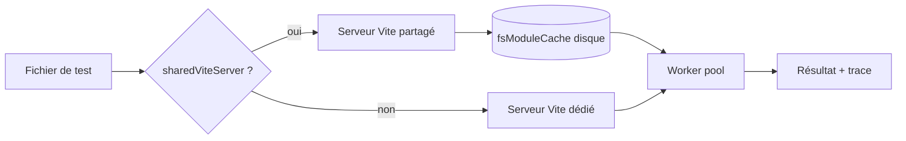
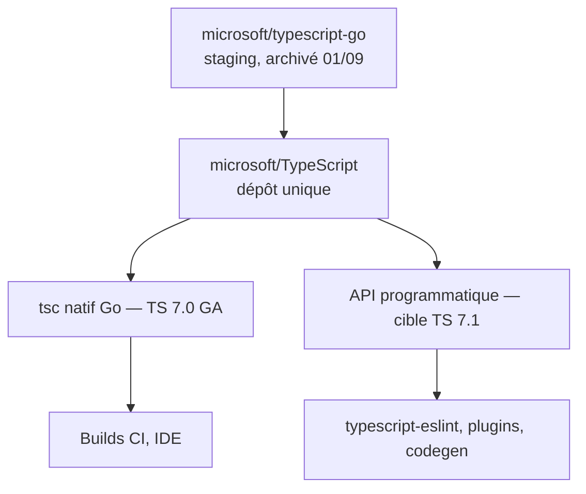

# Angular — Détail du samedi 5 septembre 2026

## 1. Vitest 5.0 — `vi.when`, `clearMocks` par défaut et assertions asynchrones strictes

**Source :** Vitest — https://vitest.dev/blog/vitest-5.html
**Date :** 3 septembre 2026

### Contexte

Vitest est le lanceur de tests par défaut de l'écosystème Vite, et donc de plus en plus de projets Angular qui migrent depuis Karma. La version 4 avait stabilisé le Browser Mode ; la version 5, sortie le 3 septembre, cible autre chose : le temps de restitution sur des suites réalistes.

L'équipe a construit `vitest-dev/benchmarks`, un jeu d'applications générées allant d'un paquet utilitaire de 5 fichiers à un monolithe de 1 280 modules. Chaque application tourne sur les quatre pools (`forks`, `threads`, `vmForks`, `vmThreads`) et trois environnements. Les chiffres publiés vont de −8 % à −53 % selon la cellule. Mais la release apporte surtout deux changements de comportement qui vont faire tomber des tests verts aujourd'hui.

### Comment ça marche

Le gain de performance vient de quatre leviers cumulés. D'abord, les projets déclarés dans `test.projects` qui ne modifient pas la config Vite partagent maintenant le serveur Vite du fichier racine : un fichier commun n'est transformé qu'une fois pour tout le monde (`sharedViteServer`). Ensuite, `fsModuleCache` sort d'`experimental` : les modules transformés sont persistés sur disque et réutilisés entre deux exécutions et même entre deux processus Vitest distincts. Troisièmement, les pools `vmThreads` et `vmForks` réutilisent le code compilé entre contextes et préchauffent le graphe de modules. Enfin, Vitest embarque désormais ses propres dépendances, ce qui réduit le nombre de paquets à résoudre dans `node_modules`.

Le second axe est comportemental. `clearMocks` passe à `true` : `vi.clearAllMocks()` est appelé avant chaque test, donc l'historique d'appels d'un mock ne traverse plus la frontière entre deux tests — les implémentations, elles, restent en place. C'est la source la plus courante de tests dépendants de l'ordre d'exécution. Et les assertions asynchrones (`resolves`, `rejects`, `toMatchFileSnapshot`) échouent maintenant si tu oublies le `await`, là où Vitest 4 se contentait d'un avertissement et les attendait en fin de test.

Le troisième apport visible au quotidien est `vi.when`. Jusqu'ici, faire répondre différemment un espion selon ses arguments imposait un `mockImplementation` avec des `if` manuels. `vi.when` déclare ces comportements par jeu d'arguments, comparés par égalité profonde, avec support des matchers asymétriques.



### En pratique — exemple de code

Le mocking conditionnel avec `vi.when`, et la version 4 équivalente en commentaire :

```ts
import { expect, test, vi } from 'vitest'

test('retourne les données utilisateur', async () => {
  const findById = vi.fn()

  // Avant (Vitest 4) : un mockImplementation avec des if manuels
  // findById.mockImplementation(id => id === 1 ? Promise.resolve(...) : ...)

  // Après (Vitest 5) : un comportement déclaré par jeu d'arguments
  vi.when(findById)
    .calledWith(1)
    .thenResolve({ id: 1, name: 'Ella' })
    .calledWith(expect.any(Number)) // matcher asymétrique = cas par défaut
    .thenReject(new Error('not found'))

  await expect(findById(1)).resolves.toEqual({ id: 1, name: 'Ella' })
  await expect(findById(3)).rejects.toThrow('not found')
})
```

Et la config minimale pour activer la Trace View du Browser Mode, qui rejoue chaque interaction sous forme de snapshot DOM :

```ts
import { defineConfig } from 'vitest/config'

export default defineConfig({
  test: {
    browser: { traceView: true },   // rejeu pas à pas, dispo aussi dans le rapport HTML
    // clearMocks: false,           // décommente pour garder le comportement Vitest 4
  },
})
```

### Pourquoi ça compte pour toi

Si tu testes un front Angular avec Vitest, planifie la montée en deux temps : d'abord Node 22.12 et Vite 6.4, ensuite les défauts. Les assertions asynchrones non attendues sont le piège le plus rentable — elles révèlent des tests qui ne vérifiaient rien. Lance `vitest doctor` avant d'optimiser à la main : il rejoue ta suite sous d'autres configurations et te dit laquelle gagne.

### Points de vigilance

`locators.exact` est activé par défaut : `getByText('Item')` ne matche plus `Item 1`. Les rapports (`html`, `json`, `junit`), captures d'échec et traces atterrissent tous dans un unique dossier `.vitest/` — une seule ligne à ajouter au `.gitignore`, mais les chemins d'artefacts CI existants sont à corriger.

---

## 2. `microsoft/typescript-go` archivé — le port Go réintègre `microsoft/TypeScript`

**Source :** GitHub — https://github.com/microsoft/typescript-go
**Date :** 1er septembre 2026

### Contexte

TypeScript 7.0, la réécriture du compilateur en Go, est passée en GA le 8 juillet 2026. Pendant toute la phase de portage, le code vivait dans un dépôt séparé, `microsoft/typescript-go`, avec son propre backlog d'issues et sa propre commande, `tsgo`. Deux dépôts, deux trackers, deux sources de vérité : praticable pendant un portage, intenable une fois le produit livré.

Le 1er septembre 2026, Microsoft a archivé `microsoft/typescript-go`. La pull request « Migrate repo to TypeScript 7 » rapatrie l'intégralité du code Go dans `microsoft/TypeScript`, qui redevient le dépôt unique du compilateur. Pour toi, ça ne change rien au binaire installé — mais ça change où poser une issue, où lire le code, et quand espérer les outils tiers.

### Comment ça marche

Il faut distinguer trois choses que la communication autour de TypeScript 7 mélange souvent.

Le **binaire** d'abord. Le compilateur natif s'invoquait `tsgo` pendant la bêta pour cohabiter avec le `tsc` historique. En 7.0 GA, c'est `tsc` qui pointe sur l'implémentation Go ; `tsgo` reste comme alias transitoire dans certains paquets. Ton `tsconfig.json` est inchangé : mêmes options, mêmes diagnostics, dix fois moins de temps de build sur les gros projets.

Le **dépôt** ensuite. `microsoft/typescript-go` était un « staging repo ». Son archivage signifie qu'il est en lecture seule : plus d'issue, plus de PR. Tout remonte désormais sur `microsoft/TypeScript`, y compris les jalons — le jalon « TypeScript 7.1 » y suit sa vie.

L'**API programmatique** enfin, et c'est le point qui bloque encore l'écosystème. L'ancien compilateur exposait une API JavaScript stable, utilisée par `typescript-eslint`, les plugins de bundlers, les générateurs de doc, les transformateurs custom. Le compilateur Go ne l'expose pas encore de façon stable : Microsoft l'a annoncée pour **7.1**, pas pour 7.0. Tant qu'elle n'est pas là, les outils qui font de l'analyse « type-aware » restent sur l'ancien paquet, ou tournent en mode dégradé.



### En pratique — exemple de code

Ce que ça donne dans un projet Angular ou Node en cours de migration. La partie build bascule sans douleur ; la partie lint type-aware attend 7.1 :

```jsonc
// package.json — cohabitation pendant la transition
{
  "devDependencies": {
    "typescript": "7.0.4",          // compilateur natif : tsc = Go
    "typescript-eslint": "8.x"      // encore adossé à l'API de l'ancien compilateur
  },
  "scripts": {
    "typecheck": "tsc --noEmit",    // rapide : c'est le binaire Go
    "lint": "eslint ."              // pas encore accéléré, dépend de l'API 7.1
  }
}
```

```bash
# Vérifier quelle implémentation répond réellement
npx tsc --version          # Version 7.0.x
# Et mesurer le gain sur ton projet avant/après
npx tsc --noEmit --diagnostics | grep -E "Total time|Check time"
```

### Pourquoi ça compte pour toi

Concrètement : ouvre tes issues sur `microsoft/TypeScript`, plus sur `typescript-go`, sinon personne ne les lira. Si ta CI est lente sur le typecheck, TS 7 est un gain quasi gratuit. Mais ne planifie pas la suppression de l'ancien `typescript` tant que ton linter et tes plugins de build n'ont pas migré : c'est 7.1 qui débloquera ça, pas 7.0.

### Limites

Aucune date publique n'est engagée pour 7.1 au-delà d'un « plusieurs mois après 7.0 ». Traite le calendrier comme incertain et garde une voie de repli sur l'ancien compilateur pour les outils qui en dépendent.
