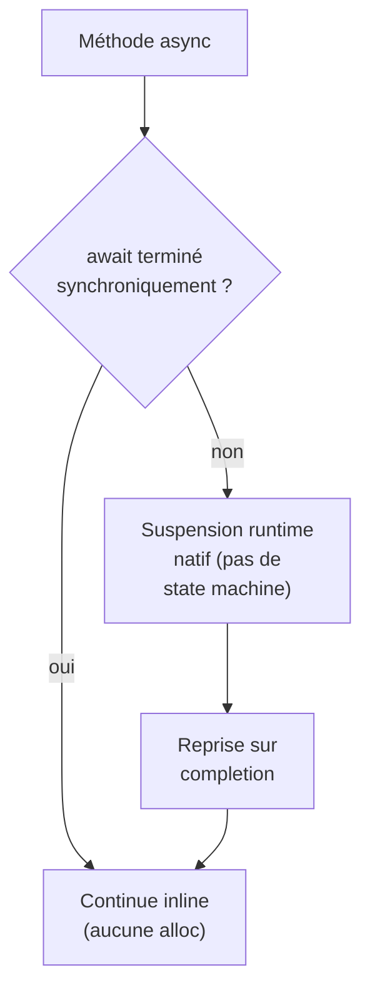
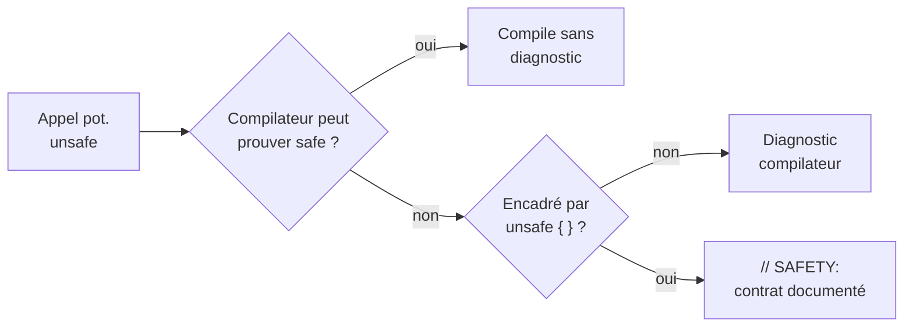
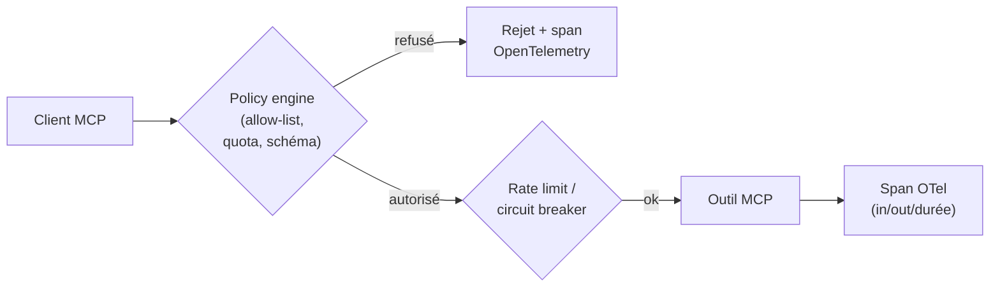
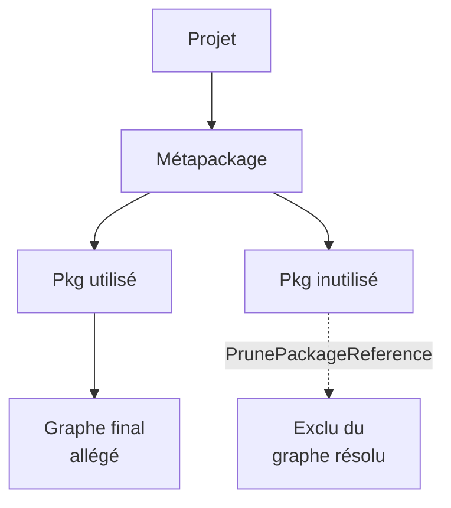

# CSharp / .NET — Détail du jeudi 28 mai 2026

## 1. .NET 11 Preview 4 — Runtime async stable, JIT plus agressif, JSON first-class dans EF Core

**Source :** Microsoft DevBlog — https://devblogs.microsoft.com/dotnet/dotnet-11-preview-4/
**Date :** 12 mai 2026

### Contexte

.NET 11 (non-LTS) est attendu en novembre 2026, dans la cadence annuelle classique de Microsoft. La Preview 4 du 12 mai marque une étape : c'est la première où **Runtime Async** n'exige plus le flag `EnablePreviewFeatures=true` pour les projets `net11.0`.

Runtime Async réécrit le modèle `async`/`await` directement dans le runtime. Avant, le compilateur générait une *state machine* par méthode `async`. Désormais le runtime gère lui-même la suspension. Tu peux donc l'utiliser en POC sans flag de feature.

### Comment ça marche

Le changement clé porte sur la suspension d'un `await`. Avant, le compilateur transformait ta méthode en classe state machine : un champ par variable locale capturée, un champ d'état (`<>1__state`), et un `MoveNext()` qui rejoue la méthode à chaque reprise. Chaque `await` non terminé synchroniquement allouait cette machine sur le tas.

Avec Runtime Async, le JIT et le runtime traitent la suspension nativement, sans matérialiser cette classe. Résultat : une allocation de moins par `await` dans le hot path, et des *stack traces* où les frames `async` apparaissent dans leur ordre logique, sans l'enchevêtrement habituel des types de continuation.



Côté JIT, la Preview 4 ajoute du *bounds check elimination* plus agressif, le retrait de contextes `checked` redondants, le *folding* des `switch` sur constantes, le constant-folding de `SequenceEqual` et l'élimination de branches redondantes. Les gains micro-benchmark vont de 2 à 8 % selon le workload. S'ajoutent les intrinsics Arm SVE2 (`ShiftRightLogicalNarrowingSaturate(Even|Odd)`), pertinents sur Graviton4, Cobalt 100 ou Apple Silicon.

### En pratique — exemple de code

Côté EF Core, les colonnes JSON deviennent first-class : leurs chemins sont représentés dans le modèle relationnel et les requêtes LINQ qui traversent un sous-document sont traduites en SQL natif (`JSON_VALUE`, `JSON_QUERY`).

```csharp
// Mapping d'une colonne JSON et requête traversant le sous-document
public class Order
{
    public int Id { get; set; }
    public OrderMetadata Metadata { get; set; } = new();   // sérialisé en colonne JSON
}

modelBuilder.Entity<Order>().OwnsOne(o => o.Metadata, b => b.ToJson());

// La traversée du sous-document est traduite en JSON_VALUE côté SQL, plus de raw SQL
var recent = await db.Orders
    .Where(o => o.Metadata.Channel == "web")
    .OrderByDescending(o => o.Metadata.Priority)
    .Take(20)
    .ToListAsync();
```

Le SDK .NET 11 embarque aussi `dotnet new mcpserver` sans installation séparée : scaffolding d'un serveur MCP fonctionnel en C# en quelques minutes.

### Pourquoi ça compte pour toi

Si tu pousses du code async-heavy (API HTTP, Functions, SignalR), Runtime Async vaut le coup d'œil dès la Preview 4 : les traces propres seules valent l'investissement. Pour la prod, attends la GA de novembre. Le support JSON natif d'EF Core règle un cas récurrent (logs structurés, configs dynamiques, blobs de métadonnées) que tu traitais sinon en raw SQL ou via `JsonDocument`.

### Pour aller plus loin

Autres ajouts utiles : APIs `Deflate`/`ZLib`/`GZip` acceptant `ReadOnlySpan<byte>`/`Span<byte>` sans allocation intermédiaire (logging/observability qui compresse à la volée) ; format `"X"` pour `float`/`double` (round-trip lossless) ; .NET MAUI sur CoreCLR par défaut, Mono en sortie progressive, avec 20-30 % de gain sur les cold starts Android d'apps complexes.

---

## 2. Improving C# Memory Safety — Le `unsafe` keyword devient explicite (C# 16)

**Source :** Microsoft DevBlog — https://devblogs.microsoft.com/dotnet/improving-csharp-memory-safety/
**Date :** 21 mai 2026

### Contexte

Le débat « C# devrait-il devenir memory-safe comme Rust ? » revient depuis que Microsoft a annoncé ses efforts memory safety sur l'ensemble de la stack Windows. La position de Richard Lander (PM .NET) est claire : pas question de transformer C# en Rust, mais **rendre explicite et auditable tout code qui peut violer la safety**.

La proposition, qui sera C# 16 (preview en .NET 11, GA en .NET 12), redéfinit le périmètre du keyword `unsafe`.

### Comment ça marche

Aujourd'hui, `unsafe` ne s'applique qu'aux pointeurs (`int*`, `&x`). Demain, il englobera **toute opération que le compilateur ne peut pas prouver safe** : P/Invoke non annoté, `Marshal.Read*`, `MemoryMarshal.CreateSpan`, etc. Le compilateur émettra un diagnostic sur chaque appel de cette nature non encadré.

Chaque usage devra être documenté par un commentaire décrivant les obligations du caller, directement inspiré de la convention Rust `// SAFETY: ...`. L'objectif n'est pas d'éliminer le code dangereux mais de le rendre **visible et contractuel** en revue.



### En pratique — exemple de code

L'évolution oblige à matérialiser un bloc `unsafe` et son contrat sur des appels jusque-là silencieux. Microsoft livrera un fixer `dotnet format` qui wrappe automatiquement les appels existants.

```csharp
// Avant — l'appel passait sans aucune annotation
Span<byte> buffer = MemoryMarshal.CreateSpan(ref start, length);

// Après — C# 16 exige le bloc unsafe + le contrat de sûreté
// SAFETY: 'start' référence le 1er octet d'une zone d'au moins 'length'
// octets, vivante pour toute la durée d'usage du span.
unsafe
{
    Span<byte> buffer = MemoryMarshal.CreateSpan(ref start, length);
}
```

### Pourquoi ça compte pour toi

Si tu fais de l'interop, du parsing binaire ou des appels P/Invoke, prépare ta codebase à expliciter les `unsafe`. Lance le fixer en preview dès la sortie de .NET 11, puis ajoute les commentaires SAFETY au fil de tes PRs. En revue, tu vois immédiatement les contrats que chaque appel impose et tu peux les vérifier ou les casser sciemment.

### Points de vigilance

Le modèle est opt-in en .NET 11/12, puis vraisemblablement default en .NET 13 (LTS) : tu as ~18 mois pour préparer ta codebase. Les libs à fort interop (SkiaSharp, ImageSharp, Npgsql) devront migrer aussi — surveille leurs roadmaps. Attention : la proposition rend les `unsafe` visibles, elle ne les élimine pas. Pour des garanties niveau Rust, il faudrait du borrow checking, non envisagé pour C#.

---

## 3. Agent Governance Toolkit MCP Extensions for .NET

**Source :** Microsoft DevBlog — https://devblogs.microsoft.com/dotnet/announcing-agent-governance-toolkit-mcp-extensions-for-dotnet/
**Date :** 21 mai 2026

### Contexte

Microsoft annonce un package officiel `Microsoft.Extensions.Agents.Governance` qui ajoute une couche de **gouvernance, observabilité et policy enforcement** au-dessus des serveurs MCP construits en .NET. C'est la réponse au constat que de plus en plus d'agents tournent en production sans audit trail, sans contrôle de débit, sans validation des outputs.

### Comment ça marche

Le toolkit s'intercale comme middleware entre le client MCP et l'exécution réelle de l'outil. À chaque invocation, un *policy engine* déclaratif évalue les règles : allow-list de tools, quotas par tenant, validation du schéma d'output, redaction automatique de PII. Une invocation refusée n'atteint jamais le handler.

Les invocations autorisées sont émises comme spans OpenTelemetry (inputs, outputs, durées), compatibles Azure Monitor, Datadog, Honeycomb. Le rate limiting et le circuit breaking sont intégrés au même pipeline, sans middleware maison.



### En pratique — exemple de code

L'intégration tient en deux gestes : ajouter le package, puis brancher la gouvernance dans le conteneur DI avec ses policies.

```csharp
// dotnet add package Microsoft.Extensions.Agents.Governance
builder.Services.AddAgentGovernance(options =>
{
    options.AllowTools("search_docs", "create_ticket");   // allow-list explicite
    options.RateLimitPerUser(maxCalls: 60, window: TimeSpan.FromMinutes(1));
    options.RedactPii();                                   // masque les PII en sortie
    options.EmitOpenTelemetry();                           // audit trail complet
});
```

### Pourquoi ça compte pour toi

Si tu construis un assistant interne ou un produit avec une couche agent en .NET, ce package te fait gagner plusieurs sprints. La gouvernance des agents est aujourd'hui sous-traitée — chacun bricole sa solution. Un standard Microsoft aligne les pratiques : allow-list, quotas et audit trail en quelques lignes, plutôt qu'un middleware maison fragile à maintenir.

---

## 4. NuGet Package Pruning — Dépendances plus propres, vulnérabilités actionnables

**Source :** Microsoft DevBlog — https://devblogs.microsoft.com/dotnet/nuget-package-pruning-in-dotnet-10/
**Date :** 18 mai 2026

### Contexte

Les graphes de dépendances NuGet enflent silencieusement : dépendances transitives, métapackages qui tirent 30 sous-packages. Le SDK .NET 10/11 livre une fonctionnalité de **pruning** qui exclut automatiquement les dépendances que ton projet n'utilise pas réellement, et améliore la lisibilité des reports de vulnérabilités.

### Comment ça marche

Le pruning intervient à la résolution du graphe, au build. Tu déclares dans le `.csproj` les packages que ton projet ne consomme pas directement (typiquement référencés par un métapackage). Le build les retire du graphe résolu, ce qui allège la sortie et le `restore`.

En parallèle, `dotnet list package --vulnerable` ne se contente plus de lister la transitive vulnérable : il remonte la **dépendance directe responsable** de la tirer. Plus de chasse au cœur de l'arbre pour savoir quoi mettre à jour.



### En pratique — exemple de code

La directive `PrunePackageReference` se pose dans le `.csproj` ; l'audit CVE devient directement actionnable en CLI.

```xml
<!-- .csproj — exclut du graphe un package tiré par un métapackage mais non consommé -->
<ItemGroup>
  <PrunePackageReference Include="System.Text.Encodings.Web" />
</ItemGroup>
```

```bash
# Remonte la dépendance directe responsable de chaque CVE transitive
dotnet list package --vulnerable
```

### Pourquoi ça compte pour toi

Tes builds peuvent gagner plusieurs centaines de Mo et quelques secondes en `dotnet restore`. Surtout, tu réduis ta surface d'attaque : moins de packages, moins de CVE potentielles. Démarre par `dotnet list package --vulnerable` sur tes solutions critiques, identifie les CVE remontées, puis décide entre purge et update en connaissant la dépendance directe fautive.
