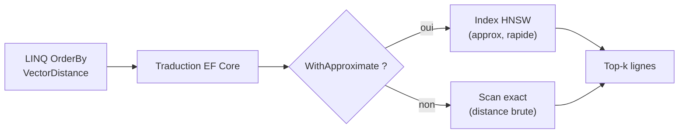
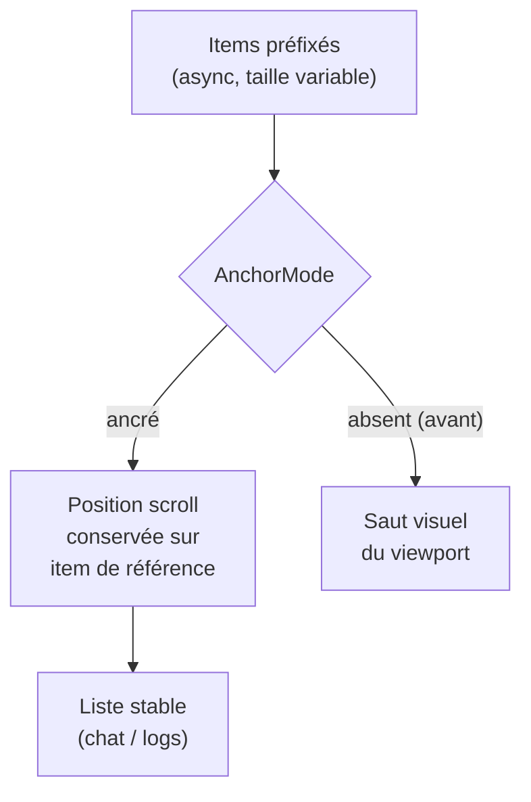

# CSharp — Détail du vendredi 29 mai 2026

## 1. EF Core 11 Preview 4 — Vector search SQL Server 2025, ChangeTracker plus malin, JSON first-class

**Source :** Microsoft .NET Blog — https://devblogs.microsoft.com/dotnet/dotnet-11-preview-4/
**Date :** 12 mai 2026

### Contexte

EF Core 10 (LTS, novembre 2025) avait déjà introduit le support du vector search côté providers, mais la traduction SQL générique restait limitée. La Preview 4 de `.NET 11` est la première à rendre ces APIs utilisables end-to-end avec **SQL Server 2025**, qui expose maintenant le type `VECTOR` et la fonction `VECTOR_DISTANCE` côté moteur.

En parallèle, EF Core répond à des demandes anciennes : moins de friction sur les colonnes JSON, et un `ChangeTracker` qui ne te force plus à passer par `DetectChanges()` quand tu sais déjà ce que tu cherches.

### Comment ça marche

Le vector search natif relie le LINQ à l'index vectoriel du moteur. `EF.Functions.VectorDistance(embedding, target)` est traduit en `VECTOR_DISTANCE` SQL. `WithApproximate()` instruit le moteur d'emprunter un index vectoriel (HNSW côté SQL Server 2025) au lieu d'un scan exact ligne à ligne. Un `OrderBy` sur la distance suivi d'un `Take(k)` produit une recherche k-NN entièrement côté serveur.

Le second levier touche le `ChangeTracker`. Normalement, lire l'état des entités déclenche `DetectChanges()`, qui balaie tout le graphe suivi pour comparer chaque propriété à son snapshot. `GetEntriesForState()` retourne les entrées filtrées par `EntityState` **sans** ce balayage — décisif sur les contextes long-vivants.



### En pratique — exemple de code

Recherche sémantique k-NN entièrement traduite en SQL, sans Dapper ni raw SQL pour la partie vectorielle.

```csharp
// k-NN sur SQL Server 2025 : index vectoriel + tri par distance, tout en LINQ
float[] target = await embedder.EmbedAsync(userQuery);

var hits = await db.Documents
    .OrderBy(d => EF.Functions.VectorDistance(d.Embedding, target))
    .WithApproximate()          // emprunte l'index HNSW plutôt qu'un scan exact
    .Take(10)
    .ToListAsync();

// Contexte long-vivant : éviter le coût de DetectChanges() à chaque tick
var added = db.ChangeTracker.GetEntriesForState(EntityState.Added);   // pas de scan du graphe
```

### Pourquoi ça compte pour toi

Si tu fais du RAG ou de la recherche sémantique sur `.NET` + SQL Server, tu peux **garder ton ORM** au lieu de basculer sur Dapper/SQL brut pour le vectoriel. `GetEntriesForState()` te débloque sur tes workers EF Core long-vivants où `DetectChanges()` coûtait cher à chaque tick. Et l'exclusion FK des migrations règle un irritant pour tes bases partagées multi-app.

### Points de vigilance

`VectorSearch()` ne tombe back à un scan exact que si l'index vectoriel n'existe pas : vérifie tes plans avant de pousser en prod. La représentation structurée des chemins JSON peut casser des compiled models existants — compare `dotnet ef migrations script` avant l'upgrade. Autres ajouts : `ExcludeForeignKeyFromMigrations(true)`, config par défaut dans `.config/dotnet-ef.json`, et `PeriodStart`/`PeriodEnd` des temporal tables désormais en propriétés CLR normales.

---

## 2. ASP.NET Core 11 Preview 4 — Blazor Virtualize stable, Web Worker, Aspire service defaults, mcpserver template

**Source :** Microsoft .NET Blog — https://devblogs.microsoft.com/dotnet/dotnet-11-preview-4/
**Date :** 12 mai 2026

### Contexte

La Preview 4 d'ASP.NET Core resserre plusieurs sujets qui traînaient. Blazor reçoit deux corrections d'UX historiques (saut du `Virtualize`, friction du Web Worker). Le wiring Aspire continue vers le « par défaut, ça marche ». Et le serveur MCP, qu'on scaffoldait à la main ou via nuget custom, devient un template SDK officiel.

### Comment ça marche

Le composant `Virtualize` ne rend que les items visibles dans le viewport et calcule la hauteur des items hors écran. Le bug : quand un item au-dessus du viewport changeait de taille (image chargée async dans une liste de messages), le contenu visible se décalait. Le nouveau paramètre `AnchorMode` ancre la position de scroll sur un item de référence quand des éléments sont préfixés ou suffixés — exactement le pattern chat UI, logs en streaming, news feed.

Côté Aspire, le template `blazor-wasm-servicedefaults` scaffolde une lib `ServiceDefaults` côté client : OpenTelemetry (logs/metrics/traces via OTLP), service discovery et resilience HTTP standard câblés d'office.



### En pratique — exemple de code

Le template MCP fait passer l'exposition de services internes en outils MCP de plusieurs heures à quelques minutes.

```bash
# Scaffolde un serveur MCP minimal, prêt à brancher dans un client (ex. Claude Desktop)
dotnet new mcpserver -o MyMcpServer

# Aspire : lib ServiceDefaults Blazor WASM (OTel + service discovery + resilience)
dotnet new blazor-wasm-servicedefaults -o Client.ServiceDefaults
```

```razor
@* Virtualize ancré : plus de saut quand un item au-dessus charge en async *@
<Virtualize Items="@messages" AnchorMode="VirtualizeAnchorMode.Bottom" Context="m">
    <MessageRow Message="@m" />
</Virtualize>
```

### Pourquoi ça compte pour toi

Si tu maintiens du Blazor avec listes virtualisées (admin tools, dashboards, monitoring), `AnchorMode` règle un bug d'UX que tu contournais sûrement à la main. Le template Aspire `servicedefaults` te fait gagner une demi-journée par projet sur le câblage observabilité. Et `dotnet new mcpserver` te laisse tester l'exposition de tes services internes comme outils MCP en moins de 10 minutes.

### Limites

`AnchorMode` ne couvre pas tous les patterns scroll : le jump-to-bottom programmatique reste à ta charge. Le serveur MCP scaffoldé n'a pas encore de templates d'authentification — tout est anonymous local pour l'instant. Autres ajouts : `InvokeVoidAsync` sur le Web Worker (fire-and-forget, cancellation/timeout par invocation), reconnaissance de la méthode HTTP QUERY en OpenAPI, `dotnet run` interactif sans TFM, et crash recovery de `dotnet watch` + Aspire.
