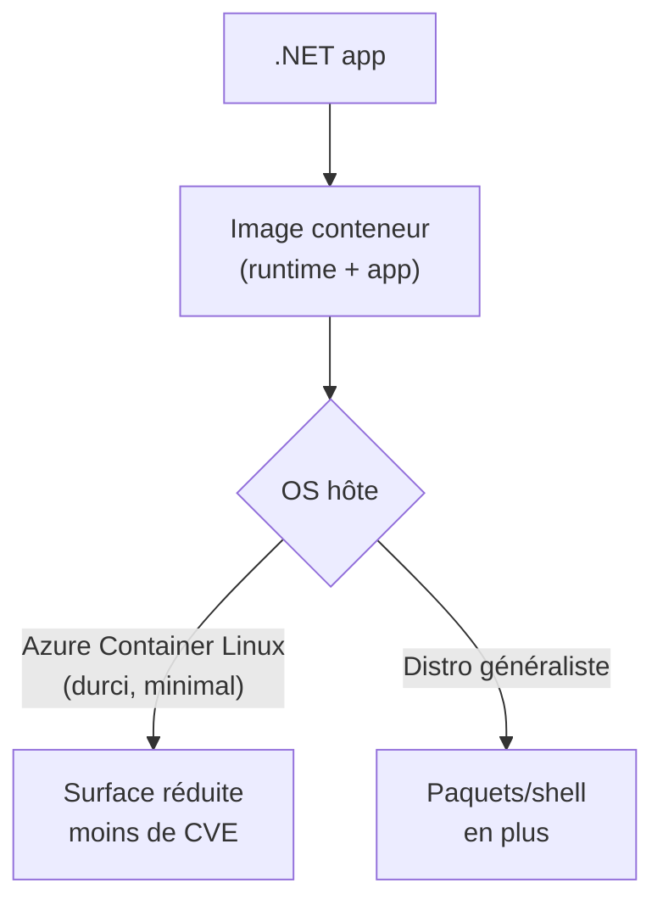
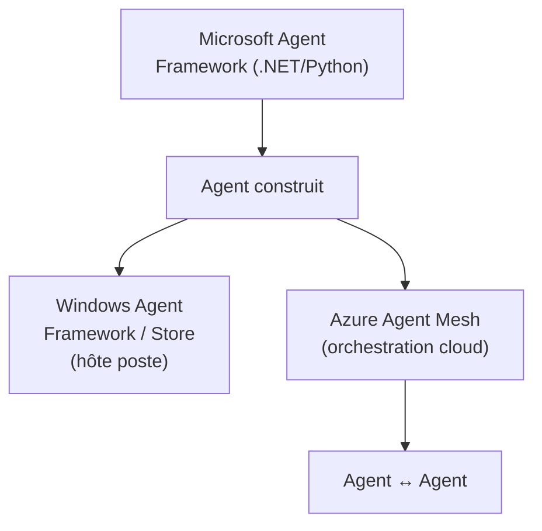

# CSharp — Détail du mardi 2 juin 2026

## 1. Azure Linux 4.0 (préversion publique) & Azure Container Linux (GA)

**Source :** Microsoft Open Source Blog — https://opensource.microsoft.com/blog/2026/05/18/from-open-source-to-agentic-systems-microsoft-at-open-source-summit-north-america-2026/
**Date :** 18 mai 2026 (annonce), déploiement élargi au Build du 2 juin 2026

### Contexte

Azure Linux est la distribution maison de Microsoft (successeur de CBL-Mariner), utilisée comme socle pour AKS et les services Azure. Annoncée à l'Open Source Summit North America le 18 mai, la version 4.0 arrive en préversion publique sur les VMs Azure.

En parallèle, **Azure Container Linux** passe en disponibilité générale au Build : un OS minimal et durci, pensé pour n'exécuter que des conteneurs, positionné comme fondation « AI-native » pour les charges agentiques.

### Comment ça marche

L'intérêt d'un OS « container-optimized » comme Azure Container Linux tient à la réduction de surface. Le système ne contient ni gestionnaire de paquets complet, ni shell interactif superflu, ni outils hôte inutiles : il fournit le strict nécessaire pour démarrer un runtime de conteneurs. Moins de binaires installés signifie mécaniquement moins de CVE applicables et une image de base plus légère.

Ton image .NET continue d'embarquer le runtime et ton app ; c'est la couche **hôte** qui maigrit. Azure Linux 4.0, lui, vise un usage plus large : base directement disponible sur les Virtual Machines, pas seulement sous AKS.



### En pratique — exemple de code

Tu peux évaluer la base durcie sans changer ton image applicative : ton `Dockerfile` .NET reste identique, c'est l'hôte AKS/VM qui choisit l'OS.

```dockerfile
# Ton image applicative ne change pas — la réduction vient de l'OS hôte
FROM mcr.microsoft.com/dotnet/aspnet:9.0 AS base
WORKDIR /app
COPY --from=build /app/publish .
ENTRYPOINT ["dotnet", "MyApi.dll"]
```

```bash
# Côté AKS : tester un node pool sur la base durcie en staging
az aks nodepool add --cluster-name my-aks --name hardened \
  --os-sku AzureLinux --node-count 2 --resource-group rg-staging
```

### Pourquoi ça compte pour toi

Si tu déploies tes API .NET en conteneur sur Azure, tu as une base OS durcie à évaluer pour réduire ta surface d'attaque et le poids des images. Container Linux étant GA, tu peux le tester en staging dès maintenant via un node pool dédié. Garde à l'esprit qu'Azure Linux 4.0 reste en préversion : pas de prod tant que ce n'est pas GA.

---

## 2. Microsoft Build 2026 — Windows devient une plateforme d'agents

**Source :** Windows News — https://windowsnews.ai/article/build-2026-microsoft-makes-windows-an-agent-platform-for-ai-developers.420496
**Date :** 2-3 juin 2026 (Build 2026, Fort Mason Center, San Francisco)

### Contexte

Build 2026 se tient les 2 et 3 juin à San Francisco. La keynote d'ouverture de Satya Nadella martèle la même thèse que l'Open Source Summit : le passage de l'IA « assistant passif » à l'« agent autonome » qui possède un workflow de bout en bout. Windows et Azure sont repositionnés comme plateformes hôtes de ces agents.

### Comment ça marche

Microsoft empile plusieurs briques. Côté poste de travail, le **Windows Agent Framework** et le **Windows Agent Store** veulent faire de Windows un hôte d'agents installables, comme on installe une app. Côté cloud, **Azure Agent Mesh** fournit une couche d'orchestration pour faire communiquer des agents entre eux (routage, découverte, coordination).

Au centre, le **Microsoft Agent Framework** (SDK .NET/Python, GA depuis le 3 avril) reste la brique de construction des agents eux-mêmes. C'est lui que tu manipules en code ; les autres couches sont des hôtes et des orchestrateurs autour.



### En pratique — exemple de code

Le Microsoft Agent Framework étant GA, tu pars sur l'API stable côté .NET pour construire un agent.

```csharp
// dotnet add package Microsoft.Agents.AI
var agent = new ChatClientAgent(chatClient)
{
    Instructions = "Tu assistes l'utilisateur sur ses tickets de support.",
};

agent.Tools.Add(AIFunctionFactory.Create(SearchTicketsAsync));   // outil exposé à l'agent

var reply = await agent.RunAsync("Trouve les tickets ouverts de l'équipe paiements.");
```

### Pourquoi ça compte pour toi

Si tu construis des agents en .NET, le Microsoft Agent Framework est la voie officielle et il est GA : tu peux l'adopter sans risque de RC. Surveille Azure Agent Mesh pour l'orchestration multi-agents côté serveur. Reste prudent sur WSL 3 et le Windows Agent Store, encore très jeunes, à observer avant tout pari en prod.
