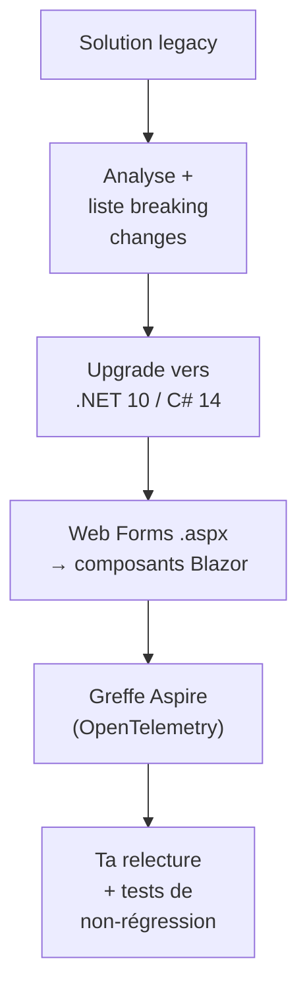

# CSharp — Détail du jeudi 4 juin 2026

## 1. Build 2026 — l'agent Copilot de modernisation .NET (Web Forms → Blazor, Aspire)

**Source :** Visual Studio Blog — https://devblogs.microsoft.com/visualstudio/whats-coming-next-in-visual-studio-our-microsoft-build-2026-announcements/
**Date :** 3 juin 2026

### Contexte

À Build 2026 (2-3 juin, San Francisco), Microsoft a détaillé sa stratégie « Copilot au-delà du chat » pour Visual Studio. Le morceau le plus concret pour un dev backend .NET est un **agent de modernisation applicative** qui industrialise les chantiers de dette technique longtemps repoussés : upgrade de framework, migration d'UI legacy, ajout d'observabilité.

### Comment ça marche

L'agent procède par étapes plutôt qu'en un saut. Il analyse d'abord la solution pour cartographier le framework cible (base .NET 10, C# 14) et **lister les breaking changes** avant toute modification. Vient ensuite la migration UI : conversion des pages `.aspx` Web Forms et de leur code-behind vers des composants Blazor.

Point structurant : Web Forms et Blazor n'ont pas le même modèle de rendu. Web Forms repose sur le ViewState et un cycle de vie postback côté serveur ; Blazor sépare composants et état, en mode server ou WebAssembly. L'agent propose la conversion, mais c'est toi qui valides le modèle de sécurité des sessions et de l'état serveur.



### En pratique — exemple de code

L'agent peut greffer Aspire sur une app existante sans réécriture : ton hôte web s'enrôle dans l'orchestration et la télémétrie OpenTelemetry.

```csharp
// Avant — hôte ASP.NET classique, sans télémétrie unifiée
var builder = WebApplication.CreateBuilder(args);
builder.Services.AddControllers();

// Après — Aspire greffé : service defaults (OTel, service discovery, resilience)
var builder = WebApplication.CreateBuilder(args);
builder.AddServiceDefaults();          // logs/metrics/traces OpenTelemetry câblés
builder.Services.AddControllers();
// ...
app.MapDefaultEndpoints();             // /health, /alive exposés d'office
```

### Pourquoi ça compte pour toi

Si tu traînes des modules ASP.NET Web Forms ou des projets bloqués sur une vieille version, cet agent peut transformer un chantier de plusieurs semaines en revue assistée. Teste-le sur une branche isolée : un upgrade « automatique » mérite ta relecture des breaking changes EF Core et de la config DI. Aspire greffé après-coup t'offre une télémétrie unifiée sans tout refactorer.

### Points de vigilance

« Cet été » signifie pas encore GA : valide le périmètre exact avant de planifier un sprint dessus. Une migration Web Forms → Blazor change le modèle de rendu (server vs WebAssembly) — audite la sécurité des sessions et l'état serveur. L'agent propose, tu valides : ne merge jamais un upgrade auto sans tests de non-régression. S'ajoutent des agents de cycle de vie (debug, profiling, génération de tests) en complément des complétions.
