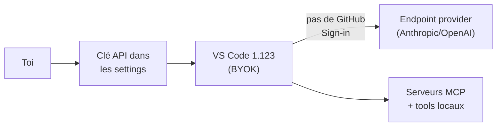

# CSharp — Détail du samedi 6 juin 2026

## 1. VS Code 1.123 — Agents en parallèle, contexte 1M tokens, BYOK air-gapped, MCP déduplication

**Source :** Visual Studio Code — https://code.visualstudio.com/updates/v1_123
**Date :** 3 juin 2026

### Contexte

VS Code 1.123 est la release de juin 2026. Elle fait suite à plusieurs mois de montée en puissance des fonctionnalités agent dans l'éditeur, mais cette version marque un palier : pour la première fois, la plateforme supporte des sessions agent parallèles visibles côte à côte.

Surtout, elle lève la dépendance à GitHub Sign-in pour les usages BYOK (*Bring Your Own Key*). Cela ouvre VS Code à des contextes entreprise avec contraintes réseau ou SSO strictes.

### Comment ça marche

Le BYOK air-gapped change le flux d'authentification. Avant, accéder aux features agent supposait un GitHub Sign-in, donc un appel sortant vers les serveurs GitHub. Désormais, tu fournis ta clé API d'un provider (Anthropic, OpenAI) directement dans les settings ; chat, tools et serveurs MCP fonctionnent **sans** authentification GitHub. Le trafic ne sort que vers l'endpoint du provider que tu choisis — compatible VMs isolées, intranet, CI/CD sans accès externe.

Deux autres mécanismes notables. La déduplication MCP : si deux extensions exposent un serveur sous le même nom, seul le plus spécifique reste actif par défaut. Et le support des fenêtres de contexte 1M tokens (modèles Anthropic et OpenAI) pour passer de grandes codebases sans troncature manuelle.



### En pratique — exemple de code

La config BYOK air-gapped se pose dans les settings VS Code : clé du provider, aucune dépendance GitHub.

```json
// settings.json — BYOK sans GitHub Sign-in, utilisable en environnement isolé
{
  "chat.byok.provider": "anthropic",
  "chat.byok.anthropic.apiKey": "${env:ANTHROPIC_API_KEY}",
  "chat.experimental.maxContextTokens": 1000000,
  "mcp.dedupeByName": true
}
```

```bash
# Filtre les serveurs MCP réellement actifs après déduplication
# (vue Extensions) : @mcp @installed
```

### Pourquoi ça compte pour toi

Le BYOK sans GitHub Sign-in est la feature la plus actionnable : si tu as des projets .NET ou Angular en environnement restreint (no internet, intranet only, SSO custom), tu peux utiliser les features IA de VS Code sans demander d'exceptions réseau. Les sessions parallèles valent aussi le test pour les revues de PR lourdes — un agent review et un agent refacto côte à côte.

### Pour aller plus loin

Autres ajouts utiles : la sync cross-machines de l'historique des sessions agent, avec recherche full-text ; et un *research agent* qui croise ta codebase, des repos GitHub publics et le web pour produire un rapport Markdown cité. Pratique pour cadrer une migration ou un choix de lib avant d'écrire la moindre ligne.
