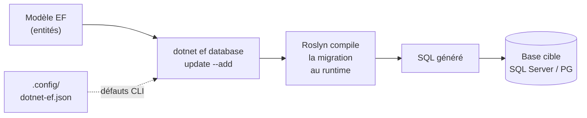

# CSharp — Détail du lundi 8 juin 2026

## 1. EF Core 11 Preview 4 — outillage migrations pour Aspire et conteneurs

**Source :** .NET Blog — https://devblogs.microsoft.com/dotnet/dotnet-11-preview-4/
**Date :** 2 juin 2026

### Contexte

La Preview 4 d'EF Core 11 a déjà fait parler d'elle pour le vector search SQL Server 2025 et le JSON first-class. Mais une partie de la livraison concerne le **flux de migrations** et la **developer experience CLI** — moins spectaculaire, plus quotidien.

C'est utile dans les scénarios **Aspire** et **conteneurisés**, où la recompilation à la volée n'est pas toujours possible. Tu génères tes migrations sur un poste de dev, mais tu les appliques dans un conteneur éphémère qui n'embarque pas le SDK. Cette friction explique pourquoi Microsoft pousse une CLI plus autonome.

### Comment ça marche

Le changement central, c'est `dotnet ef database update --add`. Avant, le flux migration imposait deux temps distincts. D'abord `dotnet ef migrations add` génère un fichier C# de migration, qui doit être **recompilé** dans l'assembly. Ensuite `dotnet ef database update` applique ce code compilé à la base.

Le nouveau `--add` fusionne ces deux temps. La clé : Roslyn compile la migration **au runtime**, en mémoire, sans passer par un rebuild de ton projet. Cela débloque les environnements où tu ne peux pas recompiler — Aspire orchestre des conteneurs, un agent CI applique le schéma juste avant le déploiement.



Deux autres ajustements complètent le tableau. Les **colonnes temporelles** (temporal tables SQL Server) deviennent des **propriétés CLR** ordinaires sur ton entité : tu lis l'historique de version comme n'importe quelle colonne mappée, sans configuration manuelle. Et plusieurs opérations **`DateTimeOffset`** se traduisent désormais en SQL côté SQL Server — des requêtes qui levaient « could not be translated » passent maintenant. Enfin, la CLI charge ses valeurs par défaut depuis `.config/dotnet-ef.json`, ce qui versionne tes options d'outillage avec ton repo.

### En pratique — exemple de code

Le gain sur le flux migration, en deux temps réduits à un seul.

```bash
# AVANT — deux étapes, recompilation obligatoire entre les deux
dotnet ef migrations add AddAuditColumns
dotnet build                       # rebuild de l'assembly de migrations
dotnet ef database update          # applique le code compilé

# APRÈS (EF Core 11 Preview 4) — création + application en une commande
# Roslyn compile la migration au runtime : pas de rebuild requis
dotnet ef database update --add AddAuditColumns
```

Côté entité, une colonne temporelle exposée comme propriété CLR ordinaire.

```csharp
public class Order
{
    public int Id { get; set; }
    public decimal Total { get; set; }

    // Colonnes temporelles SQL Server lues comme des propriétés normales
    public DateTime ValidFrom { get; set; } // début de version de la ligne
    public DateTime ValidTo   { get; set; } // fin de version de la ligne
}
```

### Pourquoi ça compte pour toi

Si tu pilotes tes migrations en CI ou dans des conteneurs, `--add` supprime une étape et fiabilise les déploiements automatisés. Les colonnes temporelles en CLR simplifient l'audit de tes entités sans mapping manuel. Et les traductions `DateTimeOffset` évitent des contournements LINQ pénibles sur PostgreSQL ou SQL Server. Teste sur une branche : c'est une préversion, pas du LTS.

### Points de vigilance

C'est **.NET 11 Preview 4** : non destiné à la prod, API susceptible de bouger d'ici la GA de novembre 2026. Vérifie que ton provider (Npgsql pour PostgreSQL) suit les mêmes traductions ; certaines optimisations ciblent d'abord SQL Server.
