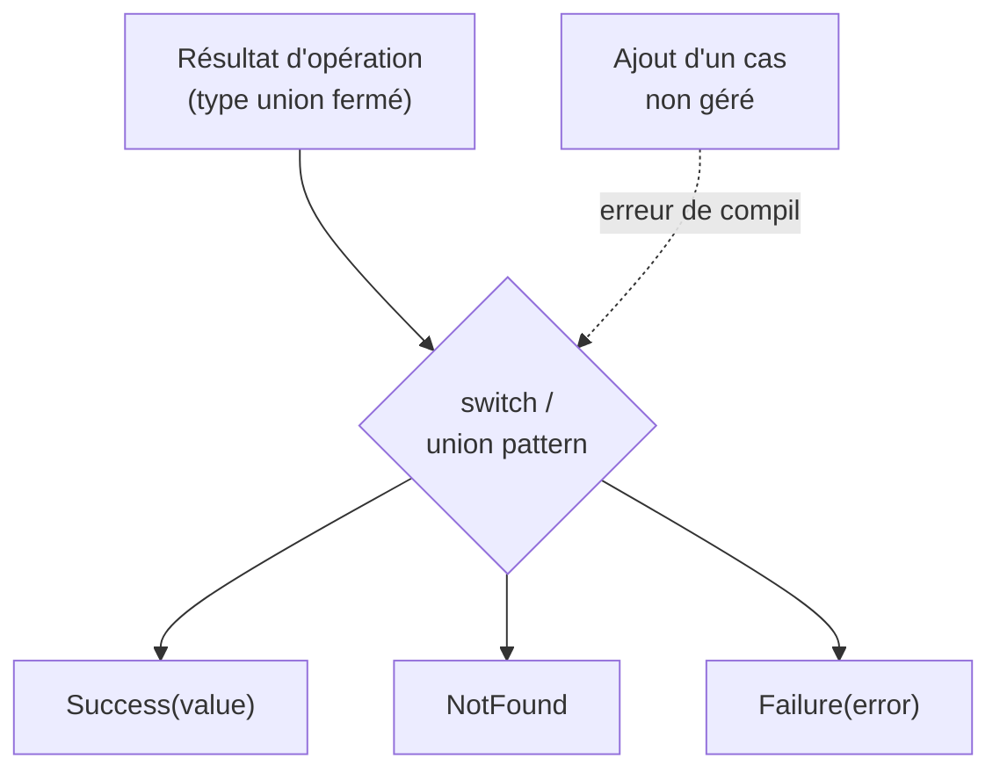
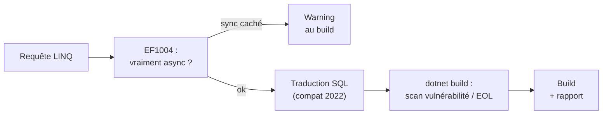

# CSharp — Détail du mercredi 10 juin 2026

## 1. .NET 11 Preview 5 — C# : closed hierarchies, union types et unsafe explicite

**Source :** .NET Blog (Microsoft) — https://devblogs.microsoft.com/dotnet/dotnet-11-preview-5/
**Date :** 9 juin 2026

### Contexte

.NET 11 est une release annuelle dont la GA est prévue en novembre 2026. Preview 5 est l'avant-dernière préversion : c'est le moment où les features de langage se stabilisent assez pour être essayées sérieusement.

Cette préversion couvre runtime, SDK, libraries, ASP.NET Core, MAUI, C# et EF Core. Le bloc le plus structurant pour ta modélisation de domaine vient du langage : trois nouveautés qui touchent la façon dont tu représentes des états.

### Comment ça marche

Trois ajouts langage méritent qu'on déroule le mécanisme.

**Closed class hierarchies.** Tu marques une hiérarchie comme fermée : le compilateur connaît alors l'**ensemble exhaustif** des sous-types autorisés. Conséquence directe : un `switch` sur ce type peut être vérifié pour l'exhaustivité. Si tu ajoutes un sous-type et oublies une branche, le compilateur t'avertit — fini les `default` qui masquent les trous.

**Union declarations & union patterns.** Des types union de **première classe** : un type qui est exactement « A ou B ou C », avec un pattern matching dédié. Tu n'as plus à bricoler une hiérarchie abstraite ni à dépendre d'un `OneOf<T>` tiers pour modéliser un résultat à plusieurs formes.

**Unsafe Evolution.** Le `unsafe` devient plus explicite, dans la lignée du durcissement mémoire amorcé en C# 16 — l'intention dangereuse est rendue plus visible au point d'usage.



Côté libraries : `System.Text.Json` supporte la sérialisation **JSON Lines**, LINQ ajoute les **full outer joins**, et la crypto gagne l'échange de clés **X25519**.

### En pratique — exemple de code

Modéliser un résultat à états mutuellement exclusifs, avec exhaustivité garantie.

```csharp
// Type union de première classe : exactement une de ces formes
public union OrderResult
{
    Found(Order order);
    NotFound;
    Invalid(string reason);
}

string Describe(OrderResult result) => result switch
{
    Found(var o)    => $"Commande {o.Id} : {o.Total:C}",
    NotFound        => "Aucune commande",
    Invalid(var r)  => $"Rejet : {r}",
    // Pas de 'default' nécessaire : le compilateur vérifie l'exhaustivité
};
```

### Pourquoi ça compte pour toi

Les union types et `closed` hierarchies changent ta façon de modéliser un domaine en C# : tu représentes des états mutuellement exclusifs sans classe abstraite ni librairie externe, avec exhaustivité garantie. Teste-les sur une branche dès maintenant — l'API peut bouger d'ici la GA, mais l'effort de modélisation sera réutilisable. JSON Lines te simplifie l'export de logs ou de flux d'événements.

### Points de vigilance

L'API langage reste préversion : n'embarque pas ces features dans une branche de prod avant la GA de novembre. Visual Studio 2026 Insiders ou VS Code + C# Dev Kit sont requis pour le tooling complet.

---

## 2. .NET 11 Preview 5 — EF Core SQL Server 2022 par défaut, EF1004 et checks SDK au build

**Source :** .NET Blog (Microsoft) — https://devblogs.microsoft.com/dotnet/dotnet-11-preview-5/
**Date :** 9 juin 2026

### Contexte

Au-delà du langage, Preview 5 touche directement ton quotidien data et build : EF Core et le SDK reçoivent des changements de comportement **par défaut**, pas seulement des ajouts opt-in. C'est ce type de changement qui mérite attention avant une montée de version, parce qu'il s'applique sans que tu l'aies demandé.

### Comment ça marche

Le changement EF Core le plus sensible : le **niveau de compatibilité par défaut passe à SQL Server 2022**. EF Core génère son SQL en fonction de ce niveau cible. Relever le niveau peut donc modifier la traduction de certaines requêtes, et par ricochet le plan d'exécution choisi par le moteur. Rien ne casse forcément, mais une requête finement optimisée peut voir ses perfs bouger.

Deuxième mécanisme : le diagnostic **EF1004**. EF Core inspecte tes appels async et lève un warning quand une requête déclarée async s'exécute en réalité **de façon synchrone** — typiquement un `.ToList()` glissé là où tu attendais `.ToListAsync()`. Ces faux-async bloquent un thread du pool sans que tu le voies.



Côté SDK et ASP.NET Core, deux ajouts utiles. `dotnet build` peut signaler les **paquets vulnérables ou en fin de vie (EOL)** — un scan de sécurité intégré au build. Les **file-based apps** progressent : un script C# référence d'autres `.cs`, les consoles incluent `System.Net.Http.Json` par défaut. Enfin `dotnet new` embarque un template **MCP Server**, et Blazor SSR gagne la validation côté client.

### En pratique — exemple de code

Le warning EF1004 cible le faux-async, source classique de blocage de thread.

```csharp
// AVANT — déclenche EF1004 : exécution synchrone déguisée en async
public async Task<List<Order>> GetOrders(AppDbContext db) =>
    db.Orders.Where(o => o.Total > 100).ToList(); // bloque un thread du pool

// APRÈS — vraie exécution asynchrone, pas de blocage
public async Task<List<Order>> GetOrders(AppDbContext db) =>
    await db.Orders.Where(o => o.Total > 100).ToListAsync();
```

Et l'activation du scan de vulnérabilité au build, idéal en CI.

```bash
# Signale paquets vulnérables / EOL pendant le build (filet de sécurité gratuit)
dotnet build /p:NuGetAudit=true /p:NuGetAuditMode=all
```

### Pourquoi ça compte pour toi

Le passage SQL Server 2022 par défaut peut modifier le plan d'exécution de tes requêtes : valide tes perfs sur un jeu de données réaliste avant de monter. EF1004 va probablement t'allumer des warnings utiles sur du code legacy — traite-les, ils révèlent souvent des blocages de thread. Les checks de vulnérabilité au build sont un filet de sécurité gratuit à activer en CI.

### Limites

Comportements susceptibles d'évoluer avant la GA. La GA d'EF Core 11 est calée sur novembre 2026 avec .NET 11.
