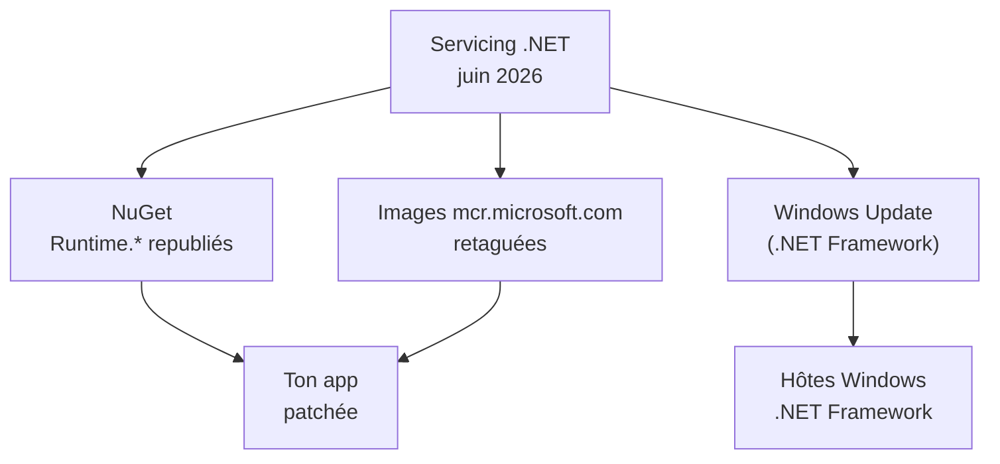
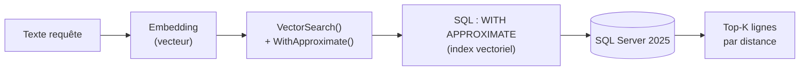

# CSharp — Détail du jeudi 11 juin 2026

## 1. .NET — mises à jour de servicing de juin 2026 (correctifs de sécurité .NET 8/9/10)

**Source :** .NET Blog — https://devblogs.microsoft.com/dotnet/dotnet-and-dotnet-framework-june-2026-servicing-updates/
**Date :** 9 juin 2026

### Contexte

Alignées sur le Patch Tuesday record de juin (~208 CVE), les mises à jour de servicing .NET et .NET Framework apportent des **correctifs de sécurité** sur les branches en support. .NET 8.0 a été rafraîchi le 9 juin (KB5097149 / KB associés), aux côtés des branches plus récentes.

Le piège habituel : tu crois être patché parce que tu as redéployé, alors que ton image de base ou tes versions épinglées portent encore le runtime vulnérable. La diffusion d'un correctif .NET passe par plusieurs canaux qu'il faut tous couvrir.

### Comment ça marche

Un servicing release n'est pas un simple coup de `git pull`. Le runtime patché se propage par **plusieurs vecteurs indépendants**, et un seul oublié laisse la faille ouverte.

D'abord les **paquets NuGet** : `Microsoft.NETCore.App.Runtime.*` et les paquets ASP.NET Core sont republiés. Si tu épingles des versions exactes dans tes `.csproj`, un simple rebuild ne tire pas le correctif — tu dois bumper la version. Ensuite les **images Docker officielles** `mcr.microsoft.com/dotnet/*` sont retaguées : ton image applicative hérite du runtime de l'image de base, donc tu dois la reconstruire et la repull. Enfin le **SDK sur tes agents CI** doit être à jour pour produire des artefacts patchés.



Le cas Windows est à part : les correctifs .NET Framework arrivent via **Windows Update**, donc un serveur gelé (pas de patch automatique) peut les rater complètement.

### En pratique — exemple de code

La séquence de remédiation côté conteneur : repull, rebuild, vérifie.

```bash
# Repull l'image de base patchée et reconstruis ton image applicative
docker pull mcr.microsoft.com/dotnet/aspnet:8.0
docker build --pull -t monapp:patched .

# Vérifie la version de runtime réellement embarquée
docker run --rm monapp:patched dotnet --info | grep -i "Host"
```

Côté CI, mets à jour le SDK des agents avant de relancer les builds.

```bash
# Aligne le SDK de l'agent CI sur la version de servicing du mois
dotnet --version          # confirme la version installée
dotnet workload update    # rafraîchit les workloads associés
```

### Pourquoi ça compte pour toi

Tes services ASP.NET Core héritent de ces CVE tant que tu n'as pas bumpé le runtime. Mets à jour le SDK sur tes agents CI, repull les images de base `aspnet`/`runtime`, et relance tes builds. Si tu utilises `RollForward` ou des runtimes auto-installés, vérifie que la version patchée est bien servie en prod avant de clore le ticket.

### Points de vigilance

Contrôle aussi les hôtes Windows exécutant .NET Framework : les correctifs arrivent via Windows Update mais les serveurs gelés peuvent les rater. Croise avec la liste KB du mois.

---

## 2. EF Core — recherche vectorielle traduite pour SQL Server 2025

**Source :** Microsoft Learn (EF Core – What's New) — https://learn.microsoft.com/en-us/ef/core/what-is-new/
**Date :** ligne de préversions .NET 11 (juin 2026)

### Contexte

La ligne de préversions .NET 11 dote EF Core d'une **traduction native de la recherche par plus proche voisin approximatif (ANN)** pour SQL Server 2025. C'est l'arrivée du vector search « first-class » dans l'ORM, là où il fallait jusqu'ici du SQL brut.

Concrètement, ton réflexe RAG côté .NET impliquait d'écrire des requêtes vectorielles à la main et de les coller dans `FromSql`. EF Core 11 les exprime désormais en LINQ.

### Comment ça marche

Le mécanisme repose sur deux opérateurs LINQ qui se traduisent en SQL spécifique à SQL Server 2025. Tu stockes un embedding (vecteur) par ligne. `VectorSearch()` retourne les lignes **ordonnées par distance vectorielle** à un vecteur de requête — du plus proche au plus lointain. Par-dessus, `WithApproximate()` force le moteur à utiliser un **index vectoriel** et se traduit par la clause `WITH APPROXIMATE` de SQL Server 2025.

La distinction exacte / approximatif est le cœur du sujet. Une recherche exacte compare ton vecteur à **toutes** les lignes : précis mais coûteux. L'ANN s'appuie sur un index pour ne visiter qu'un sous-ensemble : beaucoup plus rapide, au prix d'une **précision non garantie** (un voisin réel peut être manqué).



En parallèle, les colonnes **JSON** deviennent des citoyens de première classe du modèle relationnel : représentation structurée des chemins JSON, meilleur diagnostic, SQL de mise à jour partielle et modèles compilés.

### En pratique — exemple de code

La recherche ANN exprimée en LINQ pur, sans SQL brut.

```csharp
// AVANT — SQL vectoriel écrit à la main
var hits = db.Documents
    .FromSql($@"SELECT TOP 5 * FROM Documents
                ORDER BY VECTOR_DISTANCE('cosine', Embedding, {queryVector})")
    .ToList();

// APRÈS (EF Core 11) — LINQ traduit en WITH APPROXIMATE
var hits = db.Documents
    .VectorSearch(d => d.Embedding, queryVector) // ordonné par distance
    .WithApproximate()                           // force l'index vectoriel ANN
    .Take(5)
    .ToList();
```

### Pourquoi ça compte pour toi

Si tu fais du RAG ou de la similarité côté .NET, tu pourras rester en LINQ au lieu d'écrire du SQL vectoriel à la main. Compare néanmoins avec ton réflexe **pgvector/PostgreSQL** : SQL Server 2025 + index ANN visent la même charge, mais l'écosystème pgvector reste plus mûr et portable. Garde l'abstraction EF pour ne pas te lier au moteur.

### Limites

La feature suppose **SQL Server 2025** et la ligne .NET 11 (encore en préversion). Pas de bascule en prod avant la GA de novembre 2026 ; teste les plans d'exécution, l'ANN trade la précision contre la latence.
