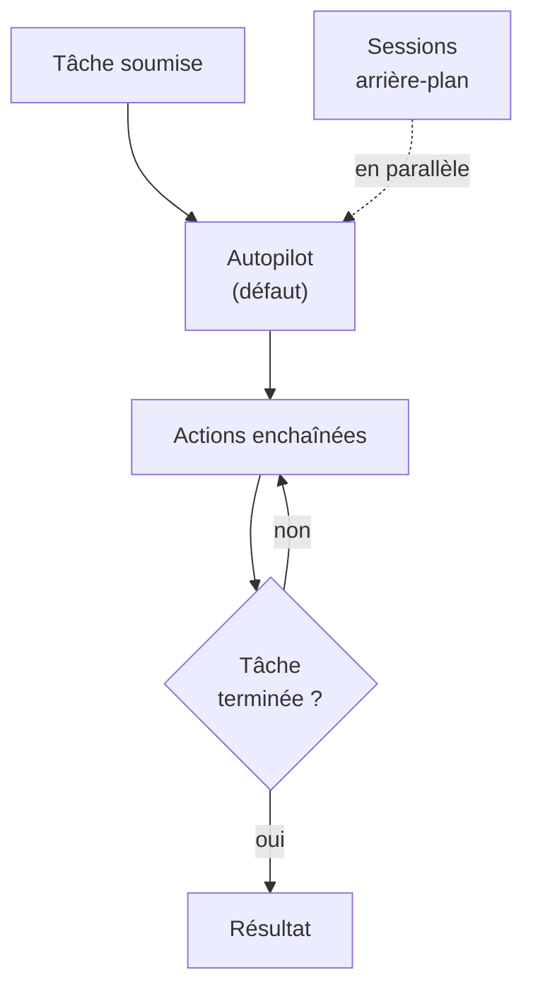
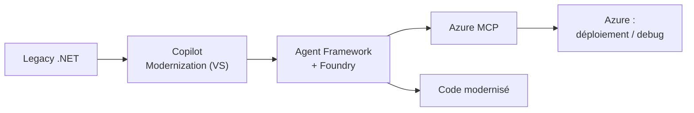

# CSharp — Détail du lundi 15 juin 2026

## 1. VS Code 1.124 — Autopilot par défaut, contexte 1M, sessions agent en arrière-plan

**Source :** Visual Studio Code — https://code.visualstudio.com/updates/v1_124
**Date :** 10 juin 2026

### Contexte

La release de juin de VS Code (1.124) pousse encore l'autonomie des agents. Suite de la 1.123 (couverte le 6 juin), elle bascule l'Autopilot en comportement par défaut et élargit le contexte exploitable.

Le mouvement de fond : l'éditeur cesse d'être un assistant qui complète ligne à ligne pour devenir un orchestrateur de tâches qui agit, vérifie, et boucle seul. Ce glissement change le contrat de confiance entre toi et l'outil.

### Comment ça marche

Trois mécanismes structurent cette release.

**Autopilot par défaut.** L'agent enchaîne désormais ses actions sans te demander de validation à chaque étape, et il est meilleur pour **détecter quand une tâche est réellement terminée**. C'est ce critère de complétion qui débloque l'autonomie : sans lui, l'agent boucle ou s'arrête trop tôt.

**Sessions en arrière-plan.** Tu lances une requête et tu **continues à composer la suivante** pendant qu'elle s'exécute. Combiné à la navigation clavier entre sessions (recherche, saut, pas-à-pas), cela transforme l'agent en file de tâches parallèles que tu pilotes.

**Contexte 1M tokens.** Pour les modèles Anthropic et OpenAI compatibles, la fenêtre passe à un million de tokens. Tu charges un module entier — EF Core, Symfony — dans une seule session au lieu de le découper.



S'ajoutent l'historique du navigateur intégré et des correctifs en 1.124.1 / 1.124.2.

### En pratique — exemple de code

Tu cadres l'autonomie via les réglages : garde la main sur les commandes sensibles.

```json
// settings.json — borne l'Autopilot avant un gros refactor
{
  "chat.agent.autoApprove": false,        // exige une validation manuelle
  "chat.agent.maxRequests": 25,           // plafonne les itérations en boucle
  "chat.tools.terminal.autoApprove": {
    "git push": false,                    // jamais auto sur les commandes destructives
    "rm": false,
    "dotnet build": true                  // sûr : laisse passer
  }
}
```

### Pourquoi ça compte pour toi

Autopilot par défaut change ton workflow : l'agent agit avec plus d'autonomie sans validation à chaque étape. Vérifie tes réglages avant un gros refactor .NET/Angular — tu veux garder la main sur les commandes sensibles. Le contexte 1M permet enfin de charger un module entier (Symfony, EF Core) dans une seule session, mais surveille tes coûts en crédits IA, qui grimpent vite avec ces fenêtres.

---

## 2. .NET Day on Agentic Modernization — livestream le 16 juin

**Source :** .NET Blog (Microsoft) — https://devblogs.microsoft.com/dotnet/join-us-for-dotnet-day-on-agentic-modernization-livestream/
**Date :** 16 juin 2026 (événement)

### Contexte

Microsoft Reactor organise une journée livestream dédiée à la modernisation « agentique » du legacy .NET, le 16 juin (16h–20h UTC). Cible : équipes qui veulent réduire la dette, accélérer la migration cloud et ajouter de l'IA aux apps existantes.

L'angle n'est plus « voici une nouvelle API » mais « voici comment des agents font le grunt work de migration pendant que tu gardes l'architecture ». C'est un changement de posture de l'outillage Microsoft.

### Comment ça marche

L'événement articule trois briques produit qui s'emboîtent.

**Migration cloud accélérée** : GitHub Copilot modernization, intégré dans Visual Studio, automatise les upgrades .NET — montée de framework, réécriture de patterns obsolètes. **Systèmes agentiques** : le **Microsoft Agent Framework** couplé à **Microsoft Foundry** fournit l'orchestration et l'hébergement des agents. **Automatisation cloud** : GitHub Copilot for Azure passe par **Azure MCP** (Model Context Protocol) pour scripter l'infra, déployer et débugger.

Le fil conducteur, c'est MCP comme couche d'interface : l'agent expose ses capacités (lire le repo, lancer un déploiement) via un protocole standardisé que les outils consomment.



Intervenants annoncés : Mika Dumont, David Pine, Klaus Loeffelmann, Jerry Nixon, Bruno Capuano, entre autres.

### En pratique — exemple de code

Le template MCP Server du SDK te montre concrètement la couche d'interface évoquée.

```bash
# Crée un serveur MCP que les agents Copilot pourront consommer
dotnet new mcpserver -n MyModernizationTools
cd MyModernizationTools
dotnet run            # expose tes outils (lecture repo, migration) via MCP
```

### Pourquoi ça compte pour toi

Si tu traînes des projets .NET Framework ou des upgrades repoussés, c'est l'occasion de voir l'outillage Copilot de modernisation en conditions réelles avant de l'adopter. Le couple Agent Framework + Foundry est la direction officielle de Microsoft pour l'agentique côté .NET — utile à connaître pour tes choix d'archi des prochains trimestres. Gratuit et en ligne ; cale-le dans ton agenda de demain.
