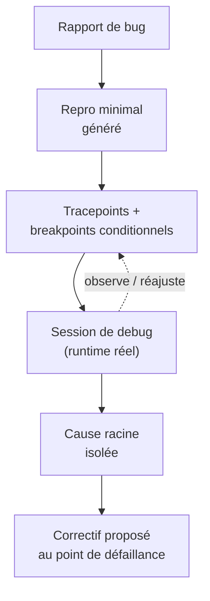
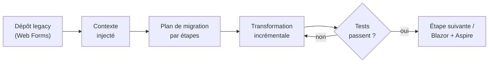

# CSharp — Détail du jeudi 18 juin 2026

## 1. Visual Studio 2026 — l'agent Copilot débarque dans le débogueur

**Source :** Visual Studio Blog — https://devblogs.microsoft.com/visualstudio/visual-studio-2026-debugging-with-copilot/
**Date :** 9 juin 2026

### Contexte

Visual Studio 2026 (GA depuis novembre 2025) reçoit des updates mensuelles. Celle de juin fait passer Copilot de la complétion au **débogage assisté**, là où VS Code (couvert récemment) avait déjà ouvert la voie côté éditeur.

L'IDE complet hérite à son tour d'un agent intégré au runtime. La nuance est importante : un agent qui débogue ne raisonne pas sur du texte mort, il pilote une session de débogage réelle et observe le comportement à l'exécution.

### Comment ça marche

Le **Debugger Agent** est la pièce maîtresse. Sa boucle se distingue de l'analyse statique : il **valide un bug contre le comportement runtime réel**, pas contre une lecture du code. Pas à pas, il relie le rapport de bug au code local, génère un **repro minimal**, puis instrumente l'exécution.

L'instrumentation est le cœur du mécanisme. L'agent pose des **tracepoints** (logs sans arrêt) et des **breakpoints conditionnels** (arrêt seulement si une condition est vraie). Il lance des sessions de debug, observe l'état réel, **isole la cause racine** au point de défaillance et propose un correctif là où ça casse. Cette boucle observe-hypothèse-vérifie est ce qui le rend efficace sur les bugs non déterministes (races, état inattendu).



Trois autres ajouts complètent l'IDE. **Smart Watch** suggère des expressions pertinentes dans les fenêtres Watch selon le contexte de debug. **Profile with Copilot**, depuis le Test Explorer, exécute un test et analyse CPU + instrumentation pour des insights perf actionnables. **Text Visualizer auto-format** détecte l'encodage/compression (ex. Base64 GZip) et convertit en clair en un clic. L'update du 16 juin ajoute une page d'options **Theme colors** pour personnaliser les tokens Fluent sans extension.

### En pratique — exemple de code

Le Debugger Agent excelle là où un breakpoint conditionnel manuel est pénible à poser.

```csharp
// Bug intermittent : la quantité devient négative pour certains items
// L'agent pose un breakpoint conditionnel équivalent à :
//   condition d'arrêt -> item.Quantity < 0
foreach (var item in cart.Items)
{
    item.Quantity -= Reserve(item);   // l'agent s'arrête uniquement quand Quantity < 0
    // Tracepoint (log sans arrêt) injecté par l'agent :
    //   "Reserve({item.Sku}) -> qty={item.Quantity}"
}
```

### Pourquoi ça compte pour toi

Sur du legacy .NET, le Debugger Agent peut raccourcir la boucle « repro → cause racine » sur les bugs runtime difficiles (races, état inattendu). Teste-le sur un vrai bug avant de lui faire confiance : il instrumente ton app et exécute du code. Le Profile with Copilot aide à chasser une régression perf sans monter un profiling manuel.

### Points de vigilance

L'agent exécute des sessions de debug et modifie l'instrumentation : à réserver aux environnements de dev, jamais branché sur de la prod.

---

## 2. .NET Day on Agentic Modernization — Microsoft industrialise la migration du legacy

**Source :** .NET Blog — https://devblogs.microsoft.com/dotnet/join-us-for-dotnet-day-on-agentic-modernization-livestream/
**Date :** 16 juin 2026

### Contexte

Après l'annonce à Build 2026 d'un agent Copilot de modernisation .NET, Microsoft a tenu le 16 juin un **.NET Day on Agentic Modernization** (Microsoft Reactor, ~4 h de livestream). Cible : les équipes qui doivent réduire la dette de maintenance et migrer vers le cloud sans tout réécrire.

L'enjeu : transformer la migration, d'un chantier manuel risqué, en un flux assisté où l'agent fait le travail répétitif et toi l'architecture.

### Comment ça marche

Le thème central : utiliser des **agents IA** pour moderniser du code existant — Web Forms → Blazor, onboarding **Aspire**, montée de framework. L'agenda déroule un pipeline en trois temps qui explique pourquoi ces migrations ne dérapent pas comme un find-replace géant.

D'abord l'**injection du contexte du dépôt** : l'agent indexe ton code pour comprendre les dépendances réelles, pas seulement les fichiers isolés. Ensuite la **génération de plans de migration** : il découpe le chantier en étapes ordonnées plutôt qu'un diff massif d'un coup. Enfin la **validation incrémentale** : chaque transformation est appliquée et vérifiée par étapes, ce qui permet de détecter une régression tôt.



Intervenants de l'équipe produit (.NET, Aspire, MAUI) : Mika Dumont, David Pine, Klaus Loeffelmann, Jerry Nixon, Bruno Capuano, entre autres.

### En pratique — exemple de code

La validation incrémentale n'a de valeur que si elle s'appuie sur des tests — barrière à mettre en place avant tout.

```bash
# Filet de sécurité d'une migration agentique : exécuter les tests à chaque étape
dotnet test --filter "Category=Migration" --logger "trx"

# Onboarding Aspire de l'app modernisée (cible cloud-native poussée par MS)
dotnet new aspire-starter -n ModernApp
```

### Pourquoi ça compte pour toi

Si tu portes une appli .NET Framework ou Web Forms, ces agents valent un POC : ils automatisent le grunt work (mapping d'API, réécriture de patterns) pendant que tu gardes la main sur l'architecture. Surveille **Aspire** si tu vises une cible cloud-native — c'est le chemin que Microsoft pousse pour le dev local et le déploiement.

### Limites

C'est un événement de cadrage, pas une release : les agents restent jeunes. Valide chaque transformation par tes tests — un diff massif généré sans couverture est un risque, pas un gain.
