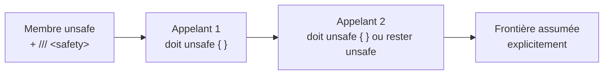

# CSharp — Détail du dimanche 21 juin 2026

## 1. C# 16 / .NET 11 — `unsafe` devient un contrat d'appelant

**Source :** .NET Blog (Richard Lander) — https://devblogs.microsoft.com/dotnet/improving-csharp-memory-safety/
**Date :** 21 mai 2026 (preview annoncée pour .NET 11)

### Contexte

Depuis toujours, `unsafe` en C# signale surtout l'usage de pointeurs. Le problème : le mot-clé est **local et silencieux**. Une méthode peut faire de l'arithmétique de pointeur dangereuse, exposer une API parfaitement normale, et l'appelant n'a aucune idée qu'il hérite d'obligations de sûreté. À l'ère du code généré par IA — qui recrache volontiers du `Span`, du `stackalloc` ou du `MemoryMarshal` sans en mesurer les invariants — Microsoft veut rendre ces obligations **visibles et revues**. L'inspiration est Rust, où `unsafe` est explicite, délimité et lié à un contrat. Mais l'objectif affiché est de garder l'ergonomie C# : pas de borrow checker, pas de réécriture massive.

### Comment ça marche

Le changement central : `unsafe` sur une **signature de membre** devient un **contrat propagatif**. Trois mécanismes s'enchaînent.

D'abord, marquer une méthode `unsafe` ne se contente plus d'autoriser les pointeurs à l'intérieur ; cela **déclare aux appelants** qu'ils doivent honorer des préconditions. Ensuite, tout appel à ce membre doit être **entouré d'un bloc `unsafe { }`**, comme l'est déjà un déréférencement de pointeur. L'obligation remonte donc la chaîne d'appel jusqu'à ce qu'un développeur décide explicitement de l'assumer. Enfin, chaque membre `unsafe` devrait porter un bloc de documentation `/// <safety>` : le **contrat formel** décrivant ce que l'appelant doit garantir (bornes, durée de vie, alignement). Un analyseur Roslyn peut signaler son absence.



Le périmètre s'élargit aussi : `unsafe` ne couvre plus seulement les pointeurs, mais **toute opération que le compilateur ne peut pas prouver sûre** (réinterprétation mémoire, invariants de `Span` non vérifiables). Le tout est **opt-in** via un paramètre du projet en .NET 11, pour ne pas casser l'existant.

### En pratique — exemple de code

L'évolution se voit surtout côté API publique d'une lib bas niveau.

```csharp
// Avant (C# actuel) : unsafe est interne, l'appelant ne sait rien
public static int ReadInt(byte* p) // pointeur exposé, aucune obligation visible
{
    return *(int*)p; // dangereux si p mal aligné ou hors bornes
}
// Appel : aucune cérémonie, le risque est invisible
int v = ReadInt(ptr);

// Après (C# 16, .NET 11 preview) : contrat propagé + documenté
/// <safety>
/// `source` doit pointer une zone d'au moins 4 octets, alignée sur 4,
/// valide pendant toute la durée de l'appel.
/// </safety>
public static unsafe int ReadInt(ReadOnlySpan<byte> source) =>
    System.Runtime.InteropServices.MemoryMarshal.Read<int>(source);

// Appel : l'obligation devient explicite et grep-able en revue
unsafe
{
    int v = ReadInt(buffer); // je déclare assumer les préconditions
}
```

Le bloc `unsafe { }` au point d'appel est la nouveauté : il transforme une dette de sûreté cachée en **décision tracée dans la diff**.

### Pourquoi ça compte pour toi

Si tu maintiens des libs perf-critiques (sérialisation, interop, parsing binaire) en .NET, tes signatures `unsafe` deviendront des contrats que tes appelants devront accepter explicitement. Bonne nouvelle en revue de code : tu repères d'un `grep unsafe {` chaque frontière à risque, y compris dans le code généré par un agent. Active la preview sur une branche pour mesurer l'impact avant .NET 12.

### Points de vigilance | Limites

C'est encore une **preview opt-in** : la syntaxe `/// <safety>` et la propagation peuvent bouger. Ne refactore pas tout ton code aujourd'hui. Surveille aussi la friction sur les API très appelées : un `unsafe { }` à chaque site d'appel peut alourdir le code chaud si l'équipe n'aligne pas ses conventions.
