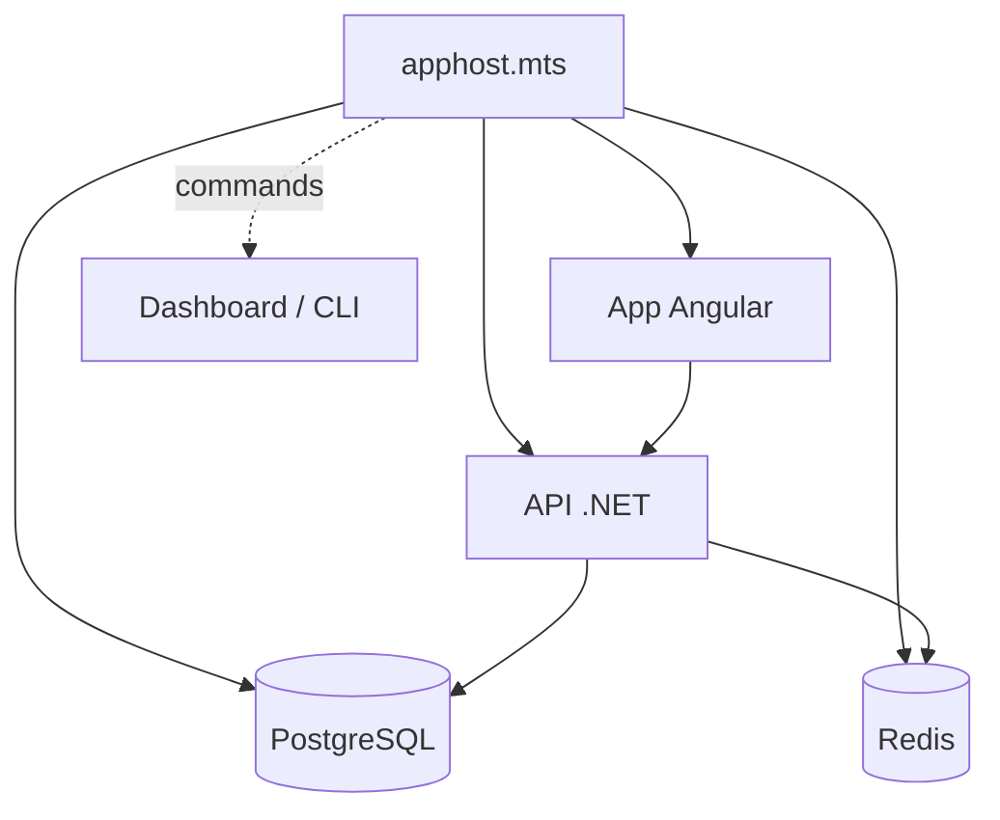

# CSharp — Détail du mardi 23 juin 2026

## 1. Aspire 13.4 — apphost TypeScript en GA, commands typées et Kubernetes mûr

**Source :** Aspire Blog (Microsoft) — https://devblogs.microsoft.com/aspire/whats-new-aspire-13-4/
**Date :** 1er juin 2026

### Contexte

Aspire est la boîte à outils .NET pour décrire, lancer et déployer des applications distribuées : tu déclares tes ressources (API, base, cache, front) dans un *apphost* code-first, et Aspire câble la configuration, la découverte de services et la télémétrie OpenTelemetry. Jusqu'ici l'apphost s'écrivait en C#. La 13.4 — 519 PR sur trois semaines — promeut l'**apphost TypeScript en GA** et ouvre Python, Java et Go en préversion. L'enjeu pour toi : un seul modèle d'orchestration pour un stack mixte .NET + Angular + PostgreSQL, sans réécrire ton infra de dev en YAML.

### Comment ça marche

Tu construis un graphe de ressources et leurs relations. Chaque `addX` enregistre une ressource ; `withReference` injecte les chaînes de connexion et variables d'environnement dans les consommateurs. Le dashboard et le CLI pilotent ensuite ce graphe (logs, télémétrie, *commands*). En 13.4, l'apphost TypeScript utilise un point d'entrée explicite `apphost.mts` (fini le `.ts` à la racine qui fâche linters et CommonJS), des modules SDK générés sous `.aspire/modules/`, et une validation de config jouée **avant** le run pour faire remonter les erreurs tôt.



### En pratique — exemple de code

L'apphost TypeScript reprend le modèle code-first du C#. Nouveauté 13.4 : `withProcessCommand()` expose un binaire local comme commande de ressource, avec passage d'arguments et capture de sortie gérés par Aspire.

```typescript
import { createBuilder } from './.aspire/modules/aspire.mjs';

const builder = await createBuilder();

// Graphe de ressources : Postgres + cache + API .NET qui les référence
const db = await builder.addPostgres('pg').addDatabase('appdb');
const cache = await builder.addRedis('cache');
await builder.addProject('api', '../Api/Api.csproj')
  .withReference(db)
  .withReference(cache);

// Nouveau en 13.4 : un CLI local devient une commande dans le dashboard
await cache.withProcessCommand('flush', 'Vider le cache', {
  executablePath: 'redis-cli',
  arguments: ['FLUSHALL'],
});

await builder.build().run();
```

La mise à jour se fait via le CLI :

```bash
aspire update --self   # met à jour le CLI Aspire
aspire update          # met à jour le projet vers 13.4
```

### Pourquoi ça compte pour toi

Tu orchestres déjà API .NET, front Angular et Postgres : Aspire te donne un *inner-loop* unique où ces briques démarrent ensemble, partagent leur config et exposent leur télémétrie. L'apphost TypeScript en GA évite d'imposer C# à ton équipe front. Les `withProcessCommand` remplacent tes scripts README par des actions cliquables et partagées. Et le support Kubernetes/AKS mûri (cert-manager, Gateway API, Helm) rapproche ton manifest de dev de ta cible de prod.

### Pour aller plus loin

- Intégrations formalisées dans le dépôt principal : `Aspire.Hosting.Go` (debug VS Code via Delve) et `Aspire.Hosting.Bun`.
- `aspire logs --search` / `aspire otel --search` filtrent côté serveur avant le stream : moins de bruit, moins de tokens brûlés par un agent.
- Détails exhaustifs et breaking changes : https://aspire.dev/whats-new/aspire-13-4/
