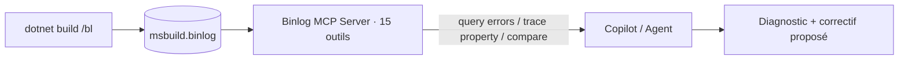

# CSharp — Détail du mercredi 24 juin 2026

## 1. Microsoft Binlog MCP Server — diagnostiquer tes builds MSBuild via un agent

**Source :** .NET Blog (Microsoft) — https://devblogs.microsoft.com/dotnet/msbuild-binlog-mcp-server/
**Date :** 17 juin 2026

### Contexte

Quand un build .NET échoue ou rame, la cause est souvent enfouie : une propriété MSBuild qui prend la mauvaise valeur, un target lent, un package résolu différemment entre deux machines. Le **binary log** (`.binlog`) de MSBuild contient déjà tout : chaque évaluation de propriété, exécution de target, invocation de task, erreur et warning. Le problème, c'est de l'explorer — l'outil graphique existe, mais fouiller à la main reste pénible.

Microsoft publie le **Binlog MCP Server** (en préversion), un serveur **Model Context Protocol** qui expose le contenu d'un `.binlog` à un assistant IA comme GitHub Copilot. Quinze outils spécialisés transforment « pourquoi mon build casse ? » en une question que l'agent instruit tout seul.

### Comment ça marche

Le MCP est un protocole standard : un *serveur* expose des outils typés, un *client* (l'IDE, Copilot) les appelle. Ici, le serveur parse le `.binlog` et offre des outils comme : interroger erreurs et warnings **avec leur contexte** projet/target/task, **tracer l'origine d'une propriété** (d'où vient sa valeur), repérer les **goulots de perf** (projets/targets/tasks les plus lents), et **comparer deux builds** pour isoler une différence de propriétés ou de packages.

Le flux est simple. Tu génères le log avec `/bl` sur n'importe quel `dotnet build`, `dotnet test` ou `dotnet pack`. Tu pointes le serveur MCP sur ce fichier. L'agent appelle alors les outils en langage naturel et raisonne sur les réponses structurées, au lieu de te faire scroller un log de 200 Mo.



### En pratique — exemple de code

Tu produis le binlog, puis tu déclares le serveur dans la config MCP de ton éditeur. Le paquet est sur NuGet (`baronfel.binlog.mcp`).

```jsonc
// 1) Générer le log à analyser
//    dotnet build /bl   ->  msbuild.binlog

// 2) .mcp.json (ou config Copilot) : enregistrer le serveur Binlog
{
  "servers": {
    "binlog": {
      "command": "dnx",
      "args": ["baronfel.binlog.mcp", "--yes", "--", "./msbuild.binlog"]
    }
  }
}
// 3) Dans le chat agent :
//    "Pourquoi le projet Api met 40 s ? Compare avec le binlog d'hier."
//    -> l'agent appelle 'slowest targets' puis 'compare builds'
```

Une phrase suffit : l'agent enchaîne les outils (`errors`, `slowest`, `trace property`) et te rend la cause racine au lieu du log brut.

### Pourquoi ça compte pour toi

Sur tes solutions .NET multi-projets, le débogage de build te coûte des heures de lecture de logs. Là, tu poses la question en français et l'agent trace la propriété ou compare deux builds CI pour toi. Active-le sur un échec de pipeline reproductible : génère le `.binlog` côté CI, branche le serveur en local et demande la diff. Attention, c'est une préversion et la télémétrie est active par défaut (`DOTNET_CLI_TELEMETRY_OPTOUT=1` pour couper).

### Pour aller plus loin

Outil communautaire à l'origine du serveur : https://github.com/baronfel/mcp-binlog-tool — le plugin `dotnet-msbuild` empaquette le serveur avec des skills et agents prêts pour l'investigation de build.
