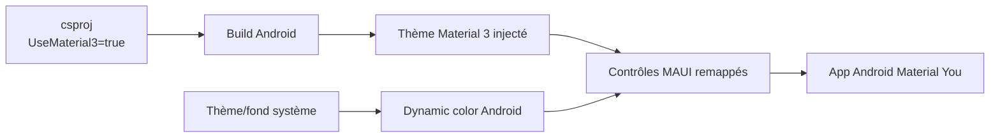

# CSharp — Détail du jeudi 25 juin 2026

## 1. .NET MAUI — Material 3 (Material You) sur Android via `<UseMaterial3>`

**Source :** .NET Blog — https://devblogs.microsoft.com/dotnet/dotnet-maui-material-3/
**Date :** 26 mai 2026, étendu jusqu'à .NET 10.0.60 (SR6, juin 2026)

### Contexte

Pendant des années, les apps .NET MAUI sur Android affichaient un look Material 2 vieillissant. Depuis .NET 10, tu peux passer tes apps Android en **Material 3** (alias **Material You**) avec une seule propriété MSBuild. La fonctionnalité s'est étalée sur plusieurs service releases : la propriété et les styles de base arrivent en **SR3 (10.0.30)**, puis la grosse vague de contrôles débarque en **SR6 (10.0.60)**. C'est donc maintenant, mi-2026, que la couverture devient assez complète pour être utilisée sérieusement. Material 3 est **Android uniquement** ; iOS, Mac Catalyst et Windows gardent leurs design systems natifs.

### Comment ça marche

Material 3 apporte deux choses. D'abord le **dynamic color** : la palette de l'app dérive du fond d'écran ou du thème système de l'utilisateur — c'est le « You » de Material You. Ensuite des formes, élévations et états de focus rafraîchis sur les contrôles. Techniquement, activer `UseMaterial3` injecte au build un thème Android Material 3 et remappe les renderers MAUI vers les composants Material Components correspondants. Au runtime, Android résout les couleurs dynamiques depuis le système et les applique aux contrôles. En SR6, le mapping couvre **Button, Entry, SearchBar, DatePicker, Slider, ProgressBar, ImageButton, Switch** et le theming **Shell**.



### En pratique — exemple de code

Une seule propriété dans le `.csproj` suffit à opter pour Material 3 côté Android. Tu peux la conditionner au TFM Android pour ne rien changer sur les autres plateformes.

```xml
<!-- MonApp.csproj — opt-in Material 3, Android seulement -->
<PropertyGroup Condition="$(TargetFramework.Contains('-android'))">
  <UseMaterial3>true</UseMaterial3>
</PropertyGroup>
```

Côté XAML, rien de spécial : tes contrôles existants adoptent le nouveau style. Le dynamic color s'appuie sur le thème système, donc déclare un thème clair/sombre cohérent.

```xml
<!-- Les contrôles héritent du style Material 3 sans markup dédié -->
<VerticalStackLayout Padding="24" Spacing="16">
    <Entry Placeholder="Recherche produit" />
    <Switch IsToggled="True" />
    <Button Text="Valider la commande" />   <!-- forme + élévation M3 -->
</VerticalStackLayout>
```

### Pourquoi ça compte pour toi

Tu fais surtout du backend, mais quand un projet MAUI Android atterrit sur ton bureau, c'est le moyen le moins cher de moderniser l'UI : une ligne MSBuild, zéro refonte XAML. Vise **10.0.60 ou plus récent** pour profiter du mapping complet des contrôles. Garde en tête que c'est Android-only : ne t'attends pas à voir le dynamic color sur iOS ou Windows, et teste le rendu en thèmes clair et sombre.

### Pour aller plus loin

La doc de référence liste les contrôles supportés et la matrice par service release : https://learn.microsoft.com/en-us/dotnet/maui/user-interface/material-design.
