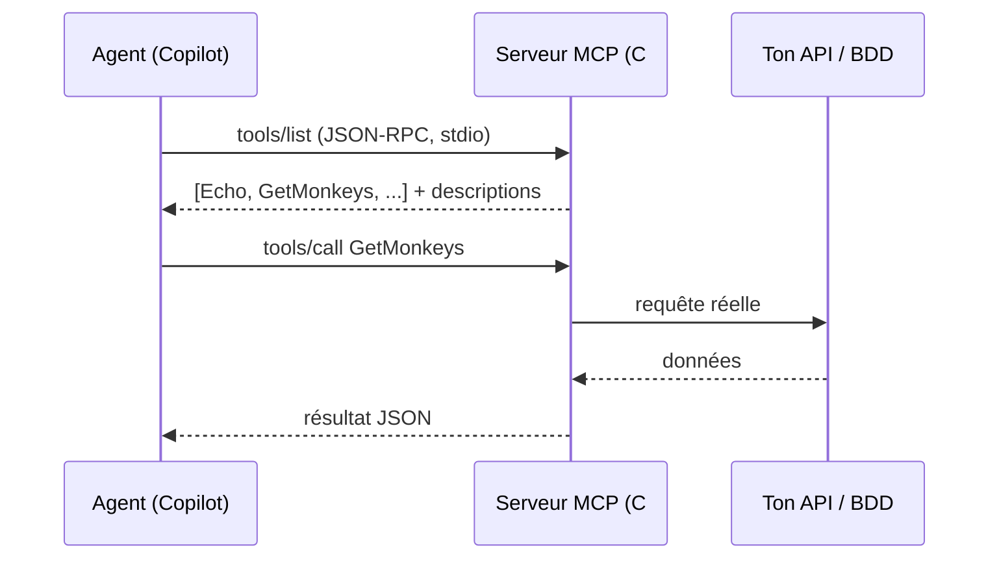
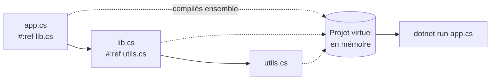

# CSharp — Détail du lundi 29 juin 2026

## 1. `dotnet new mcpserver` — scaffolder un serveur MCP en C# (.NET 11 Preview 5)

**Source :** .NET Blog (Microsoft) — https://devblogs.microsoft.com/dotnet/build-a-model-context-protocol-mcp-server-in-csharp/
**Date :** template livré dans le SDK .NET 11 Preview 5 (9 juin 2026)

### Contexte

Le **Model Context Protocol (MCP)** est le standard qui laisse un agent IA (GitHub Copilot, Claude, etc.) appeler tes outils : une fonction, une requête SQL, un appel d'API. Jusqu'ici, démarrer un serveur MCP en .NET imposait d'installer un paquet de template à part. Depuis **.NET 11 Preview 5**, le SDK **bundle** le template : `dotnet new mcpserver` fonctionne sans rien installer. C'est le signal que Microsoft traite MCP comme une cible de première classe, au même titre qu'une Web API.

### Comment ça marche

Un serveur MCP, c'est du **JSON-RPC** sur un transport (stdio en local, HTTP/SSE en distant). Le serveur publie une liste d'**outils** ; le client (l'agent) lit leurs descriptions, puis demande au serveur d'en exécuter un avec des arguments. Côté C#, le SDK fait le câblage : `AddMcpServer()` enregistre le serveur, `WithStdioServerTransport()` choisit le canal, et `WithToolsFromAssembly()` **scanne ton assembly** pour trouver les classes `[McpServerToolType]` et exposer chaque méthode `[McpServerTool]`. La `Description` de chaque outil est envoyée au client : c'est elle qui aide le modèle à choisir le bon outil.



### En pratique — exemple de code

On crée le projet, puis on déclare un outil. La méthode décorée devient appelable par l'agent.

```bash
# Plus besoin de "dotnet new install" : le template est dans le SDK 11 Preview 5
dotnet new mcpserver --transport local -o MonServeurMcp
cd MonServeurMcp
```

```csharp
using ModelContextProtocol.Server;
using System.ComponentModel;

[McpServerToolType]                       // classe scannée par WithToolsFromAssembly()
public static class EchoTool
{
    [McpServerTool, Description("Renvoie le message reçu.")]   // exposé à l'agent
    public static string Echo(string message) => $"Réponse C# : {message}";
}
```

```csharp
// Program.cs — câblage minimal du serveur
var builder = Host.CreateApplicationBuilder(args);
builder.Services
    .AddMcpServer()
    .WithStdioServerTransport()           // local : l'IDE lance le process
    .WithToolsFromAssembly();             // découvre [McpServerTool]
await builder.Build().RunAsync();
```

### Pourquoi ça compte pour toi

Tu peux exposer ton métier .NET — un repository EF Core, un endpoint interne, une procédure PostgreSQL — comme outils consommables par un agent, avec un scaffold officiel et zéro friction. Tes méthodes restent du C# typé et testable ; MCP n'ajoute qu'une couche d'attributs. C'est le moyen le plus direct de brancher tes services existants sur Copilot sans réécrire ta logique.

### Pour aller plus loin

Le template gère aussi le transport **HTTP/SSE** (serveur distant) et la publication conteneur (`dotnet publish /t:PublishContainer`) pour distribuer ton serveur en image Alpine multi-arch. Pense à traiter une config MCP locale comme du **code exécutable** (cf. la faille Amazon Q vue côté Tech le 28 juin).

---

## 2. Apps mono-fichier .NET 11 : la directive `#:ref` casse la limite du fichier unique

**Source :** .NET SDK — Release Notes .NET 11 Preview 5 — https://github.com/dotnet/core/blob/main/release-notes/11.0/preview/preview5/sdk.md
**Date :** 9 juin 2026 (Preview 5)

### Contexte

.NET 10 avait introduit les **file-based apps** : un `dotnet run app.cs` qui s'exécute **sans `.csproj`**, avec des directives `#:package` et `#:sdk` en tête de fichier pour tirer des dépendances. Pratique pour un script, un POC, un petit outil de CI. Le défaut : **tout tenait dans un seul fichier**. Preview 5 lève cette limite avec la directive **`#:ref`**, qui référence un autre fichier comme une bibliothèque — transitivité comprise.

### Comment ça marche

Le SDK construit pour ton script un **projet virtuel** en mémoire (pas de `.csproj` sur disque). `#:ref lib.cs` ajoute `lib.cs` à ce projet virtuel comme un fichier source lié. Tu peux chaîner : `lib.cs` peut lui-même référencer `utils.cs`, et la résolution est transitive. Les directives `#:include` / `#:exclude` (globs de fichiers) ne demandent plus de feature flag. Les commandes paquet comprennent désormais le chemin du script : tu ajoutes un NuGet **avant** d'avoir converti en projet.



### En pratique — exemple de code

Tu éclates ton script en deux fichiers, sans projet, et tu ajoutes un paquet directement sur le script.

```csharp
// app.cs — point d'entrée
#:ref lib.cs

Console.WriteLine(MyLib.Greeter.Greet("World"));
```

```csharp
// lib.cs — référencé comme une lib, toujours sans .csproj
namespace MyLib;

public static class Greeter
{
    public static string Greet(string name) => $"Hello, {name}!";
}
```

```bash
# Les commandes NuGet opèrent sur le projet virtuel du script
dotnet package add app.cs System.CommandLine
dotnet run app.cs        # compile app.cs + lib.cs ensemble
```

### Pourquoi ça compte pour toi

Pour tes scripts d'automatisation, tes outils de build ou tes reproductions de bug, tu gagnes une vraie structure multi-fichiers sans la cérémonie d'un projet. Tu prototypes en `.cs` nu, tu ajoutes des paquets à la volée, et quand ça grandit tu convertis en projet classique avec `dotnet project convert`. C'est le chaînon manquant entre le « script jetable » et l'app .NET structurée.

### Points de vigilance

C'est une **preview** : API et diagnostics bougent encore. Les directives dupliquées (hors `#:project` / `#:ref`) dans des fichiers inclus produisent maintenant une **erreur**, pas un silence. Pour du code de production, convertis en projet : tu récupères MSBuild, l'analyse complète et un graphe de dépendances explicite.
