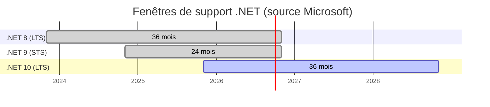
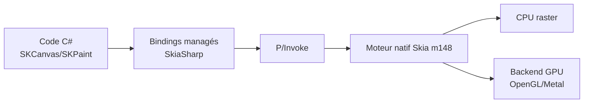

# CSharp — Détail du mercredi 1er juillet 2026

## 1. .NET 8 et .NET 9 — fin de support le 10 novembre 2026, migre vers .NET 10 LTS

**Source :** .NET Blog (Rahul Bhandari, MSFT) — https://devblogs.microsoft.com/dotnet/dotnet-8-9-end-of-support/
**Date :** 29 juin 2026

### Contexte

Microsoft a confirmé le 29 juin que **.NET 8 et .NET 9 arrivent tous les deux en fin de support le 10 novembre 2026**. Après cette date : plus de correctifs de sécurité, plus de mises à jour de servicing, plus de support technique. Tes apps continueront de tourner, mais chaque nouvelle CVE restera ouverte sur ces runtimes.

Le point qui surprend : deux versions consécutives meurent le même jour. Comprendre pourquoi, c'est comprendre la cadence de release de .NET.

### Comment ça marche

.NET suit un rythme annuel avec deux types de support. Les versions **paires** (8, 10, 12…) sont **LTS** (Long Term Support) : 36 mois de correctifs. Les versions **impaires** (9, 11…) sont **STS** (Standard Term Support). Microsoft a récemment allongé le STS de 18 à **24 mois**.

Fais le calcul. .NET 8 (LTS, sorti novembre 2023) + 36 mois → novembre 2026. .NET 9 (STS, sorti novembre 2024) + 24 mois → novembre 2026. Les deux fenêtres se referment le même Patch Tuesday.



La cible de migration est **.NET 10**, LTS sortie en novembre 2025 et supportée jusqu'en novembre 2028. Le 10 novembre étant un Patch Tuesday, .NET 8 et 9 peuvent recevoir un ultime correctif ce jour-là en cas de faille critique connue.

### En pratique — exemple de code

La migration de base tient en une ligne de `.csproj` : tu bascules le `TargetFramework` sur `net10.0`.

```xml
<!-- Avant -->
<PropertyGroup>
  <TargetFramework>net8.0</TargetFramework>
</PropertyGroup>

<!-- Après : cible .NET 10 (LTS jusqu'en nov. 2028) -->
<PropertyGroup>
  <TargetFramework>net10.0</TargetFramework>
</PropertyGroup>
```

Pour un vrai projet, épingle aussi le SDK et fais tourner l'assistant de migration officiel :

```bash
# Épingle la version du SDK pour tout le repo (reproductibilité CI)
dotnet new globaljson --sdk-version 10.0.100 --force

# Analyse et applique les correctifs de migration guidés
dotnet tool install -g upgrade-assistant
upgrade-assistant upgrade ./MonApi.csproj
```

Vérifie ensuite tes conteneurs (`mcr.microsoft.com/dotnet/aspnet:10.0`), tes pipelines et les **breaking changes** .NET 10 avant de merger.

### Pourquoi ça compte pour toi

Tu as sûrement des services en .NET 8 « parce que c'est du LTS ». Ce LTS expire dans quatre mois. Planifie la bascule vers .NET 10 dès maintenant : bump du `TargetFramework`, image Docker, `global.json`, puis relecture des breaking changes. Repousser, c'est exposer ta prod à des CVE non patchées et perdre le support Microsoft sur un socle critique.

### Pour aller plus loin

Migration ASP.NET Core 9 → 10 : https://learn.microsoft.com/aspnet/core/migration/90-to-100 · Breaking changes .NET 10 : https://learn.microsoft.com/dotnet/core/compatibility/10.0

---

## 2. SkiaSharp 4.148.0 — première release stable de la v4, moteur Skia m148

**Source :** .NET Blog (Matthew Leibowitz) — https://devblogs.microsoft.com/dotnet/skiasharp-4-0-stable/
**Date :** 29 juin 2026

### Contexte

SkiaSharp est le moteur de graphisme 2D cross-platform de .NET depuis plus de dix ans. Il rend texte, géométrie et images sur mobile, desktop, web et **serveur**, en s'appuyant sur **Skia**, le moteur open source de Google qui équipe Chrome. Il vit sous .NET MAUI, WinUI 3, WebAssembly et Uno Platform.

Le 29 juin, l'équipe .NET et Uno Platform ont publié **SkiaSharp 4.148.0**, première version stable de la branche v4. Elle consolide tout le travail des previews en un paquet NuGet posé.

### Comment ça marche

SkiaSharp est un jeu de **bindings managés** au-dessus d'une énorme base C++ (Skia). Ton code C# manipule des wrappers (`SKSurface`, `SKCanvas`, `SKPaint`) qui pointent, via P/Invoke, vers des objets natifs. Le rendu part ensuite sur CPU ou sur un backend GPU.



La v4 embarque le moteur Skia jusqu'au **milestone m148** : des années de corrections de rendu, de codecs et de **sécurité** upstream, gratuites et sans changement de code. Nouveautés : contrôle des **axes de polices variables** OpenType, palettes de **color fonts** (emoji, icônes) et encodage **WebP animé** via `SKWebpEncoder`.

Le fix invisible mais majeur : le cycle de vie des objets a été revu pour **compter les références** des singletons natifs. Cela élimine une classe de crashes *use-after-free* qui survenaient quand le GC finalisait un wrapper managé pendant un appel natif en cours. Côté perf, les cartes ombrées et surfaces empilées rendent jusqu'à **24 % plus vite** sur GPU ; le bruit de Perlin tourne **6× plus vite** sur CPU.

Enfin, la cadence devient prévisible : deux canaux calés sur Chrome. Le canal **Stable** suit le milestone Skia de Chrome Stable ; le canal **Preview** suit Chrome Beta (la 4.150.0 Preview 2 amène déjà le backend GPU Graphite d'Uno).

### En pratique — exemple de code

Rendu **côté serveur** d'un PNG (miniature, badge, graphe), sans navigateur ni interface :

```csharp
using SkiaSharp;

// Surface raster 400x200 rendue entièrement en mémoire (idéal côté API)
using var surface = SKSurface.Create(new SKImageInfo(400, 200));
SKCanvas canvas = surface.Canvas;
canvas.Clear(SKColors.White);

using var paint = new SKPaint { Color = SKColors.MidnightBlue, IsAntialias = true };
using var font = new SKFont(SKTypeface.Default, 32);
canvas.DrawText("Veille .NET", 24, 110, SKTextAlign.Left, font, paint);

// Encode en PNG et écris le flux (réponse HTTP, blob, fichier)
using SKImage image = surface.Snapshot();
using SKData data = image.Encode(SKEncodedImageFormat.Png, 90);
await using var stream = File.OpenWrite("badge.png");
data.SaveTo(stream);
```

### Pourquoi ça compte pour toi

Si tu génères des images côté backend (badges, rapports PDF, vignettes, graphes), SkiaSharp est un socle solide et cross-platform. La v4 t'apporte un moteur Skia récent — donc des correctifs de sécurité upstream — et supprime des crashes GC/natifs difficiles à diagnostiquer en prod. Le mapping de version calé sur Chrome te donne enfin une cadence de mise à jour prévisible pour planifier tes bumps.

### Pour aller plus loin

Release notes 4.148.0 : https://mono.github.io/SkiaSharp/docs/releases/4.148.0.html · Galerie interactive : https://mono.github.io/SkiaSharp/
