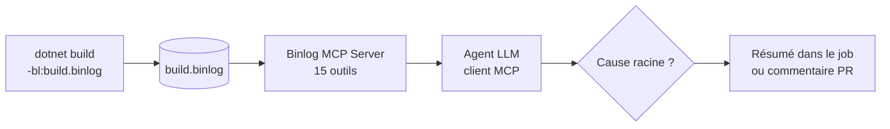

# CSharp — Détail du vendredi 10 juillet 2026

## 1. MCP Binlog en CI — diagnostiquer tes builds MSBuild depuis GitHub Actions

**Source :** .NET Blog — https://devblogs.microsoft.com/dotnet/mcp-build-diagnostics-workflows/
**Date :** 30 juin 2026

### Contexte

Fin juin, l'équipe .NET a montré comment sortir le **Microsoft Binlog MCP Server** de la fenêtre de chat pour l'exécuter **dans un workflow de CI**. Rappel : un *binlog* (`.binlog`) est le log binaire structuré que produit MSBuild — il contient chaque cible, tâche, propriété et item évalués pendant le build, bien plus riche qu'une sortie console. Le Binlog MCP expose **15 outils** qui laissent un agent IA interroger ce fichier : « pourquoi cette référence est absente ? », « quelle cible prend 40 s ? ».

Le problème que ça résout : en CI, un build qui casse ou ralentit t'oblige d'ordinaire à rapatrier les logs, les relire à la main, deviner. Ici, l'agent lit le binlog directement dans le job et te remonte une analyse.

### Comment ça marche

MCP (*Model Context Protocol*) est un protocole client-serveur : le **serveur** expose des outils (ici, des requêtes sur le binlog), le **client** est un agent LLM qui les appelle. En CI, le pipeline génère le binlog pendant le build, puis lance le serveur MCP sur ce fichier ; l'agent enchaîne des appels d'outils pour isoler la cause racine, et écrit un résumé dans les logs du job ou un commentaire de PR.



Le point pédagogique : l'agent ne « lit » pas 200 Mo de logs texte. Il pose des requêtes ciblées (`find-target-by-duration`, `why-was-property-set`) au serveur, qui répond avec des extraits structurés. C'est la différence entre grep-er un fichier plat et interroger une base indexée.

### En pratique — brancher le binlog dans un job GitHub Actions

Le binlog se génère avec le flag `-bl`. On l'archive comme artefact, puis on laisse l'étape MCP l'analyser.

```yaml
# .github/workflows/build-diagnostics.yml
jobs:
  build:
    runs-on: ubuntu-latest
    steps:
      - uses: actions/checkout@v4
      - uses: actions/setup-dotnet@v4
        with: { dotnet-version: '11.0.x' }

      # 1. Produire le binlog pendant le build (échec toléré pour l'analyser)
      - name: Build with binlog
        run: dotnet build -bl:build.binlog
        continue-on-error: true

      # 2. Conserver le binlog en artefact (débogage manuel possible aussi)
      - uses: actions/upload-artifact@v4
        with:
          name: msbuild-binlog
          path: build.binlog

      # 3. Laisser l'agent MCP investiguer le binlog et résumer la cause
      - name: Diagnose build
        run: dotnet run --project ./tools/BinlogMcpDiagnose -- build.binlog
```

### Pourquoi ça compte pour toi

Tes pipelines .NET cassent parfois pour des raisons opaques : restauration NuGet incohérente, propriété MSBuild écrasée, cible lente qui gonfle le temps de build. Brancher le Binlog MCP en CI te donne une première analyse automatique avant même que tu ouvres les logs. Sur un monorepo .NET où le build dépasse plusieurs minutes, repérer la cible coûteuse sans fouiller à la main est un gain net de temps.

### Limites

Un agent LLM en CI a un coût (tokens, latence) et introduit une dépendance externe dans ton pipeline. Réserve-le aux jobs de diagnostic (déclenchés sur échec ou à la demande), pas à chaque build vert. Garde toujours le binlog en artefact pour l'inspection manuelle via l'outil `MSBuild Structured Log Viewer`.
