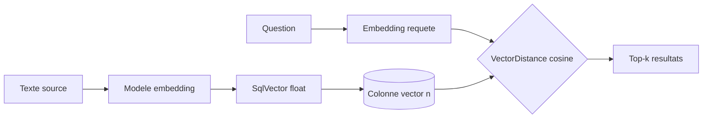

# CSharp / .NET — Détail du dimanche 12 juillet 2026

## 1. EF Core 10 — recherche vectorielle native avec `SqlVector<float>` et `VectorDistance()`

**Source :** Microsoft Learn — https://learn.microsoft.com/en-us/ef/core/providers/sql-server/vector-search
**Date :** EF Core 10.0 (stable avec .NET 10, SQL Server 2025 / Azure SQL)

### Contexte

Avec l'essor du RAG et de la recherche sémantique, stocker des *embeddings* (des vecteurs de flottants produits par un modèle) puis les comparer est devenu un besoin courant. Jusqu'ici, côté .NET, tu avais deux options : ajouter une base vectorielle dédiée (pgvector, Qdrant, Milvus) à ton infra, ou passer par l'extension communautaire `EFCore.SqlServer.VectorSearch`. EF Core 10 intègre enfin le support de bout en bout du nouveau type `vector` de SQL Server 2025 et d'Azure SQL, directement dans le modèle et dans tes requêtes LINQ.

### Comment ça marche

Le principe : une colonne `vector(n)` stocke un tableau de `n` flottants, où `n` est la dimension de ton modèle d'embedding (par exemple 1536 pour `text-embedding-3-small`). Tu calcules l'embedding de chaque texte au moment de l'insertion et tu le ranges dans cette colonne. À la requête, tu calcules la distance entre l'embedding de la question et ceux stockés, puis tu tries pour récupérer les plus proches.



EF expose ça via deux briques. Le type `SqlVector<float>` mappe la colonne côté modèle. La fonction `EF.Functions.VectorDistance("cosine", colonne, cible)` se traduit en `VECTOR_DISTANCE()` T-SQL, évaluée côté serveur. Trois métriques sont disponibles : `cosine`, `euclidean`, `dot`. Tu la places dans un `OrderBy(...).Take(k)` pour obtenir un top-k des voisins les plus proches.

Attention au mode de calcul. EF Core 10 ne supporte que la recherche **exacte** (`VECTOR_DISTANCE`), qui scanne toutes les lignes et calcule la distance pour chacune. C'est parfaitement précis, mais coûteux au-delà de quelques dizaines de milliers de lignes. L'index approximatif (ANN) via `VECTOR_SEARCH()` n'est pas encore traduit par EF 10 : pour ça, tu dois passer par du SQL brut (`FromSql`) ou attendre une version ultérieure.

### En pratique — exemple de code

```csharp
// 1) Entité : la colonne vectorielle, dimension = taille de l'embedding
public class Product
{
    public int Id { get; set; }
    public string Description { get; set; } = "";

    [Column(TypeName = "vector(1536)")]        // SQL Server 2025 / Azure SQL
    public SqlVector<float> Embedding { get; set; }
}

// 2) Requête : top-5 des produits les plus proches d'un embedding cible
float[] q = await embedder.EmbedAsync("chaise de bureau ergonomique");
var target = new SqlVector<float>(q);

var results = await db.Products
    .OrderBy(p => EF.Functions.VectorDistance("cosine", p.Embedding, target))
    .Take(5)
    .ToListAsync();   // -> ORDER BY VECTOR_DISTANCE('cosine', [Embedding], @target)
```

### Pourquoi ça compte pour toi

Si ton appli tourne déjà sur SQL Server ou Azure SQL, tu ajoutes de la recherche sémantique sans déployer ni synchroniser une base vectorielle de plus. Un service de moins à opérer, et tes embeddings restent transactionnellement cohérents avec tes données métier. Garde la limite en tête : recherche exacte seulement — au-delà de ~50 k lignes, mesure la latence et bascule sur du SQL brut avec un index ANN si besoin.

### Points de vigilance

- Nécessite **SQL Server 2025** ou **Azure SQL** — pas de rétroportage sur SQL Server 2022 et antérieurs.
- La dimension déclarée (`vector(1536)`) doit correspondre exactement à celle du modèle d'embedding, sinon l'insertion échoue.
