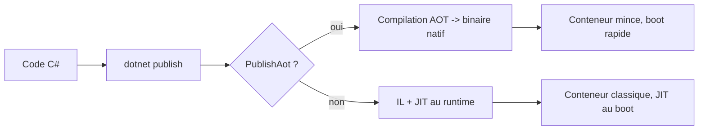
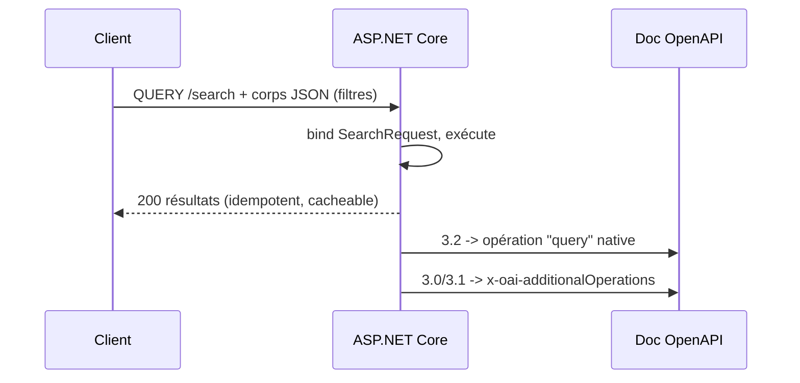

# CSharp — Détail du lundi 13 juillet 2026

## 1. .NET 11 Preview 6 — le train des previews continue avant la LTS de novembre

**Source :** C# Corner — https://www.c-sharpcorner.com/article/net-11-preview-6-new-features-every-c-sharp-developer-should-know/
**Date :** 11 juillet 2026

### Contexte

Microsoft a publié **.NET 11 Preview 6**, sixième jalon avant la version finale attendue en **novembre 2026** (LTS). Rappel de calendrier : .NET 11 succède à .NET 10, la LTS actuelle. Les previews ne sont pas faites pour la prod, mais elles fixent le périmètre de l'API que tu retrouveras en GA. Les valider tôt réduit le risque de migration : tu repères les *breaking changes* et les incompatibilités de libs avant qu'elles ne te bloquent.

Preview 6 ne change pas de cap : performance runtime, démarrage plus rapide, empreinte mémoire, cloud-native, observabilité et productivité. C'est un jalon d'affinage plus que de rupture — le gros du langage (C# 16, unions, hiérarchies scellées, `unsafe` explicite) a atterri dans les previews précédentes.

### Comment ça marche

Le fil rouge de .NET 11 est la réduction du coût au démarrage et à l'exécution, surtout en conteneur. **Native AOT** compile ton appli en code machine *avant* le déploiement : plus de JIT au lancement, pas de compilation à chaud. Résultat : démarrage quasi instantané, image plus petite, mémoire réduite — précieux en serverless et sur des replicas Kubernetes qui *scalent* souvent.



Le compromis AOT : pas de génération de code à l'exécution, donc pas de `System.Reflection.Emit` ni certains scénarios de sérialisation dynamique. Tu t'appuies sur les *source generators* (System.Text.Json, EF Core compiled models) pour remplacer la réflexion par du code généré au build.

### En pratique — exemple de code

Activer Native AOT tient en une propriété projet, puis un publish ciblé :

```xml
<!-- MonApi.csproj -->
<PropertyGroup>
  <TargetFramework>net11.0</TargetFramework>
  <PublishAot>true</PublishAot>          <!-- active la compilation native -->
  <InvariantGlobalization>true</InvariantGlobalization>
  <StripSymbols>true</StripSymbols>       <!-- binaire plus léger -->
</PropertyGroup>
```

```bash
# Publie un binaire natif autonome pour Linux x64 (idéal image conteneur "scratch"-like)
dotnet publish -r linux-x64 -c Release
# -> ./bin/Release/net11.0/linux-x64/publish/MonApi  (pas de runtime .NET à installer)
```

Le binaire produit n'a pas besoin du runtime .NET installé : tu le copies dans une image `mcr.microsoft.com/dotnet/runtime-deps` ou distroless et tu obtiens un conteneur de quelques dizaines de Mo qui démarre en millisecondes.

### Pourquoi ça compte pour toi

Sur tes APIs .NET conteneurisées, Native AOT attaque directement ta facture cloud : boot plus rapide = *scale-to-zero* viable, moins de RAM par pod = plus de replicas au même prix. Commence à tester Preview 6 sur une API interne non critique : mesure le *cold start* et vérifie que tes dépendances (EF Core, sérialisation) tolèrent l'AOT. Tu prépares la migration LTS de novembre sans surprise.

### Points de vigilance

Preview non supportée en prod ; les API peuvent encore bouger. Teste en environnement isolé, relis les *release notes* avant tout upgrade, et vérifie la compat des libs tierces (surtout celles qui font de la réflexion).

---

## 2. HTTP QUERY dans ASP.NET Core (.NET 11) — un GET qui a le droit d'avoir un corps

**Source :** Start Debugging — https://startdebugging.net/2026/05/aspnetcore-11-http-query-method-openapi/
**Date :** mai 2026 (introduit en .NET 11 Preview 4, suivi dans le cycle des previews)

### Contexte

Tes endpoints de recherche vivent un dilemme. En **GET**, les filtres passent en query string : sûr et *cacheable*, mais tu butes vite sur la limite de longueur d'URL et l'encodage devient pénible pour des filtres imbriqués. En **POST**, tu envoies un corps JSON propre, mais POST est sémantiquement « non idempotent » : caches et proxies ne peuvent pas le traiter comme une lecture.

La méthode **QUERY** (proposition IETF) tranche : *safe* et idempotente comme GET, mais avec un **corps de requête structuré** comme POST. ASP.NET Core, depuis .NET 11 Preview 4, sait la documenter en OpenAPI.

### Comment ça marche

Côté routage, rien de neuf : ASP.NET Core accepte déjà des verbes arbitraires. Le vrai apport est la **génération OpenAPI** : QUERY devient une opération de première classe en **OpenAPI 3.2**. Pour les documents 3.0/3.1, qui ne connaissent pas QUERY, le générateur bascule sur une extension `x-oai-additionalOperations` — les outils qui la comprennent voient quand même l'opération.



### En pratique — exemple de code

Avant, un POST « faussement » non idempotent ; après, un QUERY explicite avec corps :

```csharp
// Avant — POST : corps propre, mais sémantique de lecture perdue
app.MapPost("/search", (SearchRequest req) => SearchService.Run(req));

// Après — QUERY : corps structuré ET idempotence déclarée
// Pas de nouvel attribut : on réutilise MapMethods avec le verbe QUERY
app.MapMethods("/search", ["QUERY"], (SearchRequest req) => SearchService.Run(req));

// Pour que le doc OpenAPI expose QUERY nativement, on opte pour la 3.2
builder.Services.AddOpenApi(options =>
{
    options.OpenApiVersion = OpenApiSpecVersion.OpenApi3_2; // sinon fallback extension
});
```

Le code métier (`SearchService.Run`) ne change pas : seule la façade HTTP gagne en précision sémantique.

### Pourquoi ça compte pour toi

Sur tes APIs de recherche internes .NET, où tu contrôles client et serveur, QUERY est propre dès aujourd'hui : filtres complexes en JSON, sémantique de lecture correcte pour tes caches. Pour une API publique, garde un chemin POST en parallèle : navigateurs et intermédiaires ne routent pas encore QUERY partout. Vois ça comme du *future-proofing* documenté, pas comme une bascule immédiate.

### Limites

QUERY reste une méthode *proposed* : support inégal côté proxies, CDN et navigateurs. Documenter l'opération n'est pas une garantie que chaque intermédiaire la relaiera. Réserve-la au trafic service-à-service maîtrisé.
